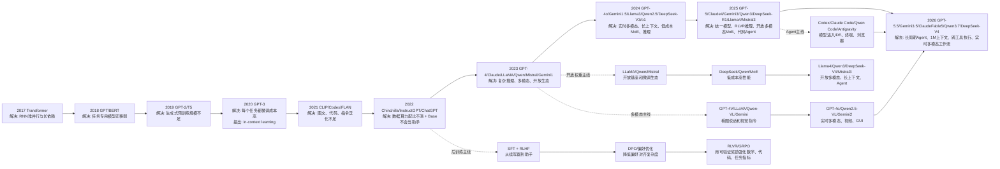
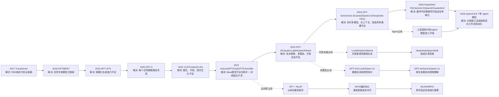
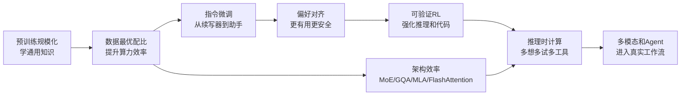

# 大模型发展历史与SOTA迭代框架（2017-2026）

> 来源：https://bytedance.larkoffice.com/docx/FUjKdPEdioj73ox8KzMcTWn6ntg

> **核心结论：**大模型的发展不是“模型越大越强”一条线，而是由 **预训练规模化**、**数据质量**、**架构效率**、**后训练对齐**、**推理时计算**、**多模态统一** 和 **Agent 工程闭环** 共同推进。理解历史时建议同时看两条线：一条是业内 SOTA 按时间如何迭代，另一条是同一家模型系列如何一代代优化。

## 先建立完整思维框架
## 业内 SOTA 模型进化时间轴：从 Transformer 到 2026 Agent
> **读图方法：**这张时间轴按能力主线组织，而不是只按公司罗列。每个节点都代表行业在解决一个新瓶颈：规模化、指令对齐、开放权重、多模态、推理时计算、长上下文、Agent 工具使用、实时交互。

| 阶段 | 代表节点 | 本阶段解决的问题 | 下一个瓶颈 |
|-|-|-|-|
| 架构统一 | Transformer, GPT, BERT | 用预训练模型替代任务专用模型，解决迁移能力弱和训练难并行 | 模型会语言建模，但不一定会生成好答案或遵循指令 |
| 规模化泛化 | GPT-2, T5, GPT-3, PaLM | 扩大参数、数据和算力，获得 few-shot / in-context 能力 | 成本高、不可控、事实性弱，仍像续写器 |
| 助手化对齐 | InstructGPT, ChatGPT, Claude | 通过 SFT、RLHF、RLAIF 让模型听指令、更安全、更像助手 | RLHF 贵且不稳，主观偏好不等于客观正确 |
| 开放生态追赶 | LLaMA, Qwen, Mistral, DeepSeek | 开放权重、LoRA、量化、vLLM 降低训练和部署门槛 | 复现依赖数据 recipe 和后训练细节，开源不等于完全可复现 |
| 多模态扩展 | GPT-4V, Gemini, LLaVA, Qwen-VL, GPT-4o | 从文本扩展到图像、视频、OCR、文档、GUI 和实时音频 | 视觉幻觉、细粒度 grounding、视频时间理解仍难 |
| 推理模型 | o1/o3, DeepSeek-R1, Gemini 2.5/3, Qwen3 | 用推理时计算和可验证奖励提升数学、代码、科学推理 | 延迟和成本上升，reward 设计、长度控制和蒸馏成为关键 |
| Agent 工作流 | GPT-5.5, Claude Fable 5, Gemini 3.5, Qwen3.7, DeepSeek-V4 | 模型进入 IDE、终端、浏览器、文档、表格和多工具环境，执行长周期任务 | 可靠性、权限、安全、审计、失败恢复和真实业务闭环成为新瓶颈 |

> **一句话路线：**行业 SOTA 的主线已经从“更大的聊天模型”转向“统一路由模型 + 推理模型 + 多模态模型 + Agent 工具执行”。对垂类训练来说，不要只问用不用 DPO/GRPO，而要先判断当前瓶颈是格式、偏好、可验证指标、长上下文、多模态 grounding，还是工具执行。

---

> **读图方法：**这张图不是按公司罗列模型，而是按能力路线看行业如何演进：先解决“学语言”，再解决“会泛化”，再解决“听指令”，之后进入“多模态、开放权重、推理模型、Agent 工作流”并行推进。

| 阶段 | 代表节点 | 本阶段主要解决的问题 | 进化到下一阶段后暴露的新问题 |
|-|-|-|-|
| 架构统一 | Transformer, GPT, BERT | 用预训练模型替代任务专用模型，解决迁移能力弱和训练难并行 | 模型会语言建模，但不一定会生成好答案或遵循指令 |
| 规模化泛化 | GPT-2, T5, GPT-3, PaLM | 通过扩大参数、数据和算力获得 few-shot / in-context 能力 | 成本高、不可控、事实性弱，仍像续写器 |
| 助手化对齐 | InstructGPT, ChatGPT, Claude | 通过 SFT、RLHF、RLAIF 让模型听指令、更安全、更像助手 | RLHF 贵且不稳，主观偏好不等于客观正确 |
| 开放生态追赶 | LLaMA, Qwen, Mistral, DeepSeek | 用开放权重、LoRA、量化、vLLM 等降低训练和部署门槛 | 开源模型强依赖数据 recipe 和后训练细节，复现仍不完整 |
| 多模态扩展 | Flamingo, BLIP-2, LLaVA, GPT-4V, Qwen-VL, Gemini | 让模型从文本扩展到图像、视频、OCR、文档和 GUI | 视觉幻觉、细粒度 grounding、视频时间理解仍难 |
| 推理模型 | o1/o3, DeepSeek-R1, Gemini 2.5, Qwen3 | 用推理时计算和可验证奖励提升数学、代码、科学推理 | 延迟和成本上升，reward 设计和长度控制成为关键 |
| Agent 工作流 | Claude Computer Use, Codex, Qwen3.6/3.7, Gemini Agent | 让模型调用工具、读写文件、操作浏览器/IDE，完成长周期任务 | 可靠性、权限、安全、审计和失败恢复成为新瓶颈 |

> **一句话路线：**行业 SOTA 的主线是：预训练获得通用能力，SFT/RLHF 变成助手，开放权重降低门槛，多模态扩展输入输出，RLVR/GRPO 强化可验证推理，Agent 把模型放进真实工具环境。

---

| 优化轴 | 核心问题 | 代表工作 | 带来的能力 | 留下的问题 |
|-|-|-|-|-|
| 规模化 | 参数、数据、算力一起增大 | GPT-2/3、PaLM | 获得通用语言和少样本能力 | 成本高、数据质量和对齐不足 |
| 数据最优配比 | 不是越大越好，要算力-参数-token 平衡 | Chinchilla、LLaMA | 同等算力下提升 base model 质量 | 只解决预训练效率，不解决指令和偏好 |
| 架构效率 | 降低训练/推理成本 | MoE、GQA/MQA、MLA、FlashAttention | 在同等成本下提升吞吐或上下文 | 工程复杂，负载均衡和通信难 |
| 指令微调 | 让模型从续写器变成助手 | FLAN、InstructGPT、LLaVA | 学会任务格式、对话、拒答和工具格式 | 模仿为主，探索弱 |
| 偏好对齐 | 让模型输出符合人类偏好 | RLHF、RLAIF、DPO、KTO | 提升有用性、安全和可读性 | reward hacking、偏见、离线分布问题 |
| 可验证 RL | 让模型探索正确解法 | DeepSeekMath、DeepSeek-R1、o 系列思路 | 数学、代码、工具任务显著增强 | 奖励稀疏、长度偏置、开放任务难验证 |
| 推理时计算 | 回答前多想、多采样、多工具 | o1/o3、Gemini 2.5、Deep Think | 复杂任务性能提升 | 延迟和成本上升，评测需考虑 budget |
| 多模态统一 | 把文本、图像、视频、音频接入统一模型 | Flamingo、GPT-4V、Gemini、Qwen-VL | 视觉问答、OCR、视频和 GUI 能力 | 幻觉、细粒度 grounding、时间理解仍难 |
| Agent 工程 | 把模型嵌入工具和环境闭环 | Codex、Claude Computer Use、Browser/IDE agents | 端到端完成软件、办公、数据任务 | 可靠性、权限、安全和可审计性成为关键 |

---

## 主线一：按业内 SOTA 时间线看技术迭代
这条线回答：行业是如何一步步从 Transformer 走到 ChatGPT、GPT-4、Claude、Gemini、Qwen、DeepSeek-R1 和 Agent 模型的。

| 年份 | 代表模型 / 工作 | 主要机构 | 解决的问题 | 关键优化 | 留下的问题 | 参考入口 |
|-|-|-|-|-|-|-|
| 2017 | Transformer | Google | 自注意力替代 RNN/CNN，解决长依赖与并行训练问题 | 并行训练 + attention 成为统一底座 | 序列长度二次复杂度，为后来的 FlashAttention/长上下文优化埋下问题 | [NeurIPS](https://proceedings.neurips.cc/paper/7181-attention-is-all-you-need) |
| 2018 | GPT-1 / BERT | OpenAI / Google | 从任务专用模型转向“预训练 + 微调” | GPT 用自回归预训练；BERT 用双向 masked LM | 生成与理解路线分化；下游任务仍需标注微调 | [BERT](https://arxiv.org/abs/1810.04805) |
| 2019 | GPT-2 / T5 / Megatron-LM | OpenAI / Google / NVIDIA | 验证扩大参数和数据能显著提升生成能力 | 更大语料、更大模型、统一 text-to-text、模型并行 | 对齐和事实性仍弱；训练工程成为壁垒 | [GPT-2](https://cdn.openai.com/better-language-models/language_models_are_unsupervised_multitask_learners.pdf) |
| 2020 | GPT-3 / RAG / Switch Transformer | OpenAI / Meta / Google | 让模型不用每个任务都微调，探索少样本泛化 | 175B dense LM、in-context learning、检索增强、MoE 稀疏激活 | 成本极高；会续写但不一定会遵循指令 | [GPT-3](https://proceedings.neurips.cc/paper/2020/hash/1457c0d6bfcb4967418bfb8ac142f64a-Abstract.html) |
| 2021 | CLIP / Codex / FLAN | OpenAI / Google | 把语言模型扩展到图文、代码和指令泛化 | 图文对比学习、代码预训练、多任务 instruction tuning | 能力开始泛化，但对话体验、安全和复杂推理仍不足 | [FLAN](https://openreview.net/forum?id=gEZrGCozdqR) |
| 2022 | InstructGPT / PaLM / Chinchilla / ChatGPT | OpenAI / Google / DeepMind | 让 base model 变成可用助手，并修正规模化训练配比 | SFT + RM + PPO；540B PaLM；Chinchilla 数据-参数最优配比 | RLHF 贵且不稳；ChatGPT 证明产品形态，但幻觉仍存在 | [InstructGPT](https://proceedings.neurips.cc/paper_files/paper/2022/hash/b1efde53be364a73914f58805a001731-Abstract-Conference.html) |
| 2023 | GPT-4 / Claude / LLaMA / Gemini 1.0 / Qwen / Mistral | OpenAI / Anthropic / Meta / Google / Alibaba / Mistral | 闭源旗舰与开放权重生态同时爆发 | 多模态、RLAIF、开放权重、MoE、函数调用、长上下文 | SOTA 不再单一；开源追赶但数据和后训练细节差距仍大 | [GPT-4 Report](https://arxiv.org/abs/2303.08774) |
| 2024 | GPT-4o / Claude 3.5 / Gemini 1.5 / Llama 3.1 / Qwen2.5 / DeepSeek-V3 / o1 | 多家机构 | 从聊天走向实时多模态、长上下文、代码和推理模型 | omni 多模态、1M 上下文、405B 开放模型、MoE/MLA、test-time compute | 推理成本、长上下文可靠性、工具调用安全成为新问题 | [GPT-4o](https://openai.com/index/hello-gpt-4o/) |
| 2025 | DeepSeek-R1 / Gemini 2.5 / o3-o4-mini / Claude 4 / Qwen3 / Llama 4 | 多家机构 | 推理能力、可验证奖励和 Agent 成为竞争中心 | RLVR/GRPO、thinking budget、MoE、长上下文、agentic coding | 需以官方发布为准；推理增强带来成本、长度偏置和安全挑战 | [DeepSeek-R1](https://github.com/deepseek-ai/DeepSeek-R1) |
| 2026 | 趋势：多模型路由、Agent 工程化、可靠评测、私有部署 | 产业界 | 从单模型能力转向端到端工作流可靠性 | 模型路由、推理预算控制、RAG/工具/环境反馈闭环、持续评测 | 2026 新旗舰细节变化快；报告只把公开可信方向作为框架 | [Qwen3](https://qwenlm.github.io/blog/qwen3/) |

---

## SOTA 迭代的阶段性总结
| 阶段 | 时间 | 核心问题 | 主流解法 | 你应该形成的判断 |
|-|-|-|-|-|
| 预训练范式确立 | 2017-2019 | 如何获得通用语言表示 | Transformer + GPT/BERT + 大语料 | 这是大模型能力的地基，但还不是好用助手 |
| 规模化涌现 | 2020-2021 | 模型能否少样本泛化 | 扩大参数、数据、算力；prompt / in-context learning | 规模带来能力，但不自动带来可靠性 |
| 助手化对齐 | 2022-2023 | 如何让模型听指令、少胡说、更安全 | SFT + RLHF/RLAIF + 高质量指令数据 | ChatGPT 的关键不只是 GPT-3.5，而是后训练和产品反馈 |
| 开放生态追赶 | 2023-2024 | 如何让强模型可复现、可部署、低成本 | LLaMA/Qwen/Mistral/DeepSeek，LoRA/QLoRA/vLLM | 开源路线的核心是 recipe、数据和系统工程 |
| 推理模型兴起 | 2024-2025 | 如何提升数学、代码、复杂规划能力 | test-time compute、RLVR、GRPO、推理蒸馏 | 能力竞争从“答得像”转向“能不能真正解题” |
| Agent 与多模态工作流 | 2025-2026 | 如何把模型放进真实环境完成任务 | 工具调用、浏览器/IDE/文件系统、长上下文、多模型路由 | 下一阶段 SOTA 是模型 + 工具 + 评测 + 安全闭环 |

---

## 主线二：按同系列模型看迭代历史（更新至 2026-06-14）
> **本节重写说明：**前一版确实不全，且很多系列停在 2025。现在按 2026-06-14 的公开官方信息补齐文档中已有系列：OpenAI、Google Gemini/PaLM、Meta LLaMA、Anthropic Claude、Alibaba Qwen、DeepSeek、Mistral，并新增“其他主流 SOTA 补充”。每行都回答：上一阶段什么问题没解决、本代怎么解决，以及官方入口。

| 口径 | 说明 | 为什么这样处理 |
|-|-|-|
| 完整范围 | 覆盖本文已有主线系列，不把每个 API 小版本、Embedding、安全分类器、图像/视频生成模型都展开成主线 | 避免把产品 SKU 当作基础模型代际；重要专项会在对应系列中保留 |
| 可信来源 | 官方博客、官方模型卡、官方 API 更新日志、官方 GitHub/HF/ModelScope、正式论文页面优先 | 减少传闻和第三方榜单造成的误导 |
| 性质标注 | 区分开放权重、API/产品模型、技术报告、研究模型、访问受限模型 | 同样叫模型，但训练可复现性、部署方式和研究价值不同 |

### OpenAI GPT / o 系列：从语言建模到统一推理 Agent
| 版本/系列 | 时间 | 性质 | 前一阶段解决不了什么 | 本代怎么解决/主要优化 | 官方入口 |
|-|-|-|-|-|-|
| GPT-1 | 2018 | 论文/研究模型 | NLP 依赖任务专用模型，迁移能力弱 | 生成式预训练 + 下游微调，验证 decoder-only 预训练可迁移 | [OpenAI PDF](https://cdn.openai.com/research-covers/language-unsupervised/language_understanding_paper.pdf) |
| GPT-2 | 2019 | 论文/研究模型 | GPT-1 规模小，zero-shot 生成能力不明显 | 扩大模型和 WebText，展示无监督多任务生成 | [OpenAI PDF](https://cdn.openai.com/better-language-models/language_models_are_unsupervised_multitask_learners.pdf) |
| GPT-3 | 2020 | 论文/API 基座 | 每个任务都微调成本高，少样本泛化未被系统证明 | 175B + in-context learning，让 prompt 成为任务接口 | [NeurIPS](https://proceedings.neurips.cc/paper/2020/hash/1457c0d6bfcb4967418bfb8ac142f64a-Abstract.html) |
| InstructGPT / ChatGPT | 2022 | 后训练/API 产品 | Base 模型像续写器，不会稳定当助手 | SFT + Reward Model + PPO/RLHF，把模型对齐到人类指令和偏好 | [NeurIPS](https://proceedings.neurips.cc/paper_files/paper/2022/hash/b1efde53be364a73914f58805a001731-Abstract-Conference.html) |
| GPT-4 | 2023 | 技术报告/API | ChatGPT 复杂推理、代码、多模态、可靠性不足 | 更强预训练和后训练，加入图像输入和系统化安全评测 | [Technical Report](https://arxiv.org/abs/2303.08774) |
| GPT-4o | 2024-05 | API/产品模型 | GPT-4 多模态链路割裂，语音视觉实时交互慢 | 原生 omni 多模态，统一文本、图像、音频，降低交互延迟 | [OpenAI](https://openai.com/index/hello-gpt-4o/) |
| GPT-4o mini | 2024-07 | API/产品模型 | 强模型成本高，不适合高频批量任务 | 小型高性价比 omni 模型，降低延迟和调用成本 | [OpenAI](https://openai.com/index/gpt-4o-mini-advancing-cost-efficient-intelligence/) |
| o1-preview / o1-mini / o1 | 2024-09/12 | 推理模型 | 普通 chat 模型复杂数学/代码容易一步到位出错 | 显式推理时计算，先思考再回答，o1-mini 降低 STEM 推理成本 | [OpenAI](https://openai.com/index/introducing-openai-o1-preview/) |
| o3-mini | 2025-01 | 推理模型 | o1 推理成本和延迟偏高，生产高频 STEM 场景不经济 | 把推理模型做小做快，面向代码、数学、逻辑高频调用 | [OpenAI](https://openai.com/index/openai-o3-mini/) |
| GPT-4.5 | 2025-02 | 研究预览/API | 非推理模型的世界知识、写作和自然对话仍需提升 | 继续扩大预训练和对齐，提升低幻觉、自然对话和创意写作 | [OpenAI](https://openai.com/index/introducing-gpt-4-5/) |
| GPT-4.1 / mini / nano | 2025-04 | API 模型族 | 代码、指令遵循和长上下文 API 场景需要更稳 | 1M 上下文，强化代码、指令遵循，并提供 mini/nano 成本梯度 | [OpenAI](https://openai.com/index/gpt-4-1/) |
| o3 / o4-mini | 2025-04 | 推理+工具模型 | 推理模型需要进入真实多步骤工具任务 | 推理模型深度结合工具、视觉、Python、搜索和图像能力 | [OpenAI](https://openai.com/index/introducing-o3-and-o4-mini/) |
| o3-pro | 2025-06 | 高可靠推理模型 | o3 仍需要更高可靠性和长思考 | 为科学、教育、编程、商业等复杂任务提供更可靠长思考版本 | [Release notes](https://help.openai.com/en/articles/9624314-model-release-notes) |
| GPT-5 | 2025-08 | 统一模型/API/产品 | 用户需要在 GPT 和推理模型间手动选型 | 统一快速回答与深度思考路由，降低模型选择复杂度 | [Release notes](https://help.openai.com/en/articles/9624314-model-release-notes) |
| GPT-5-Codex | 2025-09 | 代码 Agent 模型 | 通用模型做长期代码任务、CLI/IDE 工作流仍不稳 | 面向 Codex 的 agentic coding，强化代码审查、长期任务和工具执行 | [Release notes](https://help.openai.com/en/articles/9624314-model-release-notes) |
| GPT-5.1 Instant / Thinking | 2025-11 | 统一模型升级 | 默认模型对话自然度、指令遵循和推理分配需更好 | Instant 更会判断何时思考，Thinking 更清晰高效 | [OpenAI](https://openai.com/index/gpt-5-1/) |
| GPT-5.3-Codex | 2026-02 | 代码/电脑 Agent | 代码模型需要从生成代码走向操作计算机完成工程任务 | 长期运行、工具使用、前端生成、部署调试和安全研究能力增强 | [OpenAI](https://openai.com/index/introducing-gpt-5-3-codex/) |
| GPT-5.4 Thinking / mini / nano | 2026-03 | 推理+小模型族 | 深度任务需要更好上下文管理，小任务需要更低成本 | Thinking 强化复杂工作流；mini/nano 服务高吞吐编码、分类、子 Agent | [OpenAI](https://openai.com/index/introducing-gpt-5-4-mini-and-nano/) |
| GPT-5.5 / GPT-5.5 Pro | 2026-04 | 前沿 Agent 模型 | 模型需要更长周期地理解意图、跨工具执行和自检 | 强化 agentic coding、电脑使用、知识工作、科研和网络安全防护 | [OpenAI](https://openai.com/index/introducing-gpt-5-5/) |

### Google PaLM / Gemini：从 Pathways 规模化到 Agentic Multimodal
| 版本/系列 | 时间 | 性质 | 前一阶段解决不了什么 | 本代怎么解决/主要优化 | 官方入口 |
|-|-|-|-|-|-|
| PaLM | 2022-04 | 论文/研究模型 | 需要验证超大 dense LM 的少样本、多语言和推理能力 | Pathways 扩展到 540B，提升 few-shot、推理、代码和语言理解 | [Google Research](https://blog.research.google/2022/04/pathways-language-model-palm-scaling-to.html) |
| PaLM 2 | 2023-05 | 产品/模型族 | PaLM 多语言、代码、数学和移动端适配不足 | 改进数据和训练，提供 Gecko/Otter/Bison/Unicorn 多尺寸 | [Google](https://blog.google/technology/ai/google-palm-2-ai-large-language-model/) |
| Gemini 1.0 Ultra/Pro/Nano | 2023-12 | 原生多模态模型族 | 外挂式多模态难统一处理文本、图像、音频、视频 | 从底层构建原生多模态，覆盖云端复杂任务到端侧模型 | [Google](https://blog.google/technology/ai/google-gemini-ai/) |
| Gemini 1.5 Pro | 2024-02 | 长上下文/MoE | 长文档、长视频、长音频无法完整放进上下文 | MoE 提升效率，主打百万 token 长上下文 | [Google](https://blog.google/technology/ai/google-gemini-next-generation-model-february-2024/) |
| Gemini 1.5 Flash | 2024-05 | 低成本长上下文 | 1.5 Pro 成本和延迟不适合高频应用 | 从 Pro 蒸馏出更快更便宜的 Flash，服务总结、抽取、字幕等 | [Google](https://blog.google/technology/ai/google-gemini-update-flash-ai-assistant-io-2024/) |
| Gemini 2.0 Flash | 2024-12 | Agentic 模型 | 模型需要工具使用、原生输出和实时多模态进入 Agent 场景 | 面向 agentic era，增强工具、图像/音频输出和多步任务 | [Google DeepMind](https://blog.google/technology/google-deepmind/google-gemini-ai-update-december-2024/) |
| Gemini 2.0 Flash Thinking | 2024-12 | 实验推理模型 | Flash 快但复杂数学、代码、视觉推理不足 | 在 Flash 上加入显式 thinking，平衡推理与速度 | [Gemini API docs](https://ai.google.dev/gemini-api/docs/models) |
| Gemini 2.5 Pro / Flash / Flash-Lite | 2025-03/06 | Thinking 模型族 | 复杂推理需要成为主线能力，而非单独实验 | 把 thinking 内建到主线模型；Pro/Flash/Lite 覆盖能力到成本梯度 | [Google DeepMind](https://blog.google/technology/google-deepmind/gemini-model-thinking-updates-march-2025/) |
| Gemini 3 Pro / Deep Think | 2025-11 | 前沿推理/Agent | 复杂学习、构建、规划和交互式生成仍需更强 | 提升推理、多模态、Agentic coding 和交互式生成 | [Google](https://blog.google/products/gemini/gemini-3/) |
| Gemini 3.1 Pro | 2026-02 | 增强版旗舰 | Gemini 3 Pro 在代码库级理解和科研工程推理仍需增强 | 面向百万 token 多模态、复杂任务、仓库级代码和科研工程推理 | [Model card](https://deepmind.google/models/model-cards/gemini-3-1-pro/) |
| Gemini 3.1 Flash Live / Audio | 2026-03 | 实时音频/语音模型 | 实时语音 Agent 需要低延迟、自然轮次和可靠任务执行 | Flash Live/Audio 强化实时音频对话、长轮次和任务执行 | [Google](https://blog.google/innovation-and-ai/models-and-research/gemini-models/gemini-3-1-flash-live/) |
| Gemini 3.5 Flash | 2026-05 | Agent/编码旗舰速度档 | 前沿智能和速度通常难兼得，长程 Agent 成本高 | 面向 complex agentic workflows，强化编码、子 Agent、多模态理解和低延迟 | [Google](https://blog.google/innovation-and-ai/models-and-research/gemini-models/gemini-3-5/) |

### Meta LLaMA：开放权重生态从文本到多模态 MoE
| 版本/系列 | 时间 | 性质 | 前一阶段解决不了什么 | 本代怎么解决/主要优化 | 官方入口 |
|-|-|-|-|-|-|
| LLaMA 1 | 2023-02 | 开放权重 base | 研究者缺少高质量可访问 base model | 高质量数据和较优算力配比训练 7B-65B | [Meta](https://ai.meta.com/blog/large-language-model-llama-meta-ai/) |
| Llama 2 | 2023-07 | 开放商用 base/chat | LLaMA 1 许可和官方 chat 对齐不足 | 开放商用许可，发布 base + chat，加入 RLHF 和安全评测 | [Meta](https://ai.meta.com/llama/) |
| Code Llama | 2023-08/2024-01 | 代码专用开放模型 | 通用模型代码补全、FIM、长代码上下文不足 | 在代码语料继续训练，提供 Python/Instruct 和 70B 更新 | [Meta](https://ai.meta.com/blog/code-llama-large-language-model-coding/) |
| Llama 3 8B/70B | 2024-04 | 开放权重 base/instruct | Llama 2 数据规模、tokenizer、代码/推理能力不足 | 15T token、改进 tokenizer/GQA 和后训练，提升开放模型上限 | [Meta](https://ai.meta.com/blog/meta-llama-3/) |
| Llama 3.1 8B/70B/405B | 2024-07 | 开放旗舰/长上下文 | 开放模型缺 405B 级旗舰、长上下文和工具调用 | 405B、128K、多语言、工具调用，缩小与闭源差距 | [Llama docs](https://www.llama.com/docs/model-cards-and-prompt-formats/llama3_1/) |
| Llama 3.2 1B/3B/11B-V/90B-V | 2024-09 | 端侧+视觉 | 开放模型需要端侧小模型和官方视觉模型 | 1B/3B 端侧；11B/90B Vision 支持图像、图表、文档 VQA | [Llama docs](https://www.llama.com/docs/model-cards-and-prompt-formats/llama3_2/) |
| Llama 3.3 70B Instruct | 2024-12 | 后训练增强 | 70B 成本更低但质量需接近 405B | 通过后训练提升 70B instruct，降低部署成本 | [Model card](https://github.com/meta-llama/llama-models/blob/main/models/llama3_3/MODEL_CARD.md) |
| Llama 4 Scout / Maverick | 2025-04 | 原生多模态 MoE | 开放 Llama 需要原生多模态、MoE 和超长上下文 | Scout 面向单 H100/超长上下文；Maverick 面向更强图文、代码、推理 | [Llama 4](https://www.llama.com/models/llama-4/) |
| Llama 4 Behemoth | 2025-04 宣布 | 教师模型/未公开权重 | Scout/Maverick 需要更强教师蒸馏 | 官方定位为更大教师模型；截至 2026-06-14 未公开权重 | [Llama 4](https://www.llama.com/models/llama-4/) |

### Anthropic Claude：安全对齐、长上下文、电脑使用和 Mythos-class
| 版本/系列 | 时间 | 性质 | 前一阶段解决不了什么 | 本代怎么解决/主要优化 | 官方入口 |
|-|-|-|-|-|-|
| Claude 1 / Constitutional AI | 2022-2023 | 对齐研究/产品 | RLHF 助手容易有害、讨好或不符合原则 | Constitutional AI，用原则和 AI feedback 做安全对齐 | [Anthropic](https://www.anthropic.com/research/constitutional-ai-harmlessness-from-ai-feedback) |
| Claude 2 / 2.1 | 2023 | 长上下文助手 | 长文档处理、可靠性和安全性不足 | 100K/200K 上下文，强化长文档问答和摘要 | [Anthropic](https://www.anthropic.com/news/claude-2-1) |
| Claude 3 Opus/Sonnet/Haiku | 2024-03 | 三档模型族 | 需要覆盖快/便宜/强，并补视觉能力 | Opus/Sonnet/Haiku 分层，加入视觉输入和更低误拒 | [Anthropic](https://www.anthropic.com/news/claude-3-family) |
| Claude 3.5 Sonnet / Haiku + computer use | 2024-06/10 | 代码/电脑使用 | 前代旗舰贵，模型无法直接操作电脑 | 3.5 Sonnet 中档反超前代旗舰；computer use 能看屏幕、点击、输入 | [Anthropic](https://www.anthropic.com/news/3-5-models-and-computer-use) |
| Claude 3.7 Sonnet | 2025-02 | 混合推理 | 模型需要快速回答和长思考可切换 | 首个混合推理 Claude，配合 Claude Code 强化编码 Agent | [Anthropic](https://www.anthropic.com/news/claude-3-7-sonnet) |
| Claude Opus 4 / Sonnet 4 | 2025-05 | Agent/代码旗舰 | 代码 Agent 和长时间工具任务需要更强可靠性 | 扩展思考调用工具、并行工具、记忆和 Claude Code GA | [Anthropic](https://www.anthropic.com/news/claude-4) |
| Claude Opus 4.1 | 2025-08 | 旗舰增强 | 真实代码、搜索 Agent、研究和数据分析细节跟踪不足 | 升级 Opus 4 的智能体任务、编码、推理、深度研究精度 | [Anthropic](https://www.anthropic.com/news/claude-opus-4-1) |
| Claude Sonnet 4.5 / Haiku 4.5 | 2025-09/10 | 主力+小模型 | 复杂 Agent 和实时低成本子 Agent 需求上升 | Sonnet 4.5 强化复杂 Agent；Haiku 4.5 下放编码/电脑使用能力 | [Anthropic](https://www.anthropic.com/news/claude-sonnet-4-5) |
| Claude Opus 4.5 | 2025-11 | 旗舰升级 | 旗舰在代码、agents、电脑使用和知识工作上还需更稳且更便宜 | 提升代码/agents/研究/表格/幻灯片，并降低 Opus 价格 | [Anthropic](https://www.anthropic.com/news/claude-opus-4-5) |
| Claude Opus 4.8 | 2026-05 | 旗舰增强 | 长时协作、诚实性、专业工作一致性仍需提升 | 加入 effort control、dynamic workflows，强化编码和专业任务 | [Anthropic](https://www.anthropic.com/news/claude-opus-4-8) |
| Claude Fable 5 / Mythos 5 | 2026-06 | Mythos-class/访问受限 | 更长周期工程、科研、视觉和网络防御任务仍是瓶颈 | Fable 5 面向通用超强模型；Mythos 5 面向可信网络防御；6/12 官方暂停访问 | [Anthropic](https://www.anthropic.com/news/claude-fable-5-mythos-5) |

### Alibaba Qwen：从中文开源基座到多模态 Agent 与 Qwen3.7
| 版本/系列 | 时间 | 性质 | 前一阶段解决不了什么 | 本代怎么解决/主要优化 | 官方入口 |
|-|-|-|-|-|-|
| Qwen 初代 7B/14B/72B | 2023 | 开放 LLM | 中文和中英双语强开源模型不足 | 发布 base/chat，强化双语、代码、数学和工具调用基础 | [GitHub](https://github.com/QwenLM/Qwen) |
| Qwen-VL / Qwen-Audio | 2023 | 多模态分支 | 文本模型无法处理图像/音频 | 扩展到图文/OCR/文档/视觉定位和音频理解 | [Qwen-VL](https://github.com/QwenLM/Qwen-VL) |
| Qwen1.5 / MoE / CodeQwen / 110B | 2024-02\~04 | 模型族扩展 | 初代尺寸覆盖、部署体验和成本效率不足 | 补齐尺寸、32K、Transformers 生态，探索 MoE、代码专项和 110B 大模型 | [Qwen1.5](https://qwenlm.github.io/blog/qwen1.5/) |
| Qwen2 / Qwen2-Audio / Qwen2-VL | 2024-06\~08 | 多语言+多模态升级 | 多语言、代码、数学、长上下文和视频理解不足 | GQA、多语言增强、最高 128K；VL 支持动态分辨率和长视频 | [Qwen2](https://qwenlm.github.io/blog/qwen2/) |
| Qwen2.5 LLM/Coder/Math | 2024-09 | 专项能力升级 | 结构化输出、代码、数学、长文本和指令跟随需加强 | 18T token，强化 JSON、代码、数学、长文本、指令跟随 | [Qwen2.5](https://qwenlm.github.io/blog/qwen2.5/) |
| Qwen2.5-VL / 1M / Max / Omni | 2025-01\~03 | 视觉/长上下文/全模态 | 视觉 Agent、长上下文、全模态实时交互不足 | 文档解析、GUI/视频、1M 上下文、MoE Max、端到端全模态 | [Qwen2.5-VL](https://qwenlm.github.io/blog/qwen2.5-vl/) |
| QwQ / QVQ | 2025-03 | 推理模型 | 通用 instruct 在复杂数学/视觉推理不足 | 强化学习驱动文本推理和视觉推理模型 | [Qwen blog index](https://qwenlm.github.io/page/3/) |
| Qwen3 | 2025-04 | 开源混合思考模型 | 模型需要快速回答和深度推理可切换 | thinking/non-thinking 混合模式，dense+MoE，119 语言 | [Qwen3](https://qwenlm.github.io/zh/blog/qwen3/) |
| Qwen3-Embedding/Reranker | 2025-06 | 检索/RAG | 生成模型之外，RAG 需要更强召回和排序 | 文本向量和重排模型，服务检索、聚类、分类和 RAG | [Qwen](https://qwen.ai/blog?id=qwen3-vl-embedding) |
| Qwen3-Coder | 2025-07 | Agentic coding | 代码模型需要仓库级理解和多步工具调用 | 面向 coding agent，支持长上下文、工具调用和软件工程任务 | [Qwen](https://qwen.ai/blog?id=qwen3-coder) |
| Qwen3-VL / Qwen3Guard | 2025-09 | 视觉语言/安全 | 视觉 Agent、长视频、GUI、空间理解和安全审核不足 | Qwen3-VL 强化视觉感知/推理/GUI/长视频；Guard 做安全分类 | [Qwen3-VL](https://qwen.ai/blog?id=99f0335c4ad9ff6153e517418d48535ab6d8afef) |
| Qwen3-VL-Embedding/Reranker | 2026-01 | 多模态检索 | 图文视频统一检索和跨模态重排不足 | 统一多模态向量和 reranker，服务视频/图文 RAG | [Qwen](https://qwen.ai/blog?id=qwen3-vl-embedding) |
| Qwen3.5 / Qwen3.5-Omni | 2026-02/03 | 原生 VL Agent/全模态 | 多模态 Agent、长音视频、实时语音和工具调用需统一 | 线性注意力+稀疏 MoE；Omni 支持长音视频、实时打断、WebSearch、Function Call | [Qwen3.5](https://qwen.ai/blog?id=qwen3.5) |
| Qwen3.6-Plus | 2026-04 | 闭源/API Agent | 真实世界 Agent、代码、工具、长上下文记忆稳定性不足 | 强化 coding agent、general agent、tool usage、1M context 和多模态推理 | [Qwen3.6](https://qwen.ai/blog?id=qwen3.6) |
| Qwen3.5-LiveTranslate-Flash | 2026-05 | 实时翻译 | 低延迟语音翻译需要结合视觉上下文和术语控制 | 实时多模态同传、语音克隆、热词术语和视觉辅助翻译 | [Qwen](https://qwen.ai/blog?id=qwen3.5-livetranslate) |
| Qwen3.7-Max / Qwen-VLA | 2026-05 | Agent/具身智能 | 长程自治、多工具、办公自动化和行动闭环不足 | Max 面向 Agent 时代；VLA 从视觉语言理解走向动作决策 | [Qwen Research](https://qwen.ai/research/) |
| Qwen3.7-Plus | 2026-06 | 多模态 Agent API | Agent 需要统一 GUI/CLI、视觉编码、移动端导航和跨框架泛化 | 多模态 interactive hybrid agent，统一视觉语言、代码、工具和 GUI 操作 | [Qwen3.7-Plus](https://qwen.ai/blog?id=qwen3.7-plus) |

### DeepSeek：低成本 MoE、GRPO/RLVR 与 1M Agent
| 版本/系列 | 时间 | 性质 | 前一阶段解决不了什么 | 本代怎么解决/主要优化 | 官方入口 |
|-|-|-|-|-|-|
| DeepSeek-Coder | 2023-11 | 代码开源模型 | 开源代码模型仓库级理解和 FIM 不足 | 代码生成、补全、FIM、多语言和仓库级代码理解 | [GitHub](https://github.com/deepseek-ai/DeepSeek-Coder) |
| DeepSeek-LLM / MoE | 2024-01 | 通用 LLM/MoE | 通用开源底座和 MoE 参数效率需验证 | 发布通用 LLM；MoE 探索细粒度专家和共享专家 | [GitHub](https://github.com/deepseek-ai/DeepSeek-LLM) |
| DeepSeekMath | 2024-02 | 数学推理/RL | SFT 数学模型继续提升困难，PPO 工程复杂 | 引入 GRPO 和可验证数学奖励，强化推理能力 | [GitHub](https://github.com/deepseek-ai/DeepSeek-Math) |
| DeepSeek-VL | 2024-03 | 视觉语言 | 通用 LLM 无法处理真实图文/OCR/网页截图 | 视觉语言模型支持真实场景图文理解、OCR、文档和网页截图 | [GitHub](https://github.com/deepseek-ai/DeepSeek-VL) |
| DeepSeek-V2 / Coder-V2 | 2024-05/06 | 低成本 MoE/代码 | 大模型 KV cache 和推理成本高，代码长上下文不足 | MLA + DeepSeekMoE，128K，提升吞吐和代码工程能力 | [GitHub](https://github.com/deepseek-ai/DeepSeek-V2) |
| DeepSeek-Prover / V1.5 | 2024-05/08 | 形式化证明 | 数学形式化证明长程搜索和奖励稀疏 | Lean 4 证明模型，RLPAF/RMaxTS 提升证明成功率 | [GitHub](https://github.com/deepseek-ai/DeepSeek-Prover-V1.5) |
| DeepSeek-V2.5 / 1210 | 2024-09/12 | Chat+Coder 合并 | 通用对话和代码能力分线，体验割裂 | 合并 Chat 与 Coder，并增强数学、代码、写作、搜索 | [DeepSeek](https://api-docs.deepseek.com/news/news0905) |
| DeepSeek-V3 | 2024-12 | 开源 MoE 基座 | 需要低成本训练超大 MoE 且保持前沿性能 | 671B/37B MoE，FP8、负载均衡、多 token prediction | [GitHub](https://github.com/deepseek-ai/DeepSeek-V3) |
| DeepSeek-R1 / R1-Zero / Distill | 2025-01 | RLVR 推理模型 | 强推理不应只靠人工 CoT SFT | 基于 V3 做大规模 RLVR/GRPO，发布推理模型和蒸馏模型 | [GitHub](https://github.com/deepseek-ai/DeepSeek-R1) |
| DeepSeek-V3-0324 / R1-0528 | 2025-03/05 | 能力增强 | 前端代码、中文写作、函数调用和幻觉仍需优化 | 更新版本提升推理、Web 前端、搜索报告、JSON/Function Calling | [Updates](https://api-docs.deepseek.com/zh-cn/updates/) |
| DeepSeek-V3.1 / Terminus | 2025-08/09 | 混合推理/Agent | 需要一个模型支持思考/非思考，并提升工具 Agent | 混合推理架构，优化 Code/Search Agent 和反馈问题 | [DeepSeek](https://api-docs.deepseek.com/news/news250821/) |
| DeepSeek-V3.2 / Speciale | 2025-12 | Agent+思考 | 长上下文效率和 Agent 能力继续成为瓶颈 | 统一 chat/reasoner，融入思考推理；Speciale 提供高输出长度深度推理 | [DeepSeek](https://api-docs.deepseek.com/zh-cn/news/news251201) |
| DeepSeek-V4-Pro / V4-Flash | 2026-04 | 开源+API/1M Agent | 长上下文、Agent、世界知识和推理需要同时提升且普惠 | 1M 上下文标配，DSA 稀疏注意力，Pro 高性能，Flash 低成本 | [DeepSeek](https://api-docs.deepseek.com/zh-cn/news/news260424) |

### Mistral：开放小模型、MoE、专项模型与企业自托管
| 版本/系列 | 时间 | 性质 | 前一阶段解决不了什么 | 本代怎么解决/主要优化 | 官方入口 |
|-|-|-|-|-|-|
| Mistral 7B | 2023-09 | 开放小模型 | 开源小模型效率和质量仍有空间 | 7B 高质量 recipe，降低本地/私有部署门槛 | [Mistral](https://mistral.ai/news/announcing-mistral-7b/) |
| Mixtral 8x7B / 8x22B | 2023-12/2024-04 | 开放 MoE | dense 扩大成本高，开源复杂任务能力不足 | 稀疏 MoE 提升参数效率和复杂任务性能 | [Mistral](https://mistral.ai/news/mixtral-of-experts/) |
| Mistral Large / Large 2 | 2024-02/07 | 商业旗舰 | Mistral 需要闭源 API 旗舰覆盖企业复杂任务 | 提升复杂推理、代码、数学、多语言和企业 API 能力 | [Mistral](https://mistral.ai/news/mistral-large-2407/) |
| Codestral / Mathstral / Codestral Mamba | 2024-05/07 | 专项模型 | 通用模型代码、数学、长代码延迟不足 | 代码、数学和 Mamba 长序列代码专项模型 | [Mistral](https://mistral.ai/news/codestral/) |
| Mistral NeMo / Ministral | 2024-07/10 | 高性价比/端侧 | 企业需要 12B 级和端侧小模型 | NeMo 12B 多语言；Ministral 3B/8B 低延迟端侧 | [Mistral](https://mistral.ai/news/mistral-nemo/) |
| Pixtral 12B / Pixtral Large | 2024-09/11 | 视觉语言 | Mistral 缺开放多模态能力 | 图像理解、文档/图表/截图和多图推理 | [Mistral](https://mistral.ai/news/pixtral-12b/) |
| Mistral Small 3.1 / OCR | 2025-03 | 开放多模态/OCR | 企业文档 RAG 需要结构化抽取和单机可跑 VLM | 24B 开放多模态 128K；OCR 处理 PDF/图表/公式 | [Mistral](https://mistral.ai/news/mistral-small-3-1/) |
| Mistral Medium 3 / Devstral | 2025-05 | 企业中型/代码 Agent | 企业需要低成本强模型和真实代码库 Agent | Medium 3 覆盖代码/STEM/视觉；Devstral 面向 SWE-bench 类任务 | [Mistral](https://mistral.ai/news/devstral) |
| Magistral | 2025-06 | 推理模型 | Mistral 缺长思考推理模型 | 首批推理模型，补齐数学、逻辑和多步问题求解 | [Mistral](https://mistral.ai/news/magistral) |
| Voxtral | 2025-07 | 语音理解 | 开放语音理解和音频函数调用不足 | 转写、音频问答、总结、多语言语音与函数调用 | [Mistral](https://mistral.ai/news/voxtral) |
| Mistral 3 / Large 3 / Ministral 3 | 2025-12 | 统一开放权重家族 | 模型线分散，企业需要统一自托管矩阵 | 统一旗舰开放权重与小模型家族，覆盖视觉、长上下文、边缘部署 | [Mistral](https://mistral.ai/news/mistral-3/) |

### 其他主流 SOTA 补充：本文未展开但需要知道的路线
| 版本/系列 | 时间 | 性质 | 前一阶段解决不了什么 | 本代怎么解决/主要优化 | 官方入口 |
|-|-|-|-|-|-|
| xAI Grok 4 / Grok 4 Heavy | 2025-07 | 推理+实时搜索 | 需要强推理结合实时信息和工具 | 强化推理、原生工具、实时搜索和 X 数据 | [xAI](https://x.ai/news/grok-4) |
| Z.AI GLM-4.5 / Air | 2025-08 | 开源 MoE Agent | Agent、Reasoning、Coding 需要统一开源模型 | 面向工具调用、代码和复杂推理的开源 MoE | [Z.AI docs](https://docs.z.ai/guides/llm/glm-4.5) |
| Google Gemma 3 | 2025-03 | 开放小模型/多模态 | 端侧和单 GPU 需要强开放小模型 | 单 GPU/TPU 可跑，支持多语言、视觉和 128K | [Google](https://blog.google/technology/developers/gemma-3/) |
| Microsoft Phi-4 | 2024-12 | 小模型推理 | 受限硬件上需要高质量 STEM/数学推理 | 14B 小模型专注复杂推理和合成数据训练 | [Microsoft](https://techcommunity.microsoft.com/blog/azure-ai-foundry-blog/introducing-phi-4-microsoft’s-newest-small-language-model-specializing-in-comple/4357090) |

### 把完整模型史转成训练决策
| 历史趋势 | 你训练垂类模型时的对应动作 | 原因 |
|-|-|-|
| Base -> Instruct -> Reasoning/Agent | 不要直接堆算法，先判断当前错误属于格式、偏好、推理、工具还是多模态 grounding | 每代 SOTA 都是在解决前代瓶颈，不是简单扩大版本号 |
| SFT/RLHF -> DPO/RLVR/GRPO | SFT 建格式和任务能力；DPO 修偏好；GRPO 强化可验证指标 | 不同后训练方法不是任意堆叠，而是对应不同监督信号 |
| 长上下文和多模态成为标配 | 视频时间定位要优先保证帧采样、时间戳映射、长视频 eval 和 reward 可解析 | 长上下文不能自动解决 temporal grounding，仍需任务训练 |
| Agent 模型成为 2026 主线 | 如果任务要工具/检索/GUI，再考虑 Agent 框架；如果只是时间定位，先把 SFT+GRPO 做扎实 | Agent 能力和垂类任务指标不是同一个优化目标 |
| 开源权重和闭源 API 分化 | 闭源强教师可用来生成/筛选数据；开源学生再 SFT/DPO/GRPO 固化能力 | 强模型做 teacher，部署模型做 student，是性价比更高的路线 |

---

## 后训练主线：从“会回答”到“会推理”
如果你的重点是后训练，可以把大模型训练分成三层：SFT 负责格式和基本能力，偏好优化负责助手体验和安全，可验证 RL 负责数学、代码、工具等客观任务能力。

| 方法 | 主要数据 | 解决什么问题 | 优势 | 不足 |
|-|-|-|-|-|
| SFT | 高质量 demonstration | 让模型学会“怎么回答” | 稳定、便宜、适合冷启动 | 不会主动探索更优策略 |
| RLHF/PPO | 人类偏好排序 + reward model | 让模型更有用、更安全、更像助手 | 主观偏好对齐强 | 贵、不稳、reward hacking |
| RLAIF/Constitutional AI | AI 反馈 + 原则 | 降低人工标注成本，强化安全原则 | 可规模化、适合安全拒答 | 继承 judge/model 偏差 |
| DPO/IPO/KTO | 离线偏好对或好/坏样本 | 把偏好优化变成监督式训练 | 简单稳定，开源常用 | 依赖离线候选质量，探索弱 |
| RLVR/GRPO | 可自动验证 reward | 强化数学、代码、工具等客观任务 | 能激发长 CoT 和自我修正 | 奖励设计难，容易过长或投机 |
| 蒸馏 | 强模型答案/CoT/轨迹 | 把大模型能力迁移到小模型 | 性价比高，部署友好 | 复制 teacher 错误和风格 |
| 合成数据 | 模型生成 + 过滤 + 课程化 | 补齐长尾任务和难例 | 规模化快，可定向增强 | 污染、同质化、过滤成本高 |

### 经典 Chat 对齐 recipe
1. 强 base model 预训练
2. 高质量 SFT 冷启动
3. 收集偏好对或 AI feedback
4. DPO/RLHF 做偏好对齐
5. 安全红队与拒答边界修正
### 推理模型 recipe
1. SFT 学格式和基础 CoT
2. 同一 prompt 多采样
3. 用 verifier / rule reward 打分
4. GRPO/RLVR 强化可验证正确性
5. 把强推理轨迹蒸馏给小模型
---

## 多模态与视频：从“看图说话”到“时间理解”
多模态模型的发展可以看成三步：先把视觉接到 LLM 上，再用视觉指令数据让它会对话，最后进入视频、文档、OCR、GUI 和 Agent 场景。

| 代表路线 | 解决的问题 | 方法 | 带来的能力 | 不足 |
|-|-|-|-|-|
| Flamingo / BLIP-2 | 怎么把视觉接入 LLM | 冻结视觉/语言主干，用 Resampler/Q-Former 桥接 | 低成本构建 VLM | 视频时序和细粒度定位弱 |
| LLaVA | 怎么让 VLM 听懂视觉指令 | CLIP + projector + LLM，GPT-4 合成视觉指令 | 开源视觉指令微调范式 | 图像为主，幻觉和 grounding 弱 |
| GPT-4V / Gemini | 怎么做强通用多模态系统 | 大规模闭源多模态预训练 + SFT/RLHF/安全对齐 | 图文、视频、音频、工具能力强 | 训练细节不透明，成本高 |
| Qwen-VL / Qwen2.5-VL | 中文/多语言、OCR、文档和视频场景 | 图文预训练 + 多任务 VL + 指令微调 | 工程能力完整，适合业务场景 | 时间定位仍需任务后训练 |
| VideoChatGPT / TimeChat | 视频不只是多张图片，需要时间理解 | 视频特征 + LLM，加入时间戳/事件数据 | 推进 temporal grounding 和长视频问答 | 帧采样、标注噪声和长视频成本限制明显 |

---

## 把历史转成你的训练决策框架
> **面向 Video Time Grounding 的建议：**不要一上来追求“最新算法名词”。应该先建立 SFT baseline，再设计可验证 reward，把时间 IoU、边界误差、格式解析、重复惩罚变成稳定训练信号，最后比较 SFT、DPO、GRPO 和蒸馏路线。

| 你的目标 | 优先学习的历史线索 | 可落地方法 | 风险点 |
|-|-|-|-|
| 让模型按格式输出时间段 | InstructGPT、FLAN、LIMA | 高质量 SFT + response-only loss + 格式检查 | 数据格式噪声会直接限制上限 |
| 提升时间定位准确率 | TimeChat、MVBench、RLVR | IoU reward、boundary reward、hard negative 数据 | 帧采样和时间戳映射错误会污染 reward |
| 减少胡乱输出和重复 | RLHF、DPO、DeepSeek-R1 后训练经验 | format reward、length penalty、repetition penalty | 奖励过强会让模型学会投机格式 |
| 训练更大模型但显存有限 | LoRA、QLoRA、ZeRO、FlashAttention、vLLM | LoRA + ZeRO3 + gradient checkpointing + vLLM rollout | rollout KV cache 和视频 token 是主要显存压力 |
| 让小模型学强模型推理 | Orca、R1 distillation、WizardLM | 强模型生成解释/定位轨迹，过滤后 SFT 或 DPO | 学生可能只学形式，不学真正视觉证据 |

---

## 年视角下的关键判断
- 预训练仍是能力底座，但大多数可见能力差异来自后训练、数据、工具和推理时计算。
- RLHF 主要优化主观偏好和助手体验，RLVR/GRPO 更适合数学、代码、时间定位这类可验证任务。
- 开源模型追赶闭源模型的核心不是单个算法，而是高质量数据、蒸馏、MoE/系统效率和后训练 recipe。
- 多模态模型的下一步不是简单“看更多帧”，而是时间轴建模、事件边界、跨帧因果和可验证视觉 grounding。
- Agent 时代的 SOTA 不只看 benchmark 分数，还要看成本、延迟、工具成功率、安全权限和失败恢复。

## 建议阅读顺序
- [ ] Attention Is All You Need：理解 Transformer 为什么成为统一底座

- [ ] GPT-3：理解规模化和 in-context learning

- [ ] Chinchilla：理解数据/参数/算力配比

- [ ] InstructGPT：理解 SFT + RM + PPO 后训练范式

- [ ] LLaMA / Llama 2：理解开放权重和 chat model recipe

- [ ] DPO / IPO / KTO：理解偏好优化为何去 RL 化

- [ ] DeepSeekMath / DeepSeek-R1：理解 GRPO/RLVR 推理后训练

- [ ] Flamingo / BLIP-2 / LLaVA：理解多模态模型如何接入 LLM

- [ ] TimeChat / MVBench：理解视频时间推理和评测

- [ ] vLLM / FlashAttention / ZeRO：理解训练和 rollout 系统瓶颈
