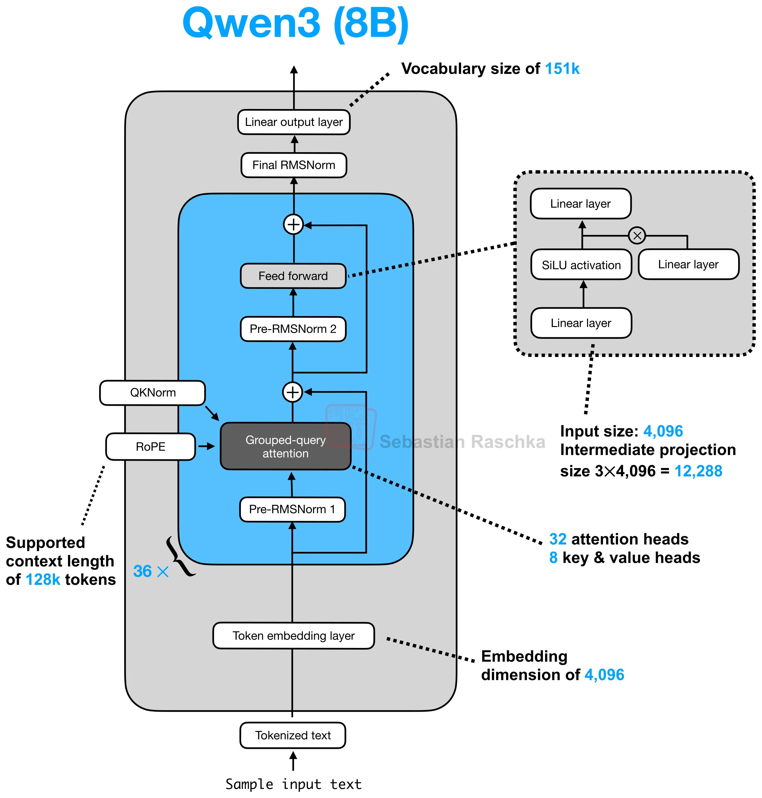
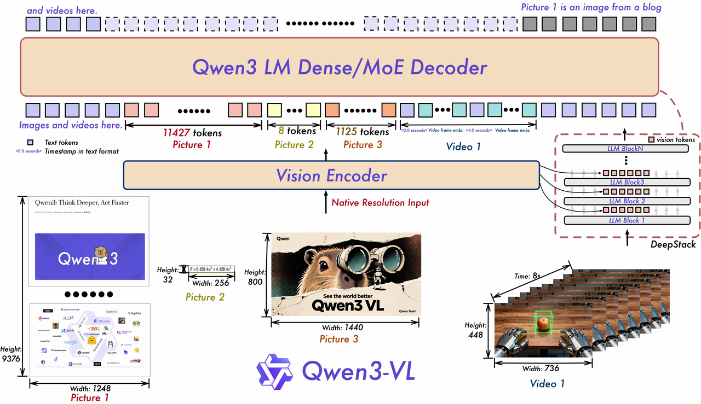
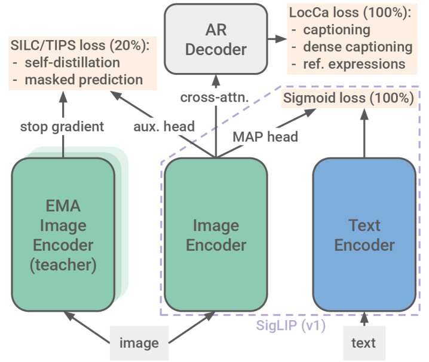
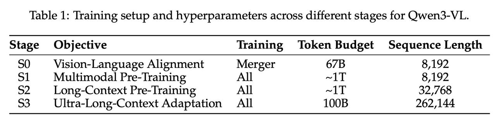

# Qwen3 与 Qwen3-VL 架构

## 知识点解析

### 概述

Qwen3 是 Qwen 系列的新一代大语言模型，Qwen3-VL 则是在 Qwen3 LLM backbone 上接入视觉编码器和视觉语言连接层的多模态模型。

面试里讲 Qwen3 / Qwen3-VL，不要只说“中文模型”或“多模态模型”，更应该抓住两条主线：

```text
Qwen3 文本模型：
Decoder-only Transformer
  + GQA
  + RoPE
  + QK-Norm
  + Pre-RMSNorm
  + SwiGLU FFN
  + 长上下文
  + Instruct / Thinking 能力

Qwen3-VL 多模态模型：
SigLIP-2-based Vision Encoder
  + Native Dynamic Resolution
  + 3D Patch Embedding
  + Interleaved-MRoPE
  + DeepStack
  + MLP-based Vision-Language Merger
  + Qwen3 LLM Backbone
```

一句话总结：

```text
Qwen3 负责强文本理解、推理和生成；Qwen3-VL 在它前面接入视觉编码和视觉 token 对齐，让图像、视频、文档、OCR、GUI 截图也能进入同一个自回归解码器统一推理。
```

### Qwen3 文本模型架构

Qwen3 文本模型仍然是主流的 **[Decoder-only](<../基础架构/Decoder-only vs Encoder-Decoder.md>) [Transformer](<../基础架构/Transformer.md>)**：

```text
token ids
  -> token embedding
  -> N 层 decoder blocks
  -> final RMSNorm
  -> linear lm head
  -> next-token logits
```

以 Qwen3-8B 为例，公开资料中常见结构信息是：

| 结构位置 | Qwen3-8B 信息 | 作用 |
| --- | --- | --- |
| Token embedding | hidden size 约 4096 | 把 token id 映射为连续向量 |
| Decoder block | 约 36 层 | 堆叠 attention 和 FFN 形成深层语义建模 |
| [Attention](<../基础架构/Self-Attention.md>) | 32 query heads，8 KV heads | [GQA](<../基础架构/GQA.md>)，降低 [KV cache](<../../05_推理部署与系统/推理工程/KV_Cache与Prefill_Decode.md>) 和推理成本 |
| Position encoding | [RoPE](<../基础架构/RoPE.md>) | 注入位置信息，支撑长上下文 |
| Attention stabilization | QK-Norm | 对 query/key 做归一化，提高注意力稳定性 |
| Norm | Pre-RMSNorm | 子层前归一化，训练更稳定 |
| FFN | SwiGLU-style MLP，中间维度约 3 x hidden size | 门控前馈网络，增强非线性表达 |
| Output | final [RMSNorm](<../基础架构/RMSNorm.md>) + linear output layer，词表约 151k | 输出 next-token logits |
| Context | 支持长上下文，例如 128k 级别 | 长文档、长视频、多轮对话会共同消耗上下文 |



这里最值得记的是：

```text
Qwen3 dense models 延续 Qwen2.5 主干：GQA、SwiGLU、RoPE、Pre-RMSNorm；
同时移除 Qwen2 中的 QKV-bias，并引入 QK-Norm。
```

### Qwen3 Decoder Block

一个 Qwen3 decoder block 可以简化为：

```text
x
  -> RMSNorm
  -> Q, K, V projection
  -> QK-Norm
  -> RoPE
  -> Grouped-Query Self-Attention
  -> residual
  -> RMSNorm
  -> SwiGLU FFN
  -> residual
```

关键组件作用：

- **GQA**：多个 query heads 共享较少的 key/value heads，减少 KV cache，适合长上下文和高并发推理。
- **RoPE**：把位置信息注入 query/key，适合相对位置建模和长上下文扩展。
- **QK-Norm**：对 query/key 做归一化，缓解 attention logits 过大或不稳定的问题。
- **Pre-RMSNorm**：每个子层前先归一化，让深层 Transformer 更稳定。
- **[SwiGLU](<../../03_训练优化与对齐/参数/常见激活函数.md>)**：门控 FFN，表达能力通常比普通 MLP 更强。

### Qwen3 为什么仍然是 Decoder-only

Qwen3 和 [GPT](<里程碑模型/GPT.md>)、[Llama](<里程碑模型/Llama.md>)、[DeepSeek](<里程碑模型/DeepSeek.md>) 等主流生成模型一样采用 Decoder-only，原因是：

1. **任务统一**：对话、代码、数学推理、工具调用、结构化输出都可以统一成 next-token prediction。
2. **训练目标简单**：预训练直接做自回归语言建模，不需要 encoder-decoder 两套结构。
3. **推理工程成熟**：[KV Cache](<../../05_推理部署与系统/推理工程/KV_Cache与Prefill_Decode.md>)、[Continuous Batching](<../../05_推理部署与系统/推理工程/Batching.md>)、[vLLM](<../../05_推理部署与系统/推理工程/vLLM.md>)、[量化](<../../05_推理部署与系统/推理工程/量化.md>)、张量并行都主要围绕 decoder-only 优化。
4. **后训练方便**：[SFT](<../../03_训练优化与对齐/后训练与对齐/SFT 监督微调.md>)、[DPO](<../../03_训练优化与对齐/后训练与对齐/DPO 直接偏好优化.md>)、[RLHF](<../../03_训练优化与对齐/后训练与对齐/RLHF 基于人类反馈的强化学习.md>)、[RLVR](<../../03_训练优化与对齐/后训练与对齐/RLVR 可验证奖励强化学习.md>)、长 [CoT](<../应用与问题/CoT.md>) 蒸馏都能直接作用在生成序列上。

代价是：它不是专门的表示模型，所以检索、向量[召回](<../../05_推理部署与系统/系统设计/召回粗排精排重排.md>)、排序任务通常会用 Qwen Embedding / Reranker 这类专门模型。

### Instruct 与 Thinking 模式

Qwen3 系列一个重要特征是区分不同使用形态：

```text
Instruct：
直接回答、指令遵循、通用助手、结构化输出

Thinking：
显式生成更长推理过程，适合数学、代码、多步推理、复杂视觉推理
```

可以理解为：

```text
简单任务：直接回答，减少延迟和 token 成本
复杂任务：开启 thinking，让模型有更多 test-time compute
```

工程上要注意：

- Thinking 能提升复杂推理，但会增加延迟和输出 token。
- 不是所有线上任务都应该打开长思考。
- 对关键帧任务，训练时可以用结构化 CoT 蒸馏；线上是否输出完整 CoT 要看延迟、解析和安全要求。
- 如果只是要 `<answer>{"time": ...}</answer>`，可以让模型内部学会推理，但输出保持短格式。

### Qwen3-VL 总体架构

Qwen3-VL 是三模块架构：

```text
image / video frames
  -> SigLIP-2-based Vision Encoder
  -> visual patch/token representations
  -> MLP-based Vision-Language Merger
  -> visual embeddings aligned to Qwen3 hidden size
  -> Qwen3 LLM Backbone
  -> text / timestamp / box / JSON / tool call
```



对应关系：

| 模块 | 输入 | 核心机制 | 输出 |
| --- | --- | --- | --- |
| Vision Encoder | 图像、视频帧、动态分辨率视觉张量 | SigLIP-2-based [ViT](<里程碑模型/ViT.md>)、动态分辨率、3D patch embedding、Interleaved-MRoPE、DeepStack | 视觉 patch/token 表示 |
| Merger | Vision Encoder 输出特征 | 空间 token 合并 + MLP 投影 | 与 Qwen3 hidden size 对齐的视觉 embedding |
| Qwen3 LLM | 文本 token、视觉占位 token、视觉 embedding、位置/时间信息 | Decoder-only Transformer，Dense/MoE 版本，自回归建模 | 文本答案、时间戳、坐标、结构化输出或工具调用 |

它不是“纯文本 Qwen3 外挂一个看图模块”这么简单。Qwen3-VL 在输入 embedding、位置编码、视觉特征注入和训练流程上都做了多模态适配。

### Vision Encoder：SigLIP-2-based ViT

Qwen3-VL 的视觉侧基于 SigLIP-2 视觉编码器继续训练和适配。

SigLIP-2 可以理解为更强的视觉语言编码器，相比传统 [CLIP](<../../06_视觉多模态与生成模型/多模态模型/CLIP.md>) 式 softmax contrastive loss，SigLIP 把 batch 内图文配对看成独立二分类问题；SigLIP-2 进一步强化多语言、OCR、定位、dense features 等能力。



这里要注意：**SigLIP-2 是一个视觉编码器家族，不同变体层数和输入分辨率不同**。放到 Qwen3-VL 里说时，重点不是泛泛背 SigLIP-2，而是记住 Qwen3-VL 使用的 **SigLIP-2-based ViT** 配置。

Qwen3-VL 视觉编码器可以按下面这张表记：

| 组件 | 常见配置 | 作用 |
| --- | --- | --- |
| Patch Embedding | `patch_size=16`，`temporal_patch_size=2` | 把图像/视频切成时空 patch，并投影成视觉 token |
| ViT body | **27 层 Transformer blocks** | 对视觉 token 做多层 self-attention 和 FFN 建模 |
| Hidden size | 约 `1152` | 视觉 token 的特征维度 |
| Attention heads | 约 `16` 个 head | 在视觉 token 之间建模空间/时间关系 |
| Position encoding | Interleaved-MRoPE | 同时编码文本位置、图像 H/W 和视频时间 T |
| DeepStack | 常取中间层特征，如第 8/16/24 层附近 | 把中间视觉特征注入 LLM 早期层，保留 OCR、按钮、局部控件细节 |
| Merger | `spatial_merge_size=2` + MLP | 合并相邻视觉 token，并投影到 Qwen3 hidden size |

一个视觉 Transformer block 内部可以简化成：

```text
visual tokens
  -> Norm
  -> Multi-Head Self-Attention + Interleaved-MRoPE
  -> residual
  -> Norm
  -> MLP / FFN
  -> residual
```

所以它本质上还是 [ViT](<里程碑模型/ViT.md>)：先把图像/视频切 patch，再用 Transformer 处理 patch 序列。Qwen3-VL 的特殊点在于：它把普通二维图像 ViT 扩展到视频时空 patch，并通过 Interleaved-MRoPE、DeepStack 和 Merger 让视觉 token 更适合接入 Qwen3 decoder。

Qwen3-VL 里 Vision Encoder 的输入处理流程是：

```text
image / video
  -> 动态分辨率缩放
  -> 时空 patch 化
  -> ViT 编码
  -> image_grid_thw / video_grid_thw 元信息
  -> visual tokens
```

关键点：

- **Native Dynamic Resolution**：按 `min_pixels`、`max_pixels`、`total_pixels` 控制视觉 token 预算。复杂图像保留更多细节，简单图像少用 token。
- **3D Patch Embedding**：图像可以看作时间维为 1 的视频；视频按 `T x H x W` 切成时空 patch。公开实现中常见设置是 `patch_size=16`、`temporal_patch_size=2`。
- **image_grid_thw / video_grid_thw**：记录视觉 token 的时间、高度、宽度网格，用于位置编码和视觉 token 对齐。

对 UI / 文档 / 视频任务来说，动态分辨率非常重要：如果统一压成低分辨率，小字、按钮、价格、角标、表格会丢；如果全量高分辨率输入，视觉 token 会爆炸。

### Qwen3-VL 接受什么图像尺寸

Qwen3-VL **不是固定输入 `224x224`、`336x336` 或 `448x448` 的视觉模型**。它支持 Native Dynamic Resolution，原始图片可以是任意合理的宽高比例，processor 会根据视觉 token 预算动态调整尺寸。

需要区分三个尺寸：

```text
原始尺寸：
  图片文件本身的 W x H，例如手机截图的竖屏尺寸。

预处理尺寸：
  processor resize 后送入 Vision Encoder 的 W' x H'。

视觉 token 网格：
  resize 后再按 patch 和 spatial merge 切分得到的 grid_thw。
```

所以模型不是直接把原始图片的每个像素送进去，也不是把所有图片都压成同一个固定正方形。

### 每张图片都会 resize 吗

通常会。Qwen3-VL 的 processor 会根据配置对图片做缩放和尺寸对齐，主要逻辑是：

```text
原始图片
  -> 保持宽高比缩放
  -> 让总像素数落在 min_pixels / max_pixels 预算内
  -> 将宽高对齐到 patch 和 spatial merge 需要的倍数
  -> 切成视觉 patch/token
```

一般不会通过拉伸把图片强行变成正方形，而是尽量保持原始宽高比。对于手机 UI 截图，这一点很重要：强行正方形 resize 会改变页面布局比例，细小文字和控件也更容易失真。

### resize 后如何计算视觉 token

以 Qwen3-VL 常见视觉配置为例：

```text
patch_size = 16
spatial_merge_size = 2
```

图片经过 resize 后，可以粗略理解为：

```text
原始视觉 patch 数
  ≈ (H' / 16) * (W' / 16)

Merger 后视觉 token 数
  ≈ (H' / 32) * (W' / 32)
```

这里的 `32` 来自 `patch_size * spatial_merge_size`。实际 token 数还会受具体 processor、边界取整和模型版本影响，最终应以 processor 生成的 `image_grid_thw` 为准。

视频则多一个时间维：

```text
video_grid_thw = [T, H, W]
```

其中 `T` 是时间 patch 网格，`H/W` 是空间 patch 网格。视频的帧率、总帧数、空间分辨率和视觉 token 预算会共同决定最终输入规模。

### `min_pixels`、`max_pixels` 和 `total_pixels`

常见控制参数可以这样理解：

| 参数 | 作用 |
| --- | --- |
| `min_pixels` | 约束图片不能被缩得过小，保证文字和局部细节有最低分辨率 |
| `max_pixels` | 限制单张图片最大像素预算，防止高分辨率图片产生过多视觉 token |
| `total_pixels` | 视频或多图片输入的总像素/token 预算，控制整个样本的视觉成本 |
| `image_grid_thw` | 记录图片经过 patch 化后的空间网格 |
| `video_grid_thw` | 记录视频经过时空 patch 化后的 T/H/W 网格 |

不同 checkpoint 和 processor 的默认值可能不同，不能把某一个项目的 `max_pixels` 当成 Qwen3-VL 的固定输入尺寸。实际使用时应以模型目录里的 processor 配置和运行参数为准。

### 固定尺寸和动态尺寸怎么选

| 方式 | 特点 | 适合场景 |
| --- | --- | --- |
| 动态分辨率 | 保持比例，按像素/token 预算变化 | 通用图片、手机截图、文档、多模态问答 |
| 固定 resize | 所有图片变成同一尺寸，吞吐和显存更容易预估 | 受限的批处理、严格固定输入的实验 |
| 固定像素预算 | 尺寸不一定相同，但总视觉 token 大致受控 | 线上服务和长视频，通常是更实用的折中 |

对关键帧/UI 任务，通常不建议直接把所有图片固定压到很小的正方形。更合理的做法是保留宽高比，用 `min_pixels` 保证小字可读，再用 `max_pixels` 或视觉 token 上限控制显存。

### Interleaved-MRoPE

Qwen3-VL 使用 Interleaved-MRoPE 来表达多维位置。

普通文本 RoPE 只需要一维 token 位置；多模态输入则有：

```text
文本位置
图像高度 H
图像宽度 W
视频时间 T
```

旧式 MRoPE 如果把时间信息集中在一部分频段，长视频里事件先后、动作边界和帧间顺序可能不够稳定。Interleaved-MRoPE 的思路是把时间、高度、宽度维度交错分布到位置编码频段里，让时间和空间都得到更均衡的位置表达。

对关键帧任务，它直接影响：

- 能否区分“先出现”和“后稳定”。
- 能否定位第一次满足完成态。
- 能否理解视频中的转场、刷新、二次加载。
- 能否把自然语言里的“首次”“之后”“重新出现”对齐到帧序列。

### DeepStack

只使用 Vision Encoder 最后一层特征时，低层纹理、小字边缘、UI 控件细节可能已经被压缩。DeepStack 的思路是从 ViT 多个中间层抽取视觉特征，并注入到 LLM 多个早期层。

它解决的问题：

- 最后一层偏语义，可能丢细节。
- UI、OCR、文档和 GUI grounding 依赖局部细粒度证据。
- 视频任务既要看整体事件，也要看局部组件是否稳定。

所以 DeepStack 对关键帧任务很有价值：它能让模型在语言推理时同时利用低层视觉细节和高层语义。

### Merger：视觉语言连接层

Merger 是 Qwen3-VL 里的视觉语言连接层，主要承担两件事：

```text
视觉 token 压缩
  + 视觉特征投影到 Qwen3 hidden size
```

处理逻辑：

1. 接收 Vision Encoder 输出的一串视觉 patch 特征。
2. 按 `spatial_merge_size` 合并相邻空间 patch，例如 2x2 patch 合并成更粗粒度 token。
3. 用 MLP 把视觉特征投影到 Qwen3 LLM 的 hidden size。
4. 保持和 `image_grid_thw` / `video_grid_thw` 的顺序对齐。

为什么需要 Merger：

- 高分辨率图像和长视频会产生太多视觉 token，需要压缩。
- ViT hidden size 和 Qwen3 hidden size 不一定一致，需要投影。
- 视觉 patch 表示和语言 token 表示空间不同，需要对齐。

### 视频输入链路

Qwen3-VL 的视频输入可以概括为：

```text
视频 URL / 本地视频 / 已抽帧列表
  -> processor / qwen-vl-utils 读取视频
  -> 按 fps 或 num_frames 采样
  -> 动态分辨率缩放
  -> pixel_values_videos
  -> video_grid_thw
  -> Vision Encoder
  -> Merger
  -> Qwen3 LLM
```

一个典型消息格式：

```python
messages = [{
    "role": "user",
    "content": [
        {"type": "video", "video": "https://example.com/demo.mp4", "fps": 2.0},
        {"type": "text", "text": "请描述视频中的关键事件，并给出发生时间。"},
    ],
}]
```

经过 processor 后，核心输入通常包括：

```text
input_ids
attention_mask
pixel_values_videos
video_grid_thw
```

模型最终仍然是自回归生成文本 token。视频不会被“输出成视频”，而是被转成：

- 自然语言描述。
- 时间戳或时间段。
- 视觉定位坐标。
- JSON / XML-like 结构化结果。
- 工具调用或 GUI action。

### Qwen3-VL 为什么能做时间定位

Qwen3-VL 能做秒级视频定位，不是因为模型真的连续看完每一帧，而是因为几个机制共同作用：

1. **采样帧携带时间顺序**：输入视频经过 fps/num_frames 采样形成帧序列。
2. **video_grid_thw 保留时间维度**：视觉 token 不是无序图片集合，而是有时间网格信息。
3. **Interleaved-MRoPE 编码 T/H/W**：时间和空间位置一起进入位置编码。
4. **视频时间戳对齐训练**：训练中学习“文本时间戳 - 视频事件边界”的对应关系。
5. **LLM 统一推理**：Qwen3 decoder 在文本条件、视觉 token 和时间位置共同约束下生成秒数或结构化答案。

这也解释了为什么关键帧任务要严格对齐 FPS、抽帧策略、帧数上限和评测逻辑：如果输入侧时间采样和评测侧不一致，模型输出的时间就可能看似合理但无法对齐真实 GT。

### Qwen3-VL 预训练过程

Qwen3-VL 的预训练大致分四个阶段：

| 阶段 | 目标 | 训练对象 | 序列长度重点 |
| --- | --- | --- | --- |
| Stage 0: Vision-Language Alignment | 让视觉和语言空间对齐 | 主要训练 Merger | 约 8k |
| Stage 1: Multimodal Pre-Training | 建立通用多模态理解能力 | 所有组件 | 约 8k |
| Stage 2: Long-Context Pre-Training | 扩展长上下文处理能力 | 所有组件 | 约 32k |
| Stage 3: Ultra-Long-Context Adaptation | 适配超长上下文 | 所有组件 | 约 256k |



Stage 0 很关键：视觉编码器和 LLM 原本不在同一个表示空间，先训练 Merger 能让视觉 token 更快贴近语言空间，降低后续全模型训练难度。

Stage 2/3 对视频和长文档非常重要，因为多帧视频会消耗大量上下文。如果没有长上下文训练，模型即使能看图，也很难稳定处理长视频和多页文档。

### Qwen3-VL 后训练过程

Qwen3-VL 后训练主要包括 SFT、强到弱蒸馏和 RL。

#### SFT

SFT 负责教模型遵循指令、输出目标格式，并激活多模态推理能力。文档中提到 SFT 分阶段扩展上下文：

```text
先做 32k 上下文 SFT
再扩展到 256k 上下文
```

数据上区分：

- 标准格式数据：用于非思维模型，强调直接回答和格式稳定。
- CoT 格式数据：用于思维模型，显式模拟推理过程。

冷启动数据里会混合纯文本、多模态图文和视频文本数据，并对 query/response 做过滤。

#### Query / Response Filtering

Query 过滤重点：

- 丢弃不易验证的问题。
- 最小化修改模糊指令。
- 丢弃缺乏实质内容的网络 query。

Response 过滤重点：

- 删除重复、不完整、格式错误回答。
- 丢弃离题或有害 query-response pair。
- 用奖励模型评估正确性、完整性、清晰度、有用性。
- 对 vision-grounded 任务，特别检查视觉信息是否被准确使用。

这个逻辑和你关键帧 CoT 蒸馏是一致的：不能只要“模型说得像”，必须过滤掉不可验证、离题、视觉证据不成立和格式不稳的数据。

#### Long-CoT 冷启动

Long-CoT 数据用于 Thinking 模型，核心不是让所有样本都变长，而是挑选更需要推理的数据：

- baseline 模型通过率低的样本。
- 生成更长、更详细回复的挑战样本。
- 用 Qwen3-30B-nothink 丢弃不需要视觉输入就能解决的问题。
- 过滤错误最终结果、重复、语言混用、明显凭猜测但缺少推理步骤的答案。

对关键帧任务，这意味着 CoT 应该用于边界难例，而不是所有简单样本无脑加长。

#### Strong-to-Weak Distillation

强到弱蒸馏分两类：

```text
Off-policy Distillation：
多个教师模型生成答案，学生模仿教师 response，快速建立基础能力。

On-policy Distillation：
学生先生成 response，再用教师分布或评分约束学生，常用 KL 散度对齐。
```

在关键帧任务中，可以对应为：

- 先用强 [VLM](<../../06_视觉多模态与生成模型/多模态模型/VLM与Vision_Instruction_Tuning.md>) / 强 reasoning model 生成结构化关键帧 CoT。
- 再用学生模型自己的输出做二次过滤和纠偏。
- 对齐时既看最终时间，也看边界证据是否成立。

#### RL

Qwen3-VL 后训练中包含 Reasoning RL 和 General RL。

Reasoning RL 关注复杂推理样本，文档里提到类似：

```text
每个 prompt 生成多个 response
全错样本不要
太简单样本不要
保留有区分度的数据用于 RL
```

General RL 关注泛化和鲁棒性，优化：

- 指令遵循。
- 偏好对齐。
- 减少语言混用、重复、格式错误。
- 通过 rule-based reward 和 model-based reward 结合，降低 reward hacking。

对关键帧任务，可以迁移成：

```text
R = R_time + R_format + R_boundary_evidence - P_length
```

也就是同时奖励时间准确、格式可解析、边界证据完整，并惩罚冗长或无效推理。

### 与关键帧任务的关系

Qwen3-VL 对关键帧任务有几个直接启发：

| Qwen3-VL 机制 | 对关键帧任务的启发 |
| --- | --- |
| Dynamic Resolution | UI 小字、按钮、商品图不能被低分辨率压没，但要控制视觉 token |
| video_grid_thw | 训练和评测必须对齐 FPS、帧数、时间戳 |
| Interleaved-MRoPE | 关键帧本质依赖时间顺序和首次完成边界 |
| DeepStack | OCR、局部 UI 控件、角标等细节不能只靠最后层视觉特征 |
| Merger | 视觉 token 压缩会影响细节保留，尤其长视频 |
| Thinking / Long-CoT | 适合难例边界判断，但线上输出不一定保留长 CoT |
| Query/Response Filtering | CoT 蒸馏必须过滤不可验证、离题、泄漏和视觉证据不成立样本 |
| RL | 可用时间误差、格式合法、边界证据设计 reward |

所以你的关键帧方案不应该只写“用 Qwen3-VL 做多模态理解”。更完整的说法是：

```text
用 Qwen3-VL 的视频理解和时间建模能力作为基础，
通过业务 task_type 规则、结构化 CoT 蒸馏、hidden filter、FPS/帧数对齐和 reward 设计，
把通用视频理解能力收敛到“首次完成态关键帧定位”。
```

### 工程使用注意点

使用 Qwen3 / Qwen3-VL 做训练或推理时，要重点确认：

- 具体版本：Qwen3 dense / [MoE](<../基础架构/MoE.md>)、Qwen3-VL dense / MoE、Instruct / Thinking 不能混说。
- tokenizer 和 chat template 是否和训练一致。
- 视频输入是 URL、本地文件、抽帧列表还是 tensor。
- `fps`、`num_frames`、`min_pixels`、`max_pixels`、`total_pixels` 是否和评测对齐。
- `video_grid_thw`、视觉 token 数和 max context 是否会溢出。
- [LoRA](<../../03_训练优化与对齐/后训练与对齐/LoRA 低秩适配.md>) adapter 是否和 base model、vision encoder、processor 版本匹配。
- 推理框架是否支持对应 VL 输入格式，不要把纯文本 vLLM 用法直接套到视频模型上。
- Thinking 输出是否需要裁剪，避免影响结构化解析和线上延迟。

## 面试应对

### Qwen3 的架构是什么？

回答思路：按 decoder-only 主干讲，再点出 GQA、RoPE、QK-Norm、Pre-RMSNorm、SwiGLU 和长上下文。

回答模板：

Qwen3 是 decoder-only Transformer，基础目标仍然是自回归 next-token prediction。以 Qwen3-8B 为例，它大致是 4096 hidden size、36 层 decoder block，attention 采用 GQA，例如 32 个 query heads 共享 8 个 KV heads，用来降低 KV cache 和推理成本。每层是 Pre-RMSNorm、self-attention、残差，再接 Pre-RMSNorm 和 SwiGLU FFN；位置编码用 RoPE，同时引入 QK-Norm 稳定 query/key 的注意力计算。最后经过 final RMSNorm 和线性输出层映射到大词表 logits。相比只记“Qwen 是中文模型”，更关键的是它沿用了现代 LLM 的高效 decoder-only 架构，并加强了长上下文和推理能力。

### Qwen3 相比 Qwen2/Qwen2.5 架构上有什么变化？

回答思路：不要夸大，抓住“主干延续 Qwen2.5，但去掉 QKV-bias，引入 QK-Norm”。

回答模板：

Qwen3 dense models 的主干基本延续 Qwen2.5，包括 GQA、SwiGLU、RoPE 和 Pre-RMSNorm，所以它不是完全换了一套结构。比较明确的架构变化是去掉 Qwen2 中使用的 QKV-bias，并引入 QK-Norm，对 query 和 key 做归一化，让 attention logits 更稳定。除此之外，Qwen3 更重要的变化体现在模型谱系、长上下文、Instruct/Thinking 形态和后训练 recipe 上，而不是单个 block 彻底重写。

### Qwen3-VL 的整体架构是什么？

回答思路：用“三模块”回答：SigLIP-2-based Vision Encoder、MLP-based Merger、Qwen3 LLM。

回答模板：

Qwen3-VL 是三模块架构：第一部分是 SigLIP-2-based Vision Encoder，它本质上是视觉 Transformer，常见配置是 `patch_size=16`、hidden size 约 1152、16 个 attention heads、27 层 ViT blocks，把图像或视频帧编码成视觉 patch/token 表示；第二部分是 MLP-based Vision-Language Merger，负责按 `spatial_merge_size=2` 合并部分视觉 token，并把视觉特征投影到 Qwen3 LLM 的 hidden size；第三部分是 Qwen3 LLM backbone，把文本 token、视觉占位 token、视觉 embedding 和位置时间信息放在同一个上下文里自回归建模。DeepStack 还会把部分中间视觉层特征注入 LLM 早期层，帮助保留 OCR、小按钮、局部控件等细节。所以它的本质是“视觉证据进入 Qwen3 解码器统一推理”，不是简单在文本模型旁边外挂一个看图模块。

### Qwen3-VL 的视频输入是怎么进模型的？

回答思路：按视频读取采样、动态分辨率、时空 patch、video_grid_thw、Vision Encoder、Merger、LLM 这条链路讲。

回答模板：

Qwen3-VL 的视频输入一般先由 processor 或 qwen-vl-utils 读取，视频可以来自 URL、本地文件或抽帧列表。然后按 `fps` 或 `num_frames` 采样，并根据 `min_pixels`、`max_pixels`、`total_pixels` 做动态分辨率缩放。采样帧会被切成时空 patch，形成 `pixel_values_videos` 和 `video_grid_thw`，其中 `video_grid_thw` 记录时间、高度、宽度网格。接着 Vision Encoder 编码视觉 token，Merger 把视觉 token 压缩并投影到 Qwen3 hidden size，最后和文本 token 一起进入 Qwen3 decoder 生成答案。

### Qwen3-VL 的图像输入尺寸是固定的吗？

回答思路：先否定固定分辨率，再讲动态 resize、像素预算、宽高比和 patch 对齐。

回答模板：

Qwen3-VL 通常不是固定输入分辨率的模型，不要求所有图片都变成 `224x224` 或 `448x448`。processor 会尽量保持原图宽高比，根据 `min_pixels`、`max_pixels` 和多图/视频的总像素预算进行 resize，再把宽高对齐到 patch 和 spatial merge 需要的倍数。以常见的 `patch_size=16`、`spatial_merge_size=2` 为例，Merger 后的视觉 token 网格大致按 `H'/32` 和 `W'/32` 计算。这样可以在保留手机截图小字和布局比例的同时控制显存和上下文成本。具体尺寸和 token 数应以当前 checkpoint 的 processor 配置以及 `image_grid_thw`/`video_grid_thw` 为准。

### Interleaved-MRoPE 和 DeepStack 分别解决什么？

回答思路：Interleaved-MRoPE 讲时间/空间位置建模，DeepStack 讲多层视觉细节注入。

回答模板：

Interleaved-MRoPE 解决的是多模态位置编码问题。视频和图像不只有文本的一维位置，还有时间、高度、宽度三个维度；Interleaved-MRoPE 把 T/H/W 交错分布到位置编码频段里，让模型更稳定地理解空间布局和时间顺序。DeepStack 解决的是视觉细节丢失问题：只用 ViT 最后一层可能会丢掉 OCR、小按钮、边缘控件等低层细节，所以它从 ViT 多个中间层抽取特征，并注入到 LLM 早期层，让低层细节和高层语义都能参与推理。

### Qwen3-VL 为什么能做视频时间定位？

回答思路：强调不是逐帧全看，而是采样帧、时间网格、位置编码、时间戳对齐训练和 LLM 统一生成共同作用。

回答模板：

Qwen3-VL 能做视频时间定位，是因为视频输入不是无序图片集合。采样帧保留时间顺序，`video_grid_thw` 记录时间、高度、宽度网格，Interleaved-MRoPE 把时间和空间位置编码进视觉 token，训练时又学习了“视频事件边界”和“文本时间戳”的对应关系。最后 Qwen3 decoder 在文本问题、视觉 token 和时间位置信息共同约束下生成秒数或时间段。所以它不是连续逐帧扫描，而是在采样和 token budget 下学习时间事件对齐。

### Qwen3-VL 的训练流程怎么理解？

回答思路：按预训练四阶段 + 后训练 SFT/蒸馏/RL 讲，不要只说“图文对齐”。

回答模板：

Qwen3-VL 训练可以分成预训练和后训练两部分。预训练先做 Stage 0 视觉语言对齐，主要训练 Merger，让视觉特征贴近语言空间；然后 Stage 1 做通用多模态预训练；Stage 2 扩展到长上下文；Stage 3 做超长上下文适配。后训练里，SFT 教模型遵循指令和输出格式，并区分普通数据和 CoT 数据；Strong-to-Weak Distillation 用强教师模型蒸馏学生能力；RL 则进一步优化推理、指令遵循和偏好对齐。对视频任务来说，长上下文训练、数据过滤、CoT 冷启动和 RL 都很关键。

### Qwen3-VL 对关键帧任务有什么启发？

回答思路：从动态分辨率、时间网格、Interleaved-MRoPE、DeepStack、CoT 过滤和 reward 设计落到你的项目。

回答模板：

Qwen3-VL 对关键帧任务的启发是：模型侧已经具备视频 token、时间位置和视觉语言统一推理能力，但业务效果取决于怎么把它约束到“首次完成态”这个目标上。动态分辨率提醒我们不能把 UI 小字和按钮压没；`video_grid_thw` 和 Interleaved-MRoPE 提醒我们训练评测要对齐 FPS、帧数和时间戳；DeepStack 说明 OCR、角标、控件细节很重要；后训练里的数据过滤和 Long-CoT 冷启动说明 CoT 不能无脑加长，而要针对边界难例，并做 hidden filter；RL 可以用时间误差、格式合法和边界证据设计 reward。所以关键帧方案应该是 Qwen3-VL 能力 + 业务规则 + CoT 蒸馏 + 评测对齐，而不是只换一个更强模型。
