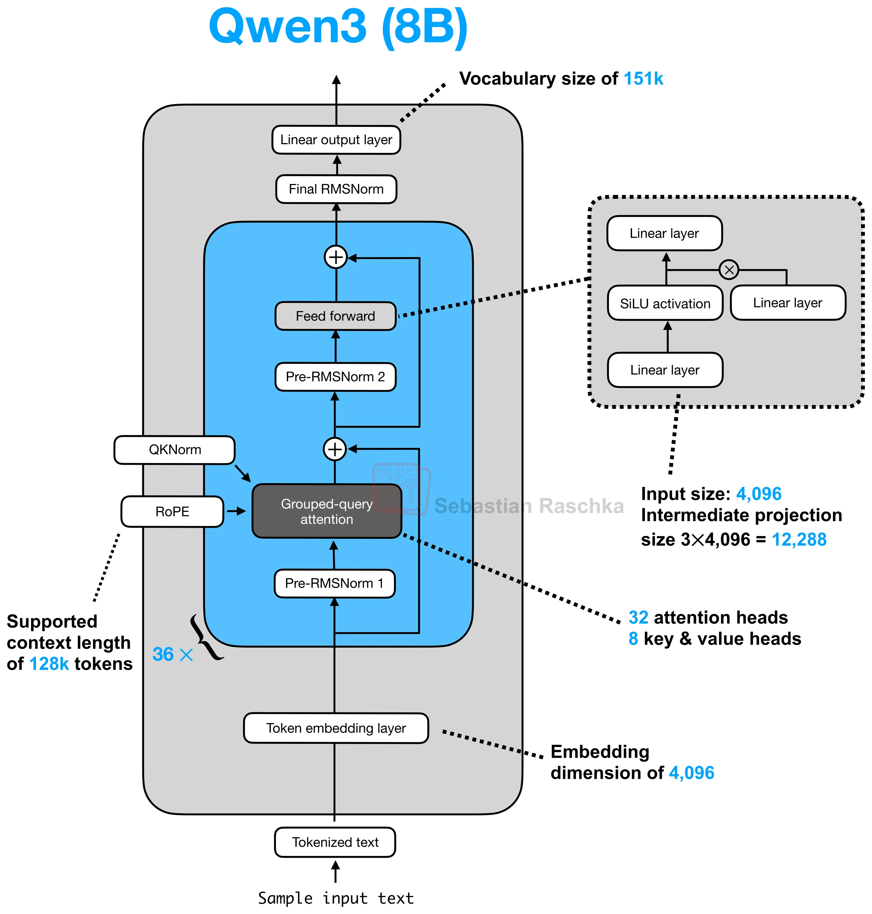
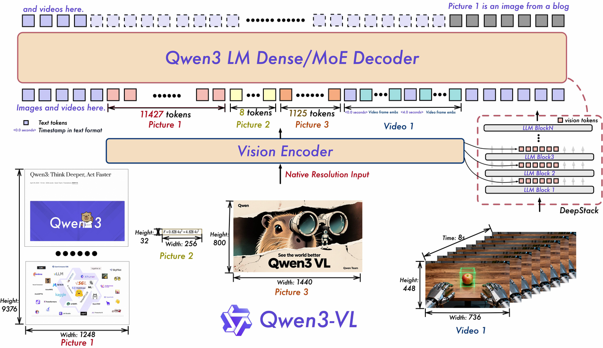
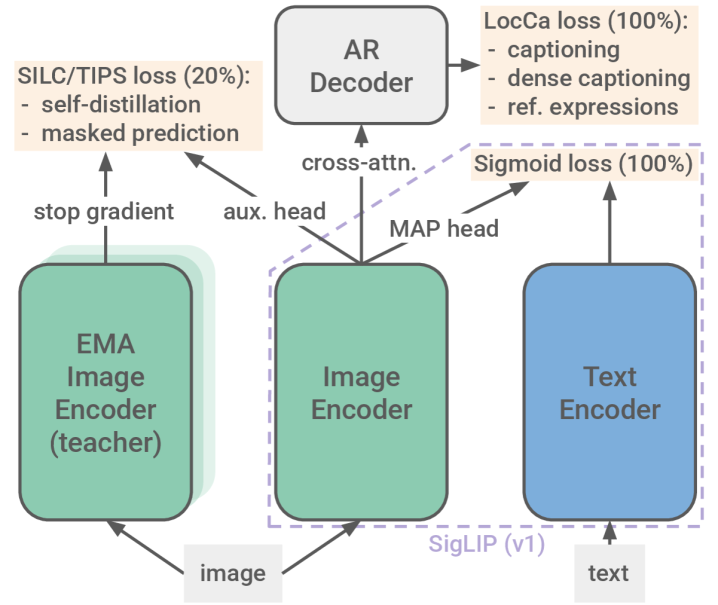
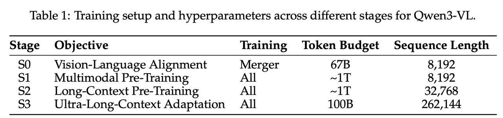

# Qwen3 与 Qwen3-VL 架构

## 知识点解析

### 概述

Qwen3 是 Qwen 系列的新一代大语言模型，Qwen3-VL 则是在 Qwen3 LLM backbone 上接入视觉编码器和视觉语言连接层的多模态模型。

面试里讲 Qwen3 / Qwen3-VL，不要只说“中文模型”或“多模态模型”，更应该抓住两条主线：

```text
Qwen3 文本模型：
Decoder-only Transformer
  + GQA
  + RoPE
  + QK-Norm
  + Pre-RMSNorm
  + SwiGLU FFN
  + 长上下文
  + Instruct / Thinking 能力

Qwen3-VL 多模态模型：
SigLIP-2-based Vision Encoder
  + Native Dynamic Resolution
  + 3D Patch Embedding
  + 视觉位置编码
  + DeepStack
  + MLP-based Vision-Language Merger
  + Qwen3 LLM Backbone 中的 Interleaved-MRoPE
```

一句话总结：

```text
Qwen3 负责强文本理解、推理和生成；Qwen3-VL 在它前面接入视觉编码和视觉 token 对齐，让图像、视频、文档、OCR、GUI 截图也能进入同一个自回归解码器统一推理。
```

如果要专门理解“文本、图像和视频到底怎样经过 processor 并进入模型”，请继续阅读[Qwen3-VL 输入处理逻辑](<Qwen3-VL输入处理逻辑.md#qwen3-vl-输入处理逻辑文本图像与视频>)。该文进一步区分了原始帧与 temporal patch，并展开说明视频 timestamp、`video_grid_thw`、Interleaved-MRoPE 和 DeepStack 的工程链路。

### Qwen3 文本模型架构

Qwen3 文本模型仍然是主流的 **[Decoder-only](<../基础架构/Decoder-only vs Encoder-Decoder.md#decoder-only-vs-encoder-decoder>) [Transformer](<../基础架构/Transformer.md#transformer>)**：

```text
token ids
  -> token embedding
  -> N 层 decoder blocks
  -> final RMSNorm
  -> linear lm head
  -> next-token logits
```

以 Qwen3-8B 为例，公开资料中常见结构信息是：

| 结构位置 | Qwen3-8B 信息 | 作用 |
| --- | --- | --- |
| Token embedding | hidden size 约 4096 | 把 token id 映射为连续向量 |
| Decoder block | 约 36 层 | 堆叠 attention 和 FFN 形成深层语义建模 |
| [Attention](<../基础架构/Self-Attention.md#self-attention>) | 32 query heads，8 KV heads | [GQA](<../基础架构/GQA.md#mha-mqa-gqa>)，降低 [KV cache](<../../05_推理部署与系统/推理工程/KV_Cache与Prefill_Decode.md#kvcache与prefilldecode>) 和推理成本 |
| Position encoding | [RoPE](<../基础架构/RoPE.md#rope>) | 注入位置信息，支撑长上下文 |
| Attention stabilization | QK-Norm | 对 query/key 做归一化，提高注意力稳定性 |
| Norm | Pre-RMSNorm | 子层前归一化，训练更稳定 |
| FFN | SwiGLU-style MLP，中间维度约 3 x hidden size | 门控前馈网络，增强非线性表达 |
| Output | final [RMSNorm](<../基础架构/RMSNorm.md#rmsnorm>) + linear output layer，词表约 151k | 输出 next-token logits |
| Context | 支持长上下文，例如 128k 级别 | 长文档、长视频、多轮对话会共同消耗上下文 |



这里最值得记的是：

```text
Qwen3 dense models 延续 Qwen2.5 主干：GQA、SwiGLU、RoPE、Pre-RMSNorm；
同时移除 Qwen2 中的 QKV-bias，并引入 QK-Norm。
```

### Qwen3 Decoder Block

一个 Qwen3 decoder block 可以简化为：

```text
x
  -> RMSNorm
  -> Q, K, V projection
  -> QK-Norm
  -> RoPE
  -> Grouped-Query Self-Attention
  -> residual
  -> RMSNorm
  -> SwiGLU FFN
  -> residual
```

关键组件作用：

- **GQA**：多个 query heads 共享较少的 key/value heads，减少 KV cache，适合长上下文和高并发推理。
- **RoPE**：把位置信息注入 query/key，适合相对位置建模和长上下文扩展。
- **QK-Norm**：对 query/key 做归一化，缓解 attention logits 过大或不稳定的问题。
- **Pre-RMSNorm**：每个子层前先归一化，让深层 Transformer 更稳定。
- **[SwiGLU](<../../01_机器学习基础/深度学习基础/常见激活函数.md#常见激活函数>)**：门控 FFN，表达能力通常比普通 MLP 更强。

### Qwen3 为什么仍然是 Decoder-only

Qwen3 和 [GPT](<里程碑模型/GPT.md#gpt>)、[Llama](<里程碑模型/Llama.md#llama-架构>)、[DeepSeek](<里程碑模型/DeepSeek.md#deepseek-架构>) 等主流生成模型一样采用 Decoder-only，原因是：

1. **任务统一**：对话、代码、数学推理、工具调用、结构化输出都可以统一成 next-token prediction。
2. **训练目标简单**：预训练直接做自回归语言建模，不需要 encoder-decoder 两套结构。
3. **推理工程成熟**：[KV Cache](<../../05_推理部署与系统/推理工程/KV_Cache与Prefill_Decode.md#kvcache与prefilldecode>)、[Continuous Batching](<../../05_推理部署与系统/推理工程/Batching.md#batching>)、[vLLM](<../../05_推理部署与系统/推理工程/vLLM.md#vllm>)、[量化](<../../05_推理部署与系统/推理工程/量化.md#量化>)、张量并行都主要围绕 decoder-only 优化。
4. **后训练方便**：[SFT](<../../03_训练优化与对齐/后训练与对齐/SFT 监督微调.md#sft-监督微调>)、[DPO](<../../03_训练优化与对齐/后训练与对齐/DPO 直接偏好优化.md#dpo-直接偏好优化>)、[RLHF](<../../03_训练优化与对齐/后训练与对齐/RLHF 基于人类反馈的强化学习.md#rlhf-基于人类反馈的强化学习>)、[RLVR](<../../03_训练优化与对齐/后训练与对齐/RLVR 可验证奖励强化学习.md#rlvr-可验证奖励强化学习>)、长 [CoT](<../应用与问题/CoT.md#cot>) 蒸馏都能直接作用在生成序列上。

代价是：它不是专门的表示模型，所以检索、向量[召回](<../../09_搜索推荐广告/召回粗排精排重排.md#召回粗排精排与重排>)、排序任务通常会用 Qwen Embedding / Reranker 这类专门模型。

### Instruct 与 Thinking 模式

Qwen3 系列一个重要特征是区分不同使用形态：

```text
Instruct：
直接回答、指令遵循、通用助手、结构化输出

Thinking：
显式生成更长推理过程，适合数学、代码、多步推理、复杂视觉推理
```

可以理解为：

```text
简单任务：直接回答，减少延迟和 token 成本
复杂任务：开启 thinking，让模型有更多 test-time compute
```

工程上要注意：

- Thinking 能提升复杂推理，但会增加延迟和输出 token。
- 不是所有线上任务都应该打开长思考。
- 对关键帧任务，训练时可以用结构化 CoT 蒸馏；线上是否输出完整 CoT 要看延迟、解析和安全要求。
- 如果只是要 `<answer>{"time": ...}</answer>`，可以让模型内部学会推理，但输出保持短格式。

### Qwen3-VL 总体架构

Qwen3-VL 是三模块架构：

```text
image / video frames
  -> SigLIP-2-based Vision Encoder
  -> visual patch/token representations
  -> MLP-based Vision-Language Merger
  -> visual embeddings aligned to Qwen3 hidden size
  -> Qwen3 LLM Backbone
  -> text / timestamp / box / JSON / tool call
```



对应关系：

| 模块 | 输入 | 核心机制 | 输出 |
| --- | --- | --- | --- |
| Vision Encoder | 图像、视频帧、动态分辨率视觉张量 | SigLIP-2-based [ViT](<里程碑模型/ViT.md#vit>)、动态分辨率、3D patch embedding、视觉位置编码、DeepStack | 视觉 patch/token 表示 |
| Merger | Vision Encoder 输出特征 | 空间 token 合并 + MLP 投影 | 与 Qwen3 hidden size 对齐的视觉 embedding |
| Qwen3 LLM | 文本 token、视觉占位 token、视觉 embedding、位置/时间信息 | Decoder-only Transformer，Dense/MoE 版本，自回归建模 | 文本答案、时间戳、坐标、结构化输出或工具调用 |

它不是“纯文本 Qwen3 外挂一个看图模块”这么简单。Qwen3-VL 在输入 embedding、位置编码、视觉特征注入和训练流程上都做了多模态适配。

### Vision Encoder：SigLIP-2-based ViT

Qwen3-VL 的视觉侧基于 SigLIP-2 视觉编码器继续训练和适配。

SigLIP-2 可以理解为更强的视觉语言编码器，相比传统 [CLIP](<里程碑模型/CLIP.md#clip>) 式 softmax contrastive loss，SigLIP 把 batch 内图文配对看成独立二分类问题；SigLIP-2 进一步强化多语言、OCR、定位、dense features 等能力。



这里要注意：**SigLIP-2 是一个视觉编码器家族，不同变体层数和输入分辨率不同**。放到 Qwen3-VL 里说时，重点不是泛泛背 SigLIP-2，而是记住 Qwen3-VL 使用的 **SigLIP-2-based ViT** 配置。

Qwen3-VL 视觉编码器可以按下面这张表记：

| 组件 | 常见配置 | 作用 |
| --- | --- | --- |
| Patch Embedding | `patch_size=16`，`temporal_patch_size=2` | 把图像/视频切成时空 patch，并投影成视觉 token |
| ViT body | **27 层 Transformer blocks** | 对视觉 token 做多层 self-attention 和 FFN 建模 |
| Hidden size | 约 `1152` | 视觉 token 的特征维度 |
| Attention heads | 约 `16` 个 head | 在视觉 token 之间建模空间/时间关系 |
| Position encoding | Vision Encoder 内的视觉位置编码 | 在视觉编码阶段表示 patch 的空间与时间位置 |
| DeepStack | 常取中间层特征，如第 8/16/24 层附近 | 把中间视觉特征注入 LLM 早期层，保留 OCR、按钮、局部控件细节 |
| Merger | `spatial_merge_size=2` + MLP | 合并相邻视觉 token，并投影到 Qwen3 hidden size |

一个视觉 Transformer block 内部可以简化成：

```text
visual tokens
  -> Norm
  -> Multi-Head Self-Attention + 视觉位置编码
  -> residual
  -> Norm
  -> MLP / FFN
  -> residual
```

所以它本质上还是 [ViT](<里程碑模型/ViT.md#vit>)：先把图像/视频切 patch，再用带视觉位置编码的 Transformer 处理 patch 序列。Qwen3-VL 的特殊点在于：它把普通二维图像 ViT 扩展到视频时空 patch，并通过 DeepStack 和 Merger 让视觉 token 更适合接入 Qwen3 decoder；进入 LLM 多模态序列后，再由 Interleaved-MRoPE 编码文本与视觉 token 的多维位置。

### 多模态输入流与位置建模

Qwen3-VL 在架构层面的输入流可以压缩为：

```text
text -> tokenizer ---------------------------------------> Qwen3 LLM
image -> dynamic resize -> 2D patch -> Vision Encoder --+
video -> frame sampling -> 3D patch -> Vision Encoder --+-> Merger -> visual embeddings -> Qwen3 LLM
```

文本 token 与视觉 embedding 在同一自回归序列中建模。图像和视频采用动态分辨率与 token 预算；视频额外保留时间结构。Interleaved-MRoPE 在 LLM 侧编码视觉 token 的时间、高度和宽度结构，绝对视频时间则由文本时间戳表达。

processor 字段、`image_grid_thw`/`video_grid_thw`、视觉 token 计算、动态 resize 参数、Interleaved-MRoPE 细节以及逐 temporal patch 的视频时间戳流程统一见 [Qwen3-VL 输入处理逻辑](<Qwen3-VL输入处理逻辑.md#qwen3-vl-输入处理逻辑文本图像与视频>)。

### DeepStack

只使用 Vision Encoder 最后一层特征时，低层纹理、小字边缘、UI 控件细节可能已经被压缩。DeepStack 的思路是从 ViT 多个中间层抽取视觉特征，并注入到 LLM 多个早期层。

它解决的问题：

- 最后一层偏语义，可能丢细节。
- UI、OCR、文档和 GUI grounding 依赖局部细粒度证据。
- 视频任务既要看整体事件，也要看局部组件是否稳定。

所以 DeepStack 对关键帧任务很有价值：它能让模型在语言推理时同时利用低层视觉细节和高层语义。

### Merger：视觉语言连接层

Merger 是 Qwen3-VL 里的视觉语言连接层，主要承担两件事：

```text
视觉 token 压缩
  + 视觉特征投影到 Qwen3 hidden size
```

处理逻辑：

1. 接收 Vision Encoder 输出的一串视觉 patch 特征。
2. 按 `spatial_merge_size` 合并相邻空间 patch，例如 2x2 patch 合并成更粗粒度 token。
3. 用 MLP 把视觉特征投影到 Qwen3 LLM 的 hidden size。
4. 保持和 `image_grid_thw` / `video_grid_thw` 的顺序对齐。

为什么需要 Merger：

- 高分辨率图像和长视频会产生太多视觉 token，需要压缩。
- ViT hidden size 和 Qwen3 hidden size 不一定一致，需要投影。
- 视觉 patch 表示和语言 token 表示空间不同，需要对齐。

### Qwen3-VL 预训练过程

Qwen3-VL 的预训练大致分四个阶段：

| 阶段 | 目标 | 训练对象 | 序列长度重点 |
| --- | --- | --- | --- |
| Stage 0: Vision-Language Alignment | 让视觉和语言空间对齐 | 主要训练 Merger | 约 8k |
| Stage 1: Multimodal Pre-Training | 建立通用多模态理解能力 | 所有组件 | 约 8k |
| Stage 2: Long-Context Pre-Training | 扩展长上下文处理能力 | 所有组件 | 约 32k |
| Stage 3: Ultra-Long-Context Adaptation | 适配超长上下文 | 所有组件 | 约 256k |



Stage 0 很关键：视觉编码器和 LLM 原本不在同一个表示空间，先训练 Merger 能让视觉 token 更快贴近语言空间，降低后续全模型训练难度。

Stage 2/3 对视频和长文档非常重要，因为多帧视频会消耗大量上下文。如果没有长上下文训练，模型即使能看图，也很难稳定处理长视频和多页文档。

### Qwen3-VL 后训练过程

Qwen3-VL 后训练主要包括 SFT、强到弱蒸馏和 RL。

#### SFT

SFT 负责教模型遵循指令、输出目标格式，并激活多模态推理能力。文档中提到 SFT 分阶段扩展上下文：

```text
先做 32k 上下文 SFT
再扩展到 256k 上下文
```

数据上区分：

- 标准格式数据：用于非思维模型，强调直接回答和格式稳定。
- CoT 格式数据：用于思维模型，显式模拟推理过程。

冷启动数据里会混合纯文本、多模态图文和视频文本数据，并对 query/response 做过滤。

#### Query / Response Filtering

Query 过滤重点：

- 丢弃不易验证的问题。
- 最小化修改模糊指令。
- 丢弃缺乏实质内容的网络 query。

Response 过滤重点：

- 删除重复、不完整、格式错误回答。
- 丢弃离题或有害 query-response pair。
- 用奖励模型评估正确性、完整性、清晰度、有用性。
- 对 vision-grounded 任务，特别检查视觉信息是否被准确使用。

这个逻辑和你关键帧 CoT 蒸馏是一致的：不能只要“模型说得像”，必须过滤掉不可验证、离题、视觉证据不成立和格式不稳的数据。

#### Long-CoT 冷启动

Long-CoT 数据用于 Thinking 模型，核心不是让所有样本都变长，而是挑选更需要推理的数据：

- baseline 模型通过率低的样本。
- 生成更长、更详细回复的挑战样本。
- 用 Qwen3-30B-nothink 丢弃不需要视觉输入就能解决的问题。
- 过滤错误最终结果、重复、语言混用、明显凭猜测但缺少推理步骤的答案。

对关键帧任务，这意味着 CoT 应该用于边界难例，而不是所有简单样本无脑加长。

#### Strong-to-Weak Distillation

强到弱蒸馏分两类：

```text
Off-policy Distillation：
多个教师模型生成答案，学生模仿教师 response，快速建立基础能力。

On-Policy Distillation 在线策略蒸馏：
学生先生成 response，再用教师分布或评分约束学生，常用 KL 散度对齐。
```

详细方法见 [On-Policy Distillation 在线策略蒸馏](<../../03_训练优化与对齐/后训练与对齐/On-Policy Distillation 在线策略蒸馏.md#on-policy-distillation-在线策略蒸馏>)。

在关键帧任务中，可以对应为：

- 先用强 [VLM](<../../02_大模型/视觉多模态与生成模型/多模态模型/VLM与Vision_Instruction_Tuning.md#vlm-与-vision-instruction-tuning>) / 强 reasoning model 生成结构化关键帧 CoT。
- 再用学生模型自己的输出做二次过滤和纠偏。
- 对齐时既看最终时间，也看边界证据是否成立。

#### RL

Qwen3-VL 后训练中包含 Reasoning RL 和 General RL。

Reasoning RL 关注复杂推理样本，文档里提到类似：

```text
每个 prompt 生成多个 response
全错样本不要
太简单样本不要
保留有区分度的数据用于 RL
```

General RL 关注泛化和鲁棒性，优化：

- 指令遵循。
- 偏好对齐。
- 减少语言混用、重复、格式错误。
- 通过 rule-based reward 和 model-based reward 结合，降低 reward hacking。

对关键帧任务，可以迁移成：

$$
R
=R_{\text{time}}
+R_{\text{format}}
+R_{\text{boundary evidence}}
-P_{\text{length}}.
$$

也就是同时奖励时间准确、格式可解析、边界证据完整，并惩罚冗长或无效推理。

### 与关键帧任务的关系

Qwen3-VL 对关键帧任务有几个直接启发：

| Qwen3-VL 机制 | 对关键帧任务的启发 |
| --- | --- |
| [输入处理与时间对齐](<Qwen3-VL输入处理逻辑.md#qwen3-vl-输入处理逻辑文本图像与视频>) | 采样必须覆盖关键事件，训练与评测使用一致时间坐标，并在细节与视觉 token 成本间取舍 |
| DeepStack | OCR、局部 UI 控件、角标等细节不能只靠最后层视觉特征 |
| Merger | 视觉 token 压缩会影响细节保留，尤其长视频 |
| Thinking / Long-CoT | 适合难例边界判断，但线上输出不一定保留长 CoT |
| Query/Response Filtering | CoT 蒸馏必须过滤不可验证、离题、泄漏和视觉证据不成立样本 |
| RL | 可用时间误差、格式合法、边界证据设计 reward |

所以你的关键帧方案不应该只写“用 Qwen3-VL 做多模态理解”。更完整的说法是：

```text
用 Qwen3-VL 的视频理解和时间建模能力作为基础，
通过业务 task_type 规则、结构化 CoT 蒸馏、hidden filter、FPS/帧数对齐和 reward 设计，
把通用视频理解能力收敛到“首次完成态关键帧定位”。
```

### 工程使用注意点

使用 Qwen3 / Qwen3-VL 做训练或推理时，要重点确认：

- 具体版本：Qwen3 dense / [MoE](<../基础架构/MoE.md#moe>)、Qwen3-VL dense / MoE、Instruct / Thinking 不能混说。
- tokenizer 和 chat template 是否和训练一致。
- 图像/视频的 processor、采样、网格、时间戳和 token 预算按 [Qwen3-VL 输入处理逻辑](<Qwen3-VL输入处理逻辑.md#qwen3-vl-输入处理逻辑文本图像与视频>) 核对。
- [LoRA](<../../03_训练优化与对齐/后训练与对齐/LoRA 低秩适配.md#lora-低秩适配>) adapter 是否和 base model、vision encoder、processor 版本匹配。
- 推理框架是否支持对应 VL 输入格式，不要把纯文本 vLLM 用法直接套到视频模型上。
- Thinking 输出是否需要裁剪，避免影响结构化解析和线上延迟。

## 面试应对

### Qwen3 的架构是什么？

回答思路：按 decoder-only 主干讲，再点出 GQA、RoPE、QK-Norm、Pre-RMSNorm、SwiGLU 和长上下文。

回答模板：

Qwen3 是 decoder-only Transformer，基础目标仍然是自回归 next-token prediction。以 Qwen3-8B 为例，它大致是 4096 hidden size、36 层 decoder block，attention 采用 GQA，例如 32 个 query heads 共享 8 个 KV heads，用来降低 KV cache 和推理成本。每层是 Pre-RMSNorm、self-attention、残差，再接 Pre-RMSNorm 和 SwiGLU FFN；位置编码用 RoPE，同时引入 QK-Norm 稳定 query/key 的注意力计算。最后经过 final RMSNorm 和线性输出层映射到大词表 logits。相比只记“Qwen 是中文模型”，更关键的是它沿用了现代 LLM 的高效 decoder-only 架构，并加强了长上下文和推理能力。

### Qwen3 相比 Qwen2/Qwen2.5 架构上有什么变化？

回答思路：不要夸大，抓住“主干延续 Qwen2.5，但去掉 QKV-bias，引入 QK-Norm”。

回答模板：

Qwen3 dense models 的主干基本延续 Qwen2.5，包括 GQA、SwiGLU、RoPE 和 Pre-RMSNorm，所以它不是完全换了一套结构。比较明确的架构变化是去掉 Qwen2 中使用的 QKV-bias，并引入 QK-Norm，对 query 和 key 做归一化，让 attention logits 更稳定。除此之外，Qwen3 更重要的变化体现在模型谱系、长上下文、Instruct/Thinking 形态和后训练 recipe 上，而不是单个 block 彻底重写。

### Qwen3-VL 的整体架构是什么？

回答思路：用“三模块”回答：SigLIP-2-based Vision Encoder、MLP-based Merger、Qwen3 LLM。

回答模板：

Qwen3-VL 是三模块架构：第一部分是 SigLIP-2-based Vision Encoder，它本质上是视觉 Transformer，常见配置是 `patch_size=16`、hidden size 约 1152、16 个 attention heads、27 层 ViT blocks，把图像或视频帧编码成视觉 patch/token 表示；第二部分是 MLP-based Vision-Language Merger，负责按 `spatial_merge_size=2` 合并部分视觉 token，并把视觉特征投影到 Qwen3 LLM 的 hidden size；第三部分是 Qwen3 LLM backbone，把文本 token、视觉占位 token、视觉 embedding 和位置时间信息放在同一个上下文里自回归建模。DeepStack 还会把部分中间视觉层特征注入 LLM 早期层，帮助保留 OCR、小按钮、局部控件等细节。所以它的本质是“视觉证据进入 Qwen3 解码器统一推理”，不是简单在文本模型旁边外挂一个看图模块。

### Qwen3-VL 的文本、图像和视频如何进入模型？

回答思路：只讲架构级主链路；processor 字段、网格计算、位置编码和视频时间戳转到输入专题。

回答模板：

纯文本经过 tokenizer 直接进入 Qwen3 LLM；图像和视频先经过动态预处理与 patch 化，再由 Vision Encoder 编码、Merger 压缩并投影成视觉 embedding，最后与文本 token 一起进入 Qwen3 decoder。视频还需要保留时间结构，模型结合文本时间戳和多维位置编码理解事件顺序。具体 processor 字段、动态尺寸、视觉 token 数、网格计算、Interleaved-MRoPE 和视频时间对齐见 [Qwen3-VL 输入处理逻辑](<Qwen3-VL输入处理逻辑.md#qwen3-vl-输入处理逻辑文本图像与视频>)。

### Qwen3-VL 的训练流程怎么理解？

回答思路：按预训练四阶段 + 后训练 SFT/蒸馏/RL 讲，不要只说“图文对齐”。

回答模板：

Qwen3-VL 训练可以分成预训练和后训练两部分。预训练先做 Stage 0 视觉语言对齐，主要训练 Merger，让视觉特征贴近语言空间；然后 Stage 1 做通用多模态预训练；Stage 2 扩展到长上下文；Stage 3 做超长上下文适配。后训练里，SFT 教模型遵循指令和输出格式，并区分普通数据和 CoT 数据；Strong-to-Weak Distillation 用强教师模型蒸馏学生能力；RL 则进一步优化推理、指令遵循和偏好对齐。对视频任务来说，长上下文训练、数据过滤、CoT 冷启动和 RL 都很关键。

### Qwen3-VL 对关键帧任务有什么启发？

回答思路：从动态分辨率、时间网格、Interleaved-MRoPE、DeepStack、CoT 过滤和 reward 设计落到你的项目。

回答模板：

Qwen3-VL 对关键帧任务的启发是：模型侧已经具备视频 token、时间位置和视觉语言统一推理能力，但业务效果取决于怎么把它约束到“首次完成态”这个目标上。动态分辨率提醒我们不能把 UI 小字和按钮压没；`video_grid_thw` 和 Interleaved-MRoPE 提醒我们训练评测要对齐 FPS、帧数和时间戳；DeepStack 说明 OCR、角标、控件细节很重要；后训练里的数据过滤和 Long-CoT 冷启动说明 CoT 不能无脑加长，而要针对边界难例，并做 hidden filter；RL 可以用时间误差、格式合法和边界证据设计 reward。所以关键帧方案应该是 Qwen3-VL 能力 + 业务规则 + CoT 蒸馏 + 评测对齐，而不是只换一个更强模型。
