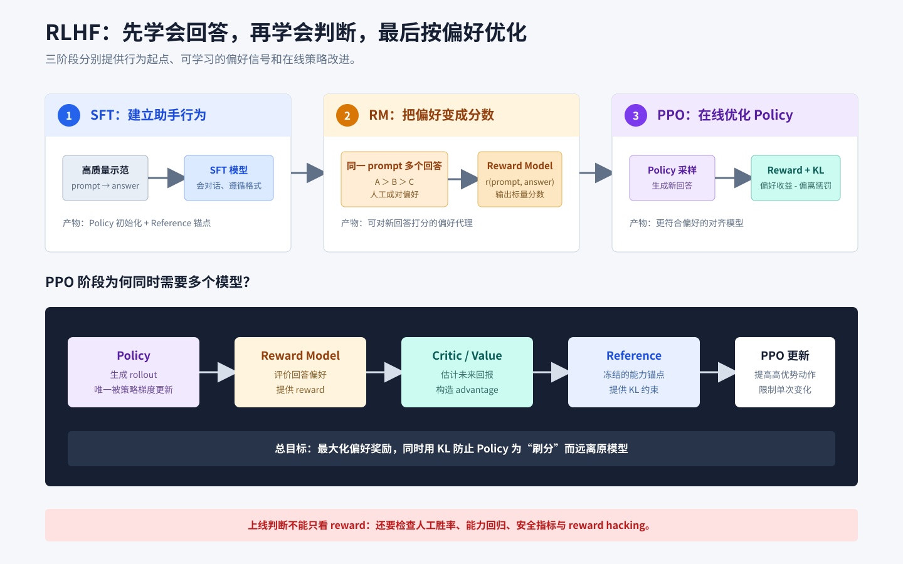
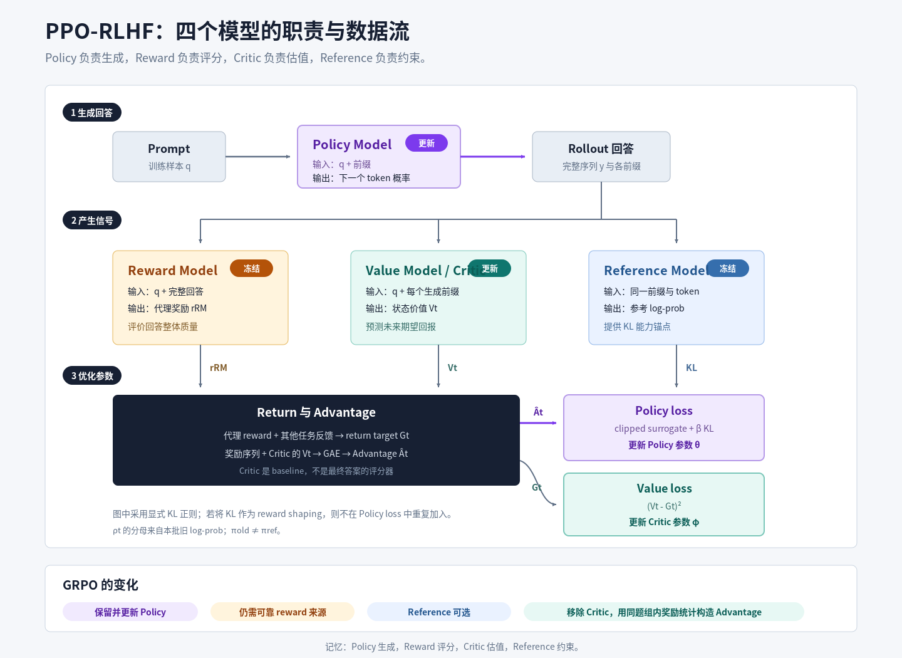

# RLHF 基于人类反馈的强化学习

## 知识点解析

### 概述

RLHF（Reinforcement Learning from Human Feedback，基于人类反馈的强化学习）是用人类偏好训练奖励模型，再用强化学习优化语言模型，使模型输出更符合人类偏好。



### 典型流程

```text
预训练模型
  -> SFT 得到初始助手模型
  -> 收集多答案偏好排序
  -> 训练 Reward Model
  -> 用 PPO 等算法优化策略模型
  -> 评测与安全对齐
```

### 为什么需要 RLHF

[SFT](<SFT 监督微调.md#sft-监督微调>) 能让模型学会回答格式，但不一定能优化这些偏好：

- 有帮助。
- 真实可靠。
- 遵循指令。
- 不胡说。
- 不输出危险内容。
- 风格自然。

RLHF 试图把这些偏好转成可优化的奖励信号。

### 偏好数据与 Reward Model 训练

RLHF 的第二阶段训练 [Reward Model](<Reward Model 与 Grader 奖励模型与评分器.md#reward-model-与-grader-奖励模型与评分器>)。它输入 prompt 和 answer，输出一个分数，表示该回答有多符合偏好。

训练数据通常来自：

- 同一 prompt 的多个候选回答。
- 人类标注排序。
- 成对偏好数据。

### PPO 阶段

[PPO（Proximal Policy Optimization，近端策略优化）](<PPO 近端策略优化.md#ppo-近端策略优化>) 把语言模型看成策略模型，通过 Reward Model 给出的奖励进行优化。

实践中会加入 KL（Kullback-Leibler，库尔贝克-莱布勒）散度约束，避免模型偏离 SFT 模型太远。正则化目标可以概括为：

$$
J(\theta)
=R_{\mathrm{preference}}
-\beta\,
\operatorname{KL}
\left(
\pi_{\mathrm{policy}}
\middle\|
\pi_{\mathrm{reference}}
\right).
$$

### PPO-RLHF 中四个模型的分工



| 模型 | 它回答的问题 | 输入与输出 | PPO 阶段是否更新 |
| --- | --- | --- | --- |
| `Policy Model / Actor` | 下一个 token 应该生成什么？ | 状态 $s_t=(q,y_{<t})$ $\rightarrow$ 下一个 token 的概率分布 | 更新 |
| `Reward Model` | 完整回答获得多少代理奖励？ | $(q,y)$ $\rightarrow$ 奖励分数 $r_{\mathrm{RM}}$ | 通常先单独训练，PPO 阶段冻结 |
| `Value Model / Critic` | 从当前生成状态继续下去，预计能获得多少回报？ | 状态 $s_t=(q,y_{<t})$ $\rightarrow$ 价值估计 $V_\phi(s_t)$ | 更新 |
| `Reference Model` | Policy 相对初始模型偏离了多少？ | 同一状态和 token 序列 $\rightarrow$ 参考 log-prob，用于计算 KL | 冻结 |

#### Policy Model 是什么，为什么它是最终被优化的模型？

Policy Model（策略模型）也叫 Actor。对语言模型而言，状态 $s_t$ 是 `prompt + 已生成的 token 前缀`，动作 $a_t$ 是下一个 token。Policy 输出：

$$
\pi_\theta(a_t\mid s_t)
=\pi_\theta(y_t\mid q,y_{<t}).
$$

Policy 先在线采样得到 rollout，再根据 advantage 调整已采样 token 的概率。正优势表示结果好于基线，对应 token 获得提高概率的激励；负优势则获得降低概率的激励。训练完成后，真正部署用于生成回答的通常也是 Policy，另外三个模型主要服务于训练。

#### Reward Model 是什么，它和 Critic 有什么区别？

Reward Model（奖励模型）输入 prompt 和完整回答，输出一个标量：

$$
r_{\mathrm{RM}}=R_\psi(q,y).
$$

它通常先用人类偏好排序数据训练，使 chosen 回答得分高于 rejected 回答，然后在 PPO 阶段冻结。它回答的是“这份完整回答获得多少代理奖励”，不负责预测生成中间状态的未来回报。Reward Model 只是人类偏好或真实任务目标的近似，因此高 reward 不一定代表真实质量更高，还要防范长度偏差、分布外失真和 reward hacking。

#### Value Model / Critic 是什么，它如何参与 Advantage 计算？

Value Model（价值模型）也叫 Critic。它输入当前状态 $s_t=(q,y_{<t})$，估计从该前缀继续生成时的期望回报：

$$
V_\phi(s_t)
=\mathbb E[G_t\mid s_t].
$$

以最简形式表示，优势可以写成：

$$
A_t\approx G_t-V_\phi(s_t).
$$

Reward Model 给完整回答一个已观测代理分数，Critic 则提前预测每个生成前缀未来能获得多少回报。Critic 充当 baseline，用来判断结果比预期好还是差，并降低策略梯度方差。实际 PPO 常先计算 return target，再用 GAE 等方法结合 $V_\phi(s_t)$ 构造 advantage。

Critic 通过价值损失拟合固定的 return target，因此也要训练。它可能是与 Policy 同量级的独立模型，也可能与 Policy 共享骨干或只增加 value head；前者会带来更多参数、激活、优化器状态和前向计算。

#### Reference Model 是什么，为什么要冻结？

Reference Model（参考模型）通常由 Policy 的初始 checkpoint 复制而来，例如冻结的 SFT 模型。它读取与 Policy 相同的前缀和已采样 token，提供参考概率分布，以计算：

$$
\operatorname{KL}
\left(
\pi_{\mathrm{policy}}
\middle\|
\pi_{\mathrm{reference}}
\right).
$$

Reference 不负责生成回答、判断正确性或提供任务奖励。它是一个冻结锚点：KL 系数过小时 Policy 容易为追求 reward 而过度漂移，过大时则可能几乎学不动。

#### 四个模型在一次 PPO-RLHF 迭代中如何协作？

一次典型 PPO-RLHF 迭代可以概括为：

```text
1. Policy 对 prompt 生成 rollout，并保存旧 log-prob。
2. Reward Model 对完整回答给出代理 reward。
3. Reference 对同一 token 序列提供参考 log-prob，用于 KL 约束。
4. 根据 reward 和其他任务反馈计算奖励序列与 return target。
5. Critic 预测各 token 前缀的状态价值，并参与构造 advantage。
6. Policy loss 使用 advantage、新旧策略概率比和图中采用的显式 KL 正则更新 Policy。
7. Value loss 让 Critic 的价值预测拟合固定 return target，从而更新 Critic。
8. Reward Model 和 Reference 在 PPO 阶段保持冻结。
```

图中采用显式 KL 正则。另一类实现会把 KL 惩罚并入逐 token reward；此时 Policy loss 不应重复加入同一项 KL。

#### Reference Model 和 Old Policy 有什么区别？

这两个模型都可能来自 Policy 的某个历史版本，但用途和刷新频率不同：

- `Old Policy`，即 $\pi_{\mathrm{old}}$：生成本批 rollout 的行为策略，或保存下来的旧 log-prob；它是 PPO 概率比 $\rho_t=\pi_\theta/\pi_{\mathrm{old}}$ 的分母，并随新一轮采样刷新。
- `Reference Model`，即 $\pi_{\mathrm{ref}}$：较长期冻结的能力锚点，用于 KL 约束，通常不会每批刷新。

#### GRPO 为什么可以去掉 Critic？

[GRPO](<GRPO 组相对策略优化.md#grpo-组相对策略优化>) 保留 Policy 和 reward 来源，可选保留 Reference，但移除 Critic，改用同一个 prompt 下多条回答的组内奖励均值与标准差构造相对 advantage。它省去了价值模型训练成本，但仍需承担多次 rollout、评分和策略更新成本。

### 常见风险

- Reward Hacking：模型学会钻奖励模型漏洞。
- Reward Collapse：奖励信号失真导致输出质量崩坏。
- 标注偏差：人类偏好不一致。
- 成本高：需要大量采样和训练。
- 稳定性差：PPO 对超参数敏感。

### 和 DPO 的区别

- RLHF + PPO：显式训练 Reward Model，再强化学习优化。
- [DPO](<DPO 直接偏好优化.md#dpo-直接偏好优化>)：直接用偏好对优化策略，不单独训练 Reward Model。

DPO 更简单稳定，但表达能力和可控性取决于数据和目标设计。

## 面试应对

### 易错点

- 把 Reward Model 和 Critic 当成同一个模型：前者给完整回答代理奖励，后者预测当前状态的未来回报。
- 把 Reference Model 和 Old Policy 当成同一个模型：前者是长期 KL 锚点，后者是本批概率比的分母。
- 认为四个模型都同时更新：PPO 阶段通常只更新 Policy 和 Critic。
- 把 Reward Model 分数当成真实质量：它只是人类偏好或任务目标的代理。
- 同时把同一 KL 惩罚并入 reward 和显式 loss，造成重复约束。

### PPO-RLHF 中四个模型分别做什么？

回答思路：按“生成、评分、估值、约束”组织，再说明哪些模型更新。

回答模板：

PPO-RLHF 中，Policy Model 负责根据 prompt 和已生成前缀预测下一个 token，是最终要优化和部署的模型；Reward Model 对完整回答给出代理奖励，在 PPO 阶段通常冻结；Value Model 或 Critic 预测每个生成状态的期望回报，用来构造 advantage，并通过价值损失训练；Reference Model 是冻结的能力锚点，用 KL 限制 Policy 偏离初始模型。PPO 阶段通常只更新 Policy 和 Critic。还要注意，旧策略只负责提供本批概率比的分母，不等于 Reference。

### Reward Model 和 Critic 有什么区别？

回答思路：先给一句话区分“评分”和“估值”，再比较输入、输出、训练目标和使用位置。

回答模板：

Reward Model 和 Critic 都输出标量，但含义不同。Reward Model 输入 prompt 和完整回答，输出对回答质量的代理奖励，通常由偏好数据预先训练，并在 PPO 阶段冻结。Critic 输入 prompt 和某个生成前缀，预测从当前状态继续生成的期望回报，通过价值损失持续训练。Reward Model 负责告诉系统最终结果得了多少分，Critic 负责判断这个结果相对当前状态的预期是更好还是更差，从而辅助计算 advantage。

### Reference Model 和 Old Policy 有什么区别？

回答思路：分别说明二者进入哪个公式、何时刷新，以及是否需要长期保留。

回答模板：

Reference Model 和 Old Policy 不是同一个概念。Reference Model 是较长期冻结的能力锚点，用于计算 Policy 与初始模型之间的 KL 偏离，通常不会每个 batch 刷新。Old Policy 是生成当前这批 rollout 的行为策略，或者保存下来的旧 log-prob，用作 PPO 概率比 $\rho_t=\pi_\theta/\pi_{\mathrm{old}}$ 的分母；完成一轮更新并重新采样后，它也会刷新。简单说，Reference 管长期偏移，Old Policy 管本批更新幅度。

### PPO-RLHF 中哪些模型会更新？

回答思路：先回答 Policy 和 Critic，再说明两个冻结模型分别提供什么固定信号。

回答模板：

在典型 PPO-RLHF 阶段，Policy 和 Critic 会更新，Reward Model 和 Reference Model 保持冻结。Policy 通过 clipped policy loss 学习提高高优势动作的概率、降低低优势动作的概率；Critic 通过 value loss 拟合 return target。Reward Model 只提供代理奖励，Reference Model 只提供 KL 锚点。如果把四个模型同时更新，奖励标准和约束锚点也会随训练漂移，目标会更加不稳定。

### GRPO 为什么可以去掉 Critic？

回答思路：先说明 Critic 在 PPO 中用于构造 advantage，再说明 GRPO 的替代信号及其代价。

回答模板：

PPO 中的 Critic 预测状态价值，为策略梯度提供 advantage baseline。GRPO 不再训练状态价值函数，而是对同一个 prompt 采样多条回答，用组内奖励均值和标准差构造相对 advantage，因此可以移除 Critic。这样能节省价值模型的参数、优化器状态和计算，但代价是需要同题多次 rollout，而且训练效果依赖组内奖励差异和评分可靠性。

### RLHF 的三阶段是什么？

回答思路：按 SFT -> 训练 Reward Model -> PPO 优化的顺序讲，最后点出 KL 约束的作用。

回答模板：

RLHF 通常包括三个阶段：第一是 SFT，用高质量指令数据把预训练模型调成能对话、能遵循指令的助手模型；第二是训练 Reward Model，用人类偏好排序数据学习什么回答更好；第三是用 PPO 等强化学习算法优化策略模型，让模型在 Reward Model 打分下生成更符合人类偏好的回答，同时用 KL 约束防止偏离 SFT 模型太远。

### Reward Model 如何训练？

回答思路：讲清 pairwise 偏好数据的构造和"chosen 高分、rejected 低分"的目标，再补上线前检查。

回答模板：

Reward Model 通常用偏好排序数据训练。对同一个 prompt 采样多个回答，由人或更强模型标注哪个更好，再把这些回答组成 pairwise preference 数据。训练目标是让 Reward Model 给 chosen 更高分、给 rejected 更低分。上线前要检查标注一致性、长度偏见、领域分桶表现和 reward hacking 风险。

### PPO 阶段为什么需要 KL 约束？

回答思路：核心是"只追 reward 会跑飞、钻漏洞"，KL 把 policy 拉回 reference 附近做平衡。

回答模板：

PPO 阶段需要 KL 约束，是因为只最大化 Reward Model 分数会让策略模型偏离原来的语言分布，甚至学会钻奖励模型漏洞。KL 项把当前 policy 拉回 reference policy 附近，相当于在“追求更高 reward”和“保持原模型能力与语言质量”之间做平衡。KL 太小容易跑飞，太大则学不动。

### Reward Hacking 是什么？

回答思路：定义为"钻奖励漏洞拿高分而非真变好"，配长度偏好、过拟合单测的例子。

回答模板：

Reward Hacking 指模型没有真正变好，而是学会利用奖励函数或 Reward Model 的漏洞拿高分。例如奖励模型偏好长回答，模型就输出冗长内容；单测覆盖不足，代码模型就过拟合测试。排查时不能只看 reward 上升，还要看人工评测、分桶指标、bad case 和护栏指标。

### RLHF 和 DPO 有什么区别？

回答思路：从"是否显式训练 Reward Model、是否在线采样"这条主线对比。

回答模板：

核心区别是要不要显式的 Reward Model 和在线强化学习。RLHF+PPO 是先用偏好数据训练一个 Reward Model，再用 PPO 让策略模型在线采样、按 reward 优化，好处是能持续探索新回答、可控性强，但流程复杂、显存和调参成本高，PPO 还对超参很敏感。DPO 则跳过 Reward Model，直接用 (prompt, chosen, rejected) 偏好对，把偏好学习转成一个类似监督学习的损失，训练更简单稳定、成本低。代价是 DPO 是离线的，效果高度依赖偏好数据质量，探索能力和上限不如 RLHF。工程上数据质量好、追求稳定就用 DPO，需要更强对齐能力和在线优化时才上 RLHF。
