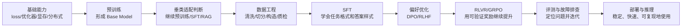
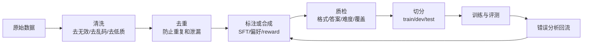
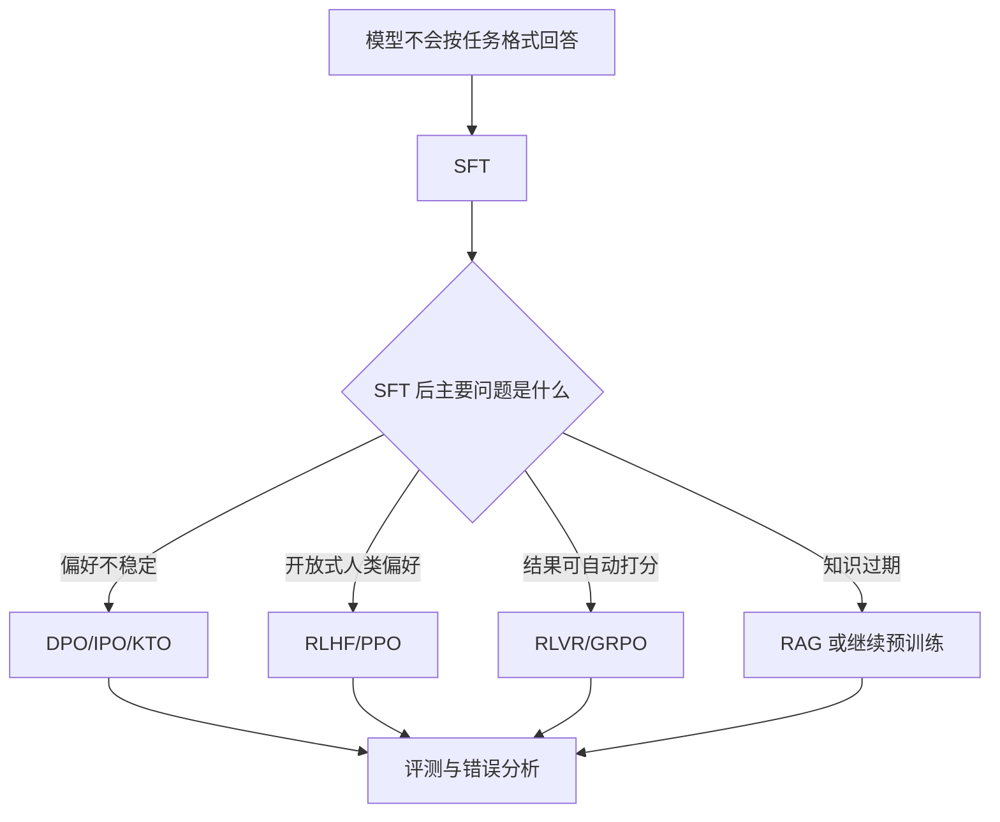

# 从零学习模型训练：预训练到后训练个人学习手册

> 来源：https://bytedance.larkoffice.com/docx/Fm4TdqbHpo1MPgx7nT1cuW4in0e

> **这份笔记的目标：**把大模型训练从“很多名词”整理成一条真实项目路线：先理解模型从哪里来，再判断任务该怎么适配，然后准备数据、训练、评测、排查问题，最后考虑推理部署。
> **核心主线：**基础能力 → 预训练直觉 → 垂类适配选择 → 数据工程 → SFT → 偏好优化 → GRPO/RLVR → 蒸馏 → 多模态视频 → 评测与故障排查 → 部署。

> **最重要的判断：**训练垂类模型时，不是把 SFT、DPO、GRPO 全部堆上去就会变强。每一步都应该对应一个明确问题：数据不够先补数据，格式不稳先 SFT，偏好不对再 DPO，指标可验证再 GRPO/RLVR，线上用不动再做推理优化。

## 总框架：模型训练到底在训练什么
大模型训练可以拆成三个层次：预训练让模型获得通用能力，后训练让模型学会按人类或任务要求输出，评测和数据迭代让模型持续变得更可靠。



### 关键概念先放在一起
| 概念 | 一句话解释 | 在训练项目里的作用 | 初学时容易误解 |
|-|-|-|-|
| Base Model | 只经过大规模预训练的基础模型。 | 提供语言、知识、代码、推理等底层能力。 | Base 不是聊天助手，不一定会听指令。 |
| Instruct Model | 经过指令微调和对齐的模型。 | 更适合作为垂类 SFT 起点，也适合做 teacher。 | Instruct 不是新架构，而是后训练版本。 |
| Continued Pretraining | 在已有模型上继续做语言模型训练。 | 补领域语料、术语、风格和知识分布。 | 不是所有知识问题都要继续预训练，很多可以用 RAG。 |
| SFT | 用输入和标准答案做监督微调。 | 让模型学会任务格式、领域表达和基本解法。 | SFT 不能自动解决偏好排序和复杂探索。 |
| DPO | 用 chosen/rejected 偏好对训练模型。 | 让模型更偏向高质量答案。 | DPO 通常不是替代 SFT，而是接在 SFT 后面。 |
| RLHF | 用人类偏好训练奖励模型，再用强化学习优化。 | 适合复杂开放式偏好和安全对齐。 | 工程复杂，reward model 可能学偏。 |
| RLVR | 用可验证奖励做强化学习。 | 适合数学、代码、格式、检索、视频时间定位等可自动打分任务。 | reward 写错会让模型钻规则漏洞。 |
| GRPO | 用同一问题的多条采样回答做组内相对优化。 | 常用于推理和可验证任务后训练。 | GRPO 是否有效主要取决于 reward、采样和稳定性。 |
| Distillation | 用强模型生成数据或推理轨迹训练小模型。 | 把 teacher 的能力迁移到 student。 | teacher 也会犯错，生成数据必须过滤。 |
| Evaluation | 固定口径衡量模型效果。 | 判断训练是否真的变好，决定下一轮怎么改。 | 只看几个样例很容易误判。 |

### 垂类模型的推荐训练顺序
| 阶段 | 先问的问题 | 常用动作 | 阶段产出 |
|-|-|-|-|
| 任务定义 | 任务输入输出是什么，指标是什么，是否可自动验证。 | 写任务说明、输出格式、评测指标。 | 任务 spec 和评测口径。 |
| 底座选择 | 模型是否支持语言、视觉、长上下文、工具调用。 | 比较 Base/Instruct、多模态能力、显存需求。 | 确定训练起点。 |
| 数据工程 | 数据从哪里来，是否干净，是否覆盖难例。 | 清洗、去重、切分、质检、构造样本。 | SFT/DPO/GRPO 数据集。 |
| SFT | 模型是否会按任务格式稳定输出。 | 监督微调、LoRA 或全参训练。 | 稳定 baseline。 |
| DPO 或偏好优化 | SFT 后是否主要是答案质量和偏好不稳定。 | 构造 chosen/rejected，训练 DPO。 | 偏好更好的模型。 |
| GRPO/RLVR | 任务是否能自动打分，reward 是否和指标一致。 | 采样、打分、KL 约束、策略优化。 | 可验证指标进一步提升。 |
| 评测和故障排查 | 提升是否真实，失败样本属于哪类。 | 固定 test set、错误分析、日志分析。 | 下一轮数据或训练方案。 |
| 部署 | 模型是否能稳定、快速、便宜地服务。 | vLLM、量化、batch、缓存、推理配置固定。 | 可上线或可复现实验服务。 |

---

## 基础能力：看懂训练脚本和日志
基础能力的目标不是一次学完所有数学，而是能读懂训练脚本、知道参数变化会带来什么影响，并能根据日志判断训练是否正常。

### 训练脚本里的常见名词
| 名词 | 是什么意思 | 为什么重要 | 实践判断 |
|-|-|-|-|
| Loss | 模型预测和目标答案之间的差距。 | 训练通常希望 loss 下降。 | loss 下降不等于任务指标一定提升，需要同时看验证集。 |
| Learning Rate | 每次参数更新的步子大小。 | 太大容易发散，太小可能学不动。 | loss 爆炸、reward 突变、KL 失控时优先检查。 |
| Batch Size | 一次更新看到多少样本。 | 影响稳定性、显存和吞吐。 | effective batch = micro batch × accumulation × GPU 数。 |
| Warmup | 训练初期逐渐升高学习率。 | 减少训练初期不稳定。 | SFT 和 RL 都常用 warmup_ratio。 |
| AdamW | 大模型常用优化器。 | 自适应更新且权重衰减更合理。 | 多数训练框架默认使用。 |
| bf16/fp16 | 低精度训练格式。 | 节省显存和提升速度。 | A800/H100 上通常优先 bf16。 |
| Gradient Checkpointing | 反向传播时重算部分激活。 | 用计算换显存。 | 长上下文和多模态训练常用。 |
| LoRA | 冻结大模型，只训练低秩适配参数。 | 降低显存和存储成本。 | 适合快速实验和资源有限场景。 |
| ZeRO/FSDP | 多卡切分参数、梯度或优化器状态。 | 让更大模型能训练。 | 系统复杂度更高，可能带来通信开销。 |
| FlashAttention | 更高效的 attention kernel。 | 减少显存访问和加速长序列。 | 长上下文和视频 token 多时很重要。 |

### 基础论文和工具论文
| 论文 / 工作 | 解决了什么问题 | 提出了什么方法 | 还有什么不足 | 为什么读 | 链接 |
|-|-|-|-|-|-|
| Attention Is All You Need | RNN/CNN 难以并行建模长距离依赖。 | 提出 Transformer 和 self-attention。 | 长序列二次复杂度带来成本问题。 | 理解 LLM 架构基础。 | [NeurIPS 2017](https://papers.nips.cc/paper_files/paper/2017/hash/3f5ee243547dee91fbd053c1c4a845aa-Abstract.html) |
| Adam | 普通 SGD 对学习率和梯度尺度敏感。 | 用一阶矩和二阶矩自适应更新。 | 权重衰减处理后来被 AdamW 改进。 | 理解优化器。 | [论文](https://arxiv.org/abs/1412.6980) |
| AdamW | Adam 中 L2 正则和权重衰减耦合。 | 解耦 weight decay。 | 仍需要调学习率和 warmup。 | 理解现代训练默认优化器。 | [ICLR 2019](https://openreview.net/forum?id=Bkg6RiCqY7) |
| LoRA | 全参微调成本高。 | 用低秩矩阵进行参数高效微调。 | 大幅改变模型能力时可能不如全参。 | 后训练常用方法。 | [ICLR 2022](https://openreview.net/forum?id=nZeVKeeFYf9) |
| ZeRO | 大模型训练显存放不下。 | 切分优化器状态、梯度和参数。 | 通信和配置复杂。 | 理解分布式训练。 | [SC 2020](https://dl.acm.org/doi/10.5555/3433701.3433727) |
| FlashAttention | attention 显存读写开销大。 | 用 IO-aware 算法优化 attention。 | 依赖硬件和 kernel 环境。 | 理解长上下文训练加速。 | [NeurIPS 2022](https://openreview.net/forum?id=H4DqfPSibmx) |

---

## 预训练：理解 Base Model 的来源
预训练的核心是 next-token prediction：给定前文预测下一个 token。大规模数据和模型容量让模型学到语言、知识、代码、推理模式和一定的 in-context learning 能力。

### 预训练相关术语
| 概念 | 解释 | 和后训练的关系 |
|-|-|-|
| Token | 模型处理文本的基本单位。 | 影响上下文长度、训练成本和格式表达。 |
| Tokenizer | 把文本切成 token 的工具。 | 中文、代码、时间戳等任务会受 tokenizer 影响。 |
| Context Length | 模型一次能看到的最大上下文。 | 长视频、长文档和 Agent 轨迹依赖长上下文。 |
| Scaling Law | 模型规模、数据量、算力和 loss 的经验规律。 | 帮助理解为什么数据和算力配比重要。 |
| Data Mixture | 预训练语料中网页、书籍、代码、数学、多语言等比例。 | 决定底座模型擅长什么。 |
| In-Context Learning | 推理时通过 prompt 中的例子临时适配任务。 | 它不是训练阶段，而是预训练涌现、后训练增强的能力。 |

### 预训练阶段需要读的关键工作
| 论文 / 工作 | 解决了什么问题 | 提出了什么方法 | 还有什么不足 | 为什么读 | 链接 |
|-|-|-|-|-|-|
| GPT-3 | 每个任务都单独微调成本高。 | 扩大自回归语言模型规模，展示 few-shot 和 in-context learning。 | 不会天然遵循指令，事实性和安全性不足。 | 理解规模化预训练的意义。 | [NeurIPS 2020](https://proceedings.neurips.cc/paper/2020/hash/1457c0d6bfcb4967418bfb8ac142f64a-Abstract.html) |
| Scaling Laws | 模型、数据、算力之间如何分配不清楚。 | 总结语言模型 loss 随规模变化的规律。 | 早期更偏向扩大模型，后来被 Chinchilla 修正。 | 理解训练预算分配。 | [论文](https://arxiv.org/abs/2001.08361) |
| Chinchilla | 很多大模型参数大但训练 token 不够。 | 提出固定算力下应更平衡地扩大模型和数据。 | 主要看语言建模 loss，不完全等同后训练能力。 | 理解数据量的重要性。 | [NeurIPS 2022](https://proceedings.neurips.cc/paper_files/paper/2022/hash/c1e2faff6f588870935f114ebe04a3e5-Abstract-Conference.html) |
| LLaMA | 闭源大模型难以复现和研究。 | 用高质量数据训练开放权重模型。 | 原始模型不是聊天助手。 | 理解开放权重生态。 | [论文](https://arxiv.org/abs/2302.13971) |
| Qwen Technical Report | 中文、多语言、代码和工具能力需要更强开放底座。 | 构建 Qwen 系列基础和对话模型。 | 不同版本差异大，训练前要确认具体模型能力。 | 和中文、多模态、Agent 训练直接相关。 | [论文](https://arxiv.org/abs/2309.16609) |

---

## 继续预训练 / SFT / RAG：垂类适配怎么选
垂类模型不一定一上来就 SFT。要先判断问题到底是知识缺失、格式不会、偏好不对，还是需要外部知识实时更新。

| 问题类型 | 典型表现 | 优先方案 | 原因 |
|-|-|-|-|
| 领域语料分布差异大 | 模型看不懂大量领域术语，表达风格和领域文本不一致。 | 继续预训练。 | 需要让模型适应领域语言分布。 |
| 模型知道相关知识但不会按任务格式答 | 内容大致对，但格式、步骤、输出结构不稳定。 | SFT。 | SFT 最擅长学习输入输出映射和格式。 |
| 知识经常变化或需要引用外部库 | 模型内置知识过期，答案需要查最新资料。 | RAG。 | 知识更新不一定要训练进参数，检索更灵活。 |
| 模型会做但好坏答案差异明显 | 同一问题有多个答案，模型常选不够好的。 | DPO 或偏好优化。 | 偏好对能告诉模型哪个答案更优。 |
| 任务结果可自动打分 | 数学、代码、格式、IoU、检索命中等可验证。 | GRPO/RLVR。 | 自动 reward 可以提供更强优化信号。 |

> **判断原则：**如果问题是“模型不知道”，考虑继续预训练或 RAG；如果问题是“模型知道但不会按要求做”，先 SFT；如果问题是“模型会做但选择不够好”，再做 DPO；如果问题是“有明确自动指标还能继续优化”，再做 GRPO/RLVR。

### 继续预训练要注意什么
| 注意点 | 说明 | 风险 |
|-|-|-|
| 语料质量 | 继续预训练不是把所有领域文本塞进去。 | 低质量语料会污染模型表达和事实性。 |
| 学习率 | 通常比从零预训练小，避免破坏原能力。 | 学习率过大可能灾难性遗忘。 |
| 数据配比 | 可以混入通用数据保持通用能力。 | 只训窄领域可能降低泛化。 |
| 评测 | 必须同时看领域能力和通用能力。 | 只看领域指标会忽略退化。 |

---

## 数据工程：训练前最容易被低估的部分
数据工程是训练效果的地基。很多训练失败不是算法不先进，而是数据格式错、标签不一致、切分泄漏、重复样本过多、难例覆盖不足。



### 不同训练阶段需要不同数据
| 训练阶段 | 数据形式 | 数据来源 | 质检重点 |
|-|-|-|-|
| 继续预训练 | 领域纯文本或文档。 | 论文、文档、业务语料、代码、日志。 | 去重、去模板噪声、去隐私、保留高质量语料。 |
| SFT | instruction + input + response，或 messages 格式。 | 人工标注、规则转换、强模型生成、历史正确样本。 | 答案正确、格式统一、覆盖任务类型。 |
| DPO | prompt + chosen + rejected。 | 人工偏好、强模型裁判、错误样本改写、A/B 输出对比。 | chosen 确实优于 rejected，差异原因清楚。 |
| RLVR/GRPO | prompt + reward function，训练时采样输出。 | 可验证任务样本、带标准答案或规则的任务。 | reward 可执行、可解释、与最终指标一致。 |
| 蒸馏 | teacher 生成答案、推理链或偏好对。 | 强模型 API、本地大模型、专家模型。 | 过滤 teacher 幻觉，控制格式和难度分布。 |
| 评测 | 固定 dev/test set。 | 人工高质量标注、历史真实样本、难例集。 | 不能混入训练集，不能只保留简单样本。 |

### 数据切分和泄漏
| 概念 | 用途 | 常见错误 | 建议 |
|-|-|-|-|
| Train Set | 用于训练模型。 | 混入测试样本导致效果虚高。 | 训练前固定切分并记录版本。 |
| Dev Set | 用于调参和选择 checkpoint。 | 反复调参导致 dev 被过拟合。 | 保留独立 test set 做最终判断。 |
| Test Set | 用于最终报告效果。 | 看到结果后再改样本，造成选择偏差。 | 冻结不动，所有模型统一评测。 |
| Dedup | 去除重复和近重复样本。 | 只做 exact match，忽略改写重复。 | 结合文本、ID、视频 ID、时间段等多字段去重。 |
| Hard Cases | 模型容易错的难样本。 | 为了提高分数删掉难样本。 | 难样本必须保留，并单独统计。 |

### SFT 数据检查表
- [ ] 输入输出格式统一，字段名和 chat template 不混乱。

- [ ] 答案是最终希望模型学习的风格，而不是临时调试格式。

- [ ] 长样本没有被截断到丢失关键信息。

- [ ] 训练集、验证集、测试集按唯一 ID 全量对齐，不随意删难样本。

- [ ] 样本覆盖常规例、边界例、负例和困难例。

- [ ] 随机抽样人工检查，确认标签和格式真实可靠。

### DPO 数据怎么构造
| 构造方式 | 适合场景 | 风险 | 建议 |
|-|-|-|-|
| 人工标注偏好 | 偏好主观、需要专家判断。 | 成本高，标注一致性难。 | 先定义偏好准则，再做一致性检查。 |
| 强模型裁判 | 开放问答、解释、摘要等。 | judge 可能有偏见或偏向长答案。 | 结合规则和人工抽检。 |
| 错误样本改写 | 已有模型常犯错。 | 只覆盖历史错误，分布可能偏。 | 和正常样本混合。 |
| 规则构造 rejected | 格式、边界、数值等规则明确任务。 | rejected 太简单会学不到细粒度偏好。 | 构造强负例，而不只是明显错误。 |

### GRPO/RLVR 数据和 reward 准备
| 准备项 | 说明 | 检查方式 |
|-|-|-|
| Prompt Set | 用于采样和强化学习的问题集合。 | 覆盖不同难度和任务类型。 |
| Reward Function | 自动给输出打分的规则或程序。 | 用人工样例测试 reward 是否符合直觉。 |
| Parser | 从模型输出中解析答案。 | 格式错误时返回明确惩罚，而不是脚本崩溃。 |
| Reference Model | 用于 KL 约束的初始模型。 | 确认和训练模型 tokenizer、模板一致。 |
| Reward Logs | 记录每条输出的各项 reward。 | 检查模型是否只优化某个子 reward。 |

---

## 后训练总览：SFT、DPO、RLHF、GRPO 的关系
后训练不是单个算法，而是一组解决不同问题的方法。SFT 解决“会不会按要求做”，DPO/RLHF 解决“哪个答案更好”，GRPO/RLVR 解决“可验证指标能否继续提升”。



### 方法选择表
| 方法 | 核心数据 | 最适合解决 | 不适合解决 | 使用判断 |
|-|-|-|-|-|
| SFT | prompt + 标准答案。 | 格式、领域表达、基础任务能力。 | 复杂偏好排序和探索。 | 几乎所有垂类训练都先做。 |
| DPO | prompt + chosen + rejected。 | 答案偏好、风格、拒答边界、简洁度。 | 模型完全不会的任务。 | SFT 后再做。 |
| RLHF/PPO | 偏好数据 + reward model + 采样输出。 | 开放式人类偏好。 | 低成本快速迭代。 | 理解原理，实际使用要考虑工程成本。 |
| RLVR/GRPO | prompt + 自动 reward。 | 数学、代码、格式、检索、时间定位等可验证任务。 | reward 难定义的主观任务。 | 可验证任务的重点进阶方向。 |
| Distillation | 强 teacher 生成的数据或轨迹。 | 把强模型能力迁移给小模型。 | teacher 不可靠的任务。 | 常比直接 RL 更容易得到稳定 baseline。 |

---

## SFT：先训练出稳定 baseline
SFT 的目标是让模型学会任务输入输出格式和基本解法。对初学者来说，第一版 SFT 不追求最高分，而是追求稳定、可复现、可解释。

### SFT 数据长什么样```json
{
  "messages": [
    {"role": "system", "content": "任务：视频时间定位。"},
    {"role": "user", "content": "请定位视频中“人物拿起杯子”的时间段。"},
    {"role": "assistant", "content": "<answer>12.4,18.7</answer>"}
  ]
}
```

### SFT 关键点
| 关键点 | 含义 | 为什么影响效果 |
|-|-|-|
| Instruction | 任务说明。 | 说明越稳定，模型越容易学习任务边界。 |
| Response | 标准答案。 | 答案质量决定模型学到什么。 |
| Chat Template | 把多轮消息拼成模型输入格式。 | 模板错会导致 role 边界错。 |
| Loss Mask | 只在 assistant 答案部分算 loss。 | 避免模型学习 user prompt。 |
| Length Control | 控制输入和输出长度。 | 截断会丢关键信息，过长会浪费显存。 |
| Data Balance | 控制不同类型样本比例。 | 避免模型只学会高频类型。 |

### SFT 关键论文
| 论文 / 工作 | 解决了什么问题 | 提出了什么方法 | 还有什么不足 | 为什么读 | 链接 |
|-|-|-|-|-|-|
| FLAN | 预训练模型不一定理解任务指令。 | 把大量任务转成 instruction 形式微调。 | 依赖任务覆盖，领域外仍可能不稳。 | 理解 instruction tuning。 | [ICLR 2022](https://openreview.net/forum?id=gEZrGCozdqR) |
| T0 | 零样本泛化需要系统指令训练。 | 用 PromptSource 构造大规模指令任务。 | 模板和数据质量影响大。 | 理解多任务 SFT。 | [ICLR 2022](https://openreview.net/forum?id=9Vrb9D0WI4) |
| Self-Instruct | 人工写指令数据成本高。 | 让模型自动生成指令和答案，再筛选训练。 | 自动数据容易同质化和继承 teacher 错误。 | 理解合成 SFT 数据。 | [ACL 2023](https://aclanthology.org/2023.acl-long.754/) |
| LIMA | 是否必须用海量 SFT 数据不清楚。 | 展示少量高质量样本也能塑造回答风格。 | 基础能力仍主要来自预训练。 | 理解数据质量的重要性。 | [NeurIPS 2023](https://proceedings.neurips.cc/paper_files/paper/2023/hash/ac662d74829e4407ce1d126477f4a03a-Abstract-Conference.html) |

---

## 偏好优化：DPO、RLHF 和偏好数据
偏好优化适合模型已经能完成任务，但在答案质量、风格、简洁性、安全边界、推理过程等方面还不稳定的场景。

### 偏好数据长什么样```json
{
  "prompt": "请解释 SFT 和 DPO 的区别。",
  "chosen": "SFT 用标准答案学习任务格式，DPO 用偏好对让模型更偏向好答案。",
  "rejected": "SFT 和 DPO 都是训练模型的方法，差不多。"
}
```

### DPO 和 RLHF 的区别
| 方法 | 核心思想 | 优点 | 风险 |
|-|-|-|-|
| Reward Model + PPO | 先训练奖励模型，再用 PPO 优化策略模型。 | 表达能力强，适合复杂偏好。 | 流程复杂，reward model 可能被利用。 |
| DPO | 直接让 chosen 的概率相对 rejected 更高。 | 不需要单独训练 reward model。 | 依赖高质量偏好对。 |
| KTO/IPO/ORPO/SimPO | 对偏好优化目标做不同改进。 | 适配不同数据条件和稳定性需求。 | 不能只看方法名，必须看验证集效果。 |

### 偏好优化关键论文
| 论文 / 工作 | 解决了什么问题 | 提出了什么方法 | 还有什么不足 | 为什么读 | 链接 |
|-|-|-|-|-|-|
| Learning to Summarize from Human Feedback | 监督学习难表达人类偏好。 | 训练 reward model，再用 RL 优化摘要模型。 | reward model 泛化有限。 | 理解 RLHF 早期范式。 | [NeurIPS 2020](https://proceedings.neurips.cc/paper/2020/hash/1f89885d556929e98d3ef9b86448f951-Abstract.html) |
| InstructGPT | GPT-3 不会稳定按人类指令帮忙。 | SFT + reward model + PPO。 | 标注和 RL 成本高。 | 理解 ChatGPT 式后训练流程。 | [NeurIPS 2022](https://proceedings.neurips.cc/paper_files/paper/2022/hash/b1efde53be364a73914f58805a001731-Abstract-Conference.html) |
| Constitutional AI | 完全依赖人工反馈成本高。 | 用规则宪法指导自我批评和偏好训练。 | 规则设计会影响模型行为。 | 理解安全对齐。 | [论文](https://arxiv.org/abs/2212.08073) |
| DPO | RLHF 训练链路复杂。 | 直接用偏好对优化策略模型。 | 对偏好数据质量敏感。 | 轻量偏好优化核心论文。 | [NeurIPS 2023](https://proceedings.neurips.cc/paper_files/paper/2023/hash/a85b405ed65c6477a4fe8302b5e06ce7-Abstract-Conference.html) |
| KTO | 很多场景没有成对偏好数据。 | 从好/坏反馈中学习。 | 依赖反馈标签质量。 | 理解非成对偏好优化。 | [ICML 2024](https://openreview.net/forum?id=iUwHnoENnl) |

---

## RLVR / GRPO：可验证任务上的进阶训练
RLVR 的关键是可验证奖励。只要模型输出可以被规则、程序或指标自动判断好坏，就可以考虑用 RLVR。GRPO 是这类训练中常见的策略优化方法。

### GRPO 的训练循环
| 步骤 | 做什么 | 容易出错的地方 |
|-|-|-|
| 采样 | 对同一 prompt 生成多条回答。 | temperature 太低会导致答案太像。 |
| 解析 | 从输出中提取答案。 | parser 不稳会导致 reward 噪声。 |
| 打分 | 用 reward function 给每条回答打分。 | reward 与最终指标不一致会优化错方向。 |
| 组内比较 | 比较同组回答的相对好坏。 | reward 方差太小会没有训练信号。 |
| 策略更新 | 提高高 reward 输出的概率。 | 更新太猛会格式崩坏。 |
| KL 约束 | 限制模型不要偏离参考模型太远。 | KL 太强学不动，太弱容易退化。 |

### 设计 reward 的原则
| 原则 | 解释 | 例子 |
|-|-|-|
| 和最终指标对齐 | reward 必须鼓励真正想提升的能力。 | 视频定位最终看 IoU，reward 就不能只看格式。 |
| 先简单后复杂 | 先做可解释规则，再叠加细分 reward。 | format reward + IoU reward + boundary reward。 |
| 防 reward hacking | 模型会利用规则漏洞拿高分。 | 只奖励标签会导致模型输出空模板。 |
| 保留语言质量 | RL 可能导致重复、啰嗦、乱码。 | 使用 KL、长度惩罚、重复惩罚。 |
| 记录 reward 分项 | 总分不够，要看每个子 reward。 | 检查模型是否只优化 format 而不优化 IoU。 |

### RLVR / 推理后训练关键工作
| 论文 / 工作 | 解决了什么问题 | 提出了什么方法 | 还有什么不足 | 为什么读 | 链接 |
|-|-|-|-|-|-|
| Training Verifiers to Solve Math Word Problems | 生成模型会产生多个看似合理但错误的解。 | 训练 verifier 对候选解打分。 | 依赖候选生成质量。 | 理解生成加验证。 | [论文](https://arxiv.org/abs/2110.14168) |
| STaR | 推理链数据难以大量人工标注。 | 自生成 rationale，再用正确答案筛选训练。 | 错误推理可能混入训练。 | 理解推理数据自举。 | [NeurIPS 2022](https://proceedings.neurips.cc/paper_files/paper/2022/hash/639a9a172c044fbb64175b5fad42e9a5-Abstract-Conference.html) |
| DeepSeekMath | 数学推理需要高质量数据和强化学习。 | 数学预训练 + SFT + GRPO。 | 数学 reward 相对容易，开放任务更难。 | 理解 GRPO 代表性用法。 | [论文](https://arxiv.org/abs/2402.03300) |
| DeepSeek-R1 | 复杂推理难以只靠 SFT 获得。 | 用 RL 诱导长链推理，并蒸馏到小模型。 | 仍有冗长、可控性和评测一致性问题。 | 理解推理模型训练范式。 | [论文](https://arxiv.org/abs/2501.12948) |

---

## 教师模型、蒸馏与合成数据
教师模型的作用是提供更强的答案、推理过程或偏好判断。蒸馏的目标是把强模型能力迁移到更小、更便宜、更可控的 student 模型。

### 教师模型是否需要 SFT
| teacher 类型 | 是否通常需要 SFT | 原因 | 判断标准 |
|-|-|-|-|
| 强 Instruct/API 模型 | 通常不需要。 | 已经具备较强指令遵循和通用能力。 | 生成数据格式稳定、正确率高、领域理解足够。 |
| Base 模型 | 通常需要。 | Base 不一定会按指令输出。 | 如果输出格式混乱或答非所问，需要先 SFT。 |
| 领域 teacher | 视情况而定。 | 领域任务可能需要先适配。 | 用小规模人工样本评估 teacher 生成质量。 |
| 多模态 teacher | 经常需要验证。 | 视觉理解和时间定位容易幻觉。 | 必须检查视频证据和时间边界。 |

### 蒸馏数据有哪些形式
| 数据形式 | 用途 | 风险 | 过滤方式 |
|-|-|-|-|
| 最终答案 | 训练 student 学会任务输出。 | teacher 错误会被 student 学到。 | 规则校验、人工抽检、和标准答案比对。 |
| 推理链 | 训练 student 学会中间思考过程。 | 推理链可能看似合理但实际错误。 | 只保留答案正确且过程一致样本。 |
| 偏好对 | 训练 DPO 或 reward model。 | teacher judge 可能偏向长答案。 | 定义偏好准则，限制长度偏差。 |
| 错误改写 | 把 student 错误输出改成正确答案。 | 只覆盖已有错误分布。 | 和真实标注样本混合。 |

### 蒸馏实践建议
- [ ] 先用强 teacher 生成小批数据，人工检查正确率和格式稳定性。

- [ ] 不要只保留 teacher 的漂亮答案，要覆盖不同难度和错误边界。

- [ ] 对可验证任务，teacher 输出必须经过规则或指标过滤。

- [ ] 蒸馏后仍然需要固定 test set 验证，不用 teacher 自己评价自己。

---

## 多模态与视频时间定位
多模态训练比纯文本更复杂，因为输入不只是文本 token，还包括图像帧、视频帧、音频或其他模态。视频时间定位的核心是理解事件，并输出准确的时间边界。

### 多模态常见概念
| 概念 | 解释 | 有什么用 |
|-|-|-|
| Vision Encoder | 把图像或视频帧编码成视觉特征。 | 决定模型能否看懂画面。 |
| Projector | 把视觉特征映射到语言模型空间。 | 连接视觉模型和语言模型。 |
| Visual Token | 视觉信息转成的 token-like 表示。 | 和文本一起进入 LLM。 |
| Frame Sampling | 从视频中抽取若干帧。 | 影响信息密度、显存和时间精度。 |
| Temporal Grounding | 根据文本描述定位视频中的时间段。 | 视频时间定位任务核心。 |
| IoU | 预测时间段和真实时间段的交并比。 | 衡量时间边界是否准确。 |
| mIoU | 多个样本 IoU 的平均值。 | 衡量整体定位质量。 |
| IoU@0.3/0.5/0.7 | IoU 超过阈值的样本比例。 | 区分粗定位和精确定位能力。 |

### 视频时间定位的训练闭环
| 环节 | 要做什么 | 常见问题 |
|-|-|-|
| 视频处理 | 抽帧、记录 fps、建立帧到时间戳映射。 | 时间戳错会导致训练和评测全部偏。 |
| 输入构造 | 组合视频、查询文本、任务指令。 | prompt 不稳定会导致输出格式不稳。 |
| 输出解析 | 解析 start/end 时间。 | 格式不稳定会让指标无法计算。 |
| 指标计算 | 计算 IoU、mIoU、IoU@阈值。 | 边界单位、秒和帧容易混淆。 |
| 错误分析 | 区分理解错、边界偏移、过长预测、幻觉。 | 不分类就不知道该补数据还是改 reward。 |

### 视频定位 reward 设计
| Reward | 奖励什么 | 防止什么问题 |
|-|-|-|
| Format Reward | 输出能否被稳定解析。 | 防止自然语言输出导致无法评测。 |
| IoU Reward | 预测时间段和标注时间段的重合度。 | 让优化方向和最终指标一致。 |
| Boundary Reward | 开始和结束边界是否接近。 | 防止边界粗糙。 |
| Duration Penalty | 预测片段长度是否合理。 | 防止输出过长片段提高覆盖率。 |
| Repetition Penalty | 惩罚重复和无效输出。 | 防止 RL 后语言退化。 |

### 常见数据集和 benchmark
| 数据集 / 任务 | 关注点 | 为什么重要 | 使用提醒 |
|-|-|-|-|
| ActivityNet Captions | 长视频事件描述和时间段。 | 常用于 dense video captioning 和 grounding。 | 注意视频级切分，避免同视频泄漏。 |
| Charades-STA | 室内活动的文本到时间段定位。 | Temporal sentence grounding 常见基准。 | 动作相似，边界判断容易混淆。 |
| QVHighlights | query-based moment retrieval 和 highlight detection。 | 更贴近查询式视频检索。 | 同时关注相关性和时间边界。 |
| TACoS | 烹饪场景中的细粒度动作定位。 | 适合研究细粒度时序理解。 | 场景窄，泛化要谨慎。 |
| Ego4D NLQ | 第一视角长视频自然语言查询。 | 更接近真实长视频检索。 | 长视频上下文和采样策略很关键。 |

### 多模态和视频相关工作
| 论文 / 工作 | 解决了什么问题 | 提出了什么方法 | 还有什么不足 | 为什么读 | 链接 |
|-|-|-|-|-|-|
| CLIP | 视觉和语言缺少大规模对齐。 | 图文对比学习。 | 对视频时序和细粒度定位不足。 | 理解多模态对齐基础。 | [ICML 2021](https://proceedings.mlr.press/v139/radford21a.html) |
| Flamingo | 语言模型难以处理图像和视频上下文。 | Perceiver Resampler 和 cross-attention。 | 闭源且训练成本高。 | 理解早期多模态大模型。 | [NeurIPS 2022](https://proceedings.neurips.cc/paper_files/paper/2022/hash/960a172bc7fbf0177ccccbb411a7d800-Abstract-Conference.html) |
| BLIP-2 | 端到端训练视觉语言模型成本高。 | Q-Former 连接冻结视觉模型和语言模型。 | 复杂视频推理仍有限。 | 理解低成本视觉语言对齐。 | [ICML 2023](https://proceedings.mlr.press/v202/li23q.html) |
| LLaVA | 开源多模态指令模型不足。 | 视觉指令数据连接视觉编码器和 LLM。 | 视频时序和精确定位不足。 | 理解多模态 SFT。 | [NeurIPS 2023](https://proceedings.neurips.cc/paper_files/paper/2023/hash/6dcf277ea32ce3288914faf369fe6de0-Abstract-Datasets_and_Benchmarks.html) |
| TimeChat | 视频问答模型常忽略事件发生时间。 | 面向时间感知视频理解构造数据和模型。 | 长视频、多段事件和边界精度仍有挑战。 | 和视频时间定位直接相关。 | [CVPR 2024](https://openaccess.thecvf.com/content/CVPR2024/html/Ren_TimeChat_A_Time-sensitive_Multimodal_Large_Language_Model_for_Long_Video_Understanding_CVPR_2024_paper.html) |

---

## 评测、错误分析与训练故障排查
训练前就要固定评测口径。训练后如果只看平均分，很难知道下一步应该补数据、调超参、改 reward，还是换模型。

### 评测指标和用途
| 指标 | 看什么 | 适用场景 |
|-|-|-|
| Accuracy | 答案是否正确。 | 分类、选择题、格式明确任务。 |
| Exact Match | 输出是否和标准答案完全一致。 | 短答案、结构化输出。 |
| F1 | 预测和答案的部分重合。 | 抽取式问答、实体识别。 |
| mIoU | 时间段预测和标注的平均重合程度。 | 视频时间定位。 |
| IoU@阈值 | 达到某个定位准确度的样本比例。 | 区分粗定位和精确定位。 |
| Format Accuracy | 输出是否可解析。 | SFT 和 RLVR 的格式稳定性检查。 |
| Win Rate | 两个模型输出哪个更好。 | 偏好优化和开放式生成。 |

### 错误分析模板
| 错误类型 | 表现 | 可能原因 | 下一步 |
|-|-|-|-|
| 格式错误 | 没有输出固定标签或 JSON。 | SFT 格式样本不足，format reward 太弱。 | 补格式 SFT，增强 format reward。 |
| 理解错误 | 选错事件或答非所问。 | 底座能力不足，视觉信息不足，数据描述不清。 | 补高质量样本，优化抽帧和 prompt。 |
| 边界偏移 | 大致事件对，但 start/end 偏早或偏晚。 | 时间戳映射、帧采样、reward 设计不细。 | 加 boundary reward，检查时间映射。 |
| 过长预测 | 输出时间段覆盖很大。 | 模型通过扩大区间提高 IoU。 | 加 duration penalty。 |
| 幻觉 | 视频中没有的事件也回答。 | 语言先验强于视觉证据。 | 加入负样本和拒答样本。 |
| 训练退化 | RL 后输出重复、啰嗦或乱码。 | 学习率过大、KL 太弱、reward 单一。 | 降低 lr，增强 KL，检查 reward 分布。 |

### 训练故障排查表
> **排查原则：**训练故障不要只看一个 loss。优先按顺序检查：数据是否正确、模型是否真的在更新、训练配置是否合理、显存是否被序列/视觉 token/optimizer state 吃掉、评测和推理是否用了同一个 checkpoint 和模板。
> **推荐顺序：**先抽样看 tokenized 数据和 labels，再看 trainable params / grad norm / lr / loss，再看显存曲线和样例输出。很多问题不是算法错，而是数据、模板、mask、checkpoint 路径或推理配置错。

#### 快速定位：先判断是哪一类问题
| 现象 | 最可能的问题类型 | 第一步检查 | 优先级 |
|-|-|-|-|
| loss 完全不动 | 参数没更新、labels 全错、学习率过低。 | 检查 trainable params、grad norm、labels 是否全是 -100。 | 最高 |
| loss 是 0 或极低 | loss mask 错、assistant 答案被全部 mask、数据为空。 | 打印 tokenized input_ids、labels、attention_mask。 | 最高 |
| loss 爆炸或 NaN | 学习率过大、混合精度溢出、脏数据、梯度爆炸。 | 检查 lr、grad norm、bf16/fp16、异常样本。 | 最高 |
| 训练 loss 降但评测不升 | 过拟合、数据泄漏、评测口径错、训练目标和指标不一致。 | 检查 dev/test 切分、样例输出、metric 计算脚本。 | 高 |
| SFT 后格式仍不稳 | chat template、格式样本、stop words、解析器问题。 | 固定推理参数，抽样检查模型输出和 parser。 | 高 |
| GRPO reward 升但真实指标不升 | reward hacking、reward 和指标不一致。 | 看 reward 分项和真实 test metric 的相关性。 | 高 |
| 训练刚开始 OOM | batch、sequence length、视频帧数、模型规模过大。 | 先降 micro batch、max length、frame 数和分辨率。 | 最高 |
| 训练中途 OOM | 超长样本、padding 浪费、显存碎片、eval 阶段触发。 | 记录每步 seq_len、batch token 数、显存曲线。 | 高 |
| 训练能跑但评测 OOM | generation KV cache、max_new_tokens、eval batch 过大。 | 降低 eval batch 和 max_new_tokens。 | 高 |
| 训练很慢 | 数据加载、padding、通信、attention kernel、GPU 利用率问题。 | 看 tokens/s、GPU 利用率、data loading time。 | 中 |

#### Loss 不降 / Loss 异常排查表
| 现象 | 优先看什么 | 常见原因 | 处理方式 | 验证方法 |
|-|-|-|-|-|
| loss 完全不动 | trainable params、grad norm、optimizer step。 | LoRA 没挂上、target modules 写错、参数全 frozen、optimizer 没有接到可训练参数。 | 打印可训练参数数量，确认 LoRA target modules 命中，检查 optimizer param groups。 | grad norm 非 0，step 后参数 checksum 变化。 |
| loss 完全不动 | learning rate、scheduler、warmup。 | 学习率太低、warmup 过长、scheduler 配置错导致 lr 接近 0。 | 打印每 step lr，缩短 warmup，适当提高 lr。 | lr 曲线正常，loss 在少量 step 后开始变化。 |
| loss 为 0 或接近 0 | labels、loss mask。 | assistant 部分全部是 -100，模型没有任何 token 参与 loss。 | 打印 tokenized labels，确认 assistant answer token 没有被 mask 掉。 | 有效 label token 数大于 0。 |
| loss 为 NaN | 混合精度、grad norm、异常样本。 | fp16 溢出、学习率过大、输入中存在异常长文本或非法数值。 | 优先改 bf16，降低 lr，开启 gradient clipping，定位 NaN 前一个 batch。 | NaN 不再出现，grad norm 稳定。 |
| loss 爆炸 | lr、grad norm、batch 内最大长度。 | 学习率过大、长样本导致梯度异常、脏标签。 | 降低 lr，裁剪异常长样本，开启 grad clipping。 | loss 曲线不再突然尖峰。 |
| loss 降得很慢 | 数据样例、label token 数、lr。 | 学习率偏低、有效训练 token 太少、样本太难或数据噪声高。 | 提高 lr，增加有效 batch，清洗数据，先用小样本 overfit 测试。 | 小样本能快速 overfit。 |
| 小样本也无法 overfit | tokenized 数据、模型输入、labels。 | chat template 错、answer 被截断、label 对不上 input。 | 人工 decode input_ids 和 labels，确认模型看到 prompt 和答案。 | 几十条样本上 loss 能明显下降。 |
| 训练 loss 降但样例输出没变化 | checkpoint 路径、推理加载日志。 | 推理时加载了旧模型、LoRA adapter 没加载、保存 checkpoint 失败。 | 确认 checkpoint revision、adapter 路径、merge 逻辑。 | 同一 prompt 对比训练前后输出有变化。 |
| 训练 loss 降但验证不升 | dev set、metric、样例输出。 | 过拟合训练集、训练目标和评测指标不一致、dev/test 分布不同。 | 检查数据切分，增加 dev 难例分桶，按错误类型补数据。 | 分桶指标能解释整体变化。 |
| loss 震荡很大 | batch size、样本长度、lr、数据难度。 | batch 太小、样本难度差异大、lr 偏高。 | 增大 effective batch，降低 lr，按长度或难度做 bucketing。 | loss 曲线波动幅度下降。 |
| SFT 后回答格式混乱 | chat template、stop words、format accuracy。 | 训练模板和推理模板不一致，格式样本不足，stop words 截断错误。 | 统一 template，补格式样本，固定 decoding 参数。 | format accuracy 提升。 |
| 模型输出重复 | 样例输出、response length、重复 n-gram。 | 训练数据重复、解码参数不合适、RL 更新过猛。 | 去重数据，调低 max_new_tokens，加入重复惩罚或 KL 约束。 | 重复率下降，答案可读性恢复。 |

#### OOM / 显存问题排查表
| 现象 | 优先看什么 | 常见原因 | 处理方式 | 验证方法 |
|-|-|-|-|-|
| 训练刚启动 OOM | 模型规模、micro batch、max sequence length。 | 模型本身太大、batch 太大、上下文太长。 | 减小 micro batch，降低 max_length，使用 LoRA/QLoRA，开启 ZeRO/FSDP。 | 模型完成第一轮 forward/backward。 |
| forward OOM | activation memory、seq_len、visual token。 | 长序列、多图、多帧导致 activation 过大。 | 开启 gradient checkpointing，减少帧数/分辨率/max_pixels，使用 FlashAttention。 | forward 峰值显存下降。 |
| backward OOM | grad memory、activation、checkpointing。 | 反向传播需要保存/恢复激活，显存峰值更高。 | 开启 checkpointing，降低 micro batch，减少序列长度。 | backward 能完成，step 正常执行。 |
| optimizer step OOM | optimizer state、ZeRO/FSDP 配置。 | AdamW 的一阶/二阶矩状态占显存，全参训练尤其明显。 | 使用 ZeRO-2/3、FSDP、optimizer offload，或改 LoRA。 | optimizer step 不再 OOM。 |
| 多卡仍 OOM | 参数/梯度/optimizer 是否真的 shard。 | DDP 只是复制模型，不会减少每卡参数显存；ZeRO/FSDP 没正确启用。 | 确认 sharding strategy，检查每卡显存占用是否下降。 | 单卡显存随 shard 策略下降。 |
| 训练中途 OOM | 每步 max seq_len、batch token 数、样本 ID。 | 某个 batch 有超长样本，padding 到最长导致显存尖峰。 | 按长度 bucketing，限制 max_length，过滤极端长样本，动态 batch by tokens。 | 显存曲线不再中途尖峰。 |
| 视频训练 OOM | frame 数、分辨率、visual token 数。 | 视频帧太多、分辨率太高、视觉 token 未压缩。 | 降低 fps/num_frames/max_pixels，使用均匀抽帧或关键帧，限制 visual token。 | 同样 batch 下 visual token 数下降。 |
| 评测 OOM | eval batch、max_new_tokens、KV cache。 | 生成阶段 KV cache 随输出长度增长，训练能跑不代表生成能跑。 | 降低 eval batch，缩短 max_new_tokens，分批评测，关闭不必要的 beam search。 | 评测完整跑完。 |
| 保存 checkpoint OOM | save strategy、state dict、rank0 显存。 | 保存时聚合完整权重或 adapter merge 导致额外峰值。 | 使用 sharded checkpoint，避免训练中频繁 merge 全量权重。 | checkpoint 正常保存。 |
| 显存碎片导致 OOM | reserved/allocated memory 差距。 | 动态 shape 频繁变化，显存碎片化。 | 减少 batch shape 波动，设置 allocator 配置，重启进程清理碎片。 | reserved 和 allocated 差距缩小。 |
| padding 浪费导致 OOM | batch 内长度分布。 | 短样本和超长样本混在一起，全 batch pad 到最长。 | 按长度分桶，使用 packing 或 token-based batching。 | 平均 padding ratio 降低。 |
| 开启 FlashAttention 后仍 OOM | 是否真实启用、fallback 日志。 | 环境不匹配导致 fallback 到普通 attention。 | 检查 flash-attn 版本、模型配置、日志中 attention backend。 | backend 日志显示 FlashAttention 生效。 |

#### SFT / DPO / GRPO 特有故障
| 阶段 | 现象 | 常见原因 | 处理方式 | 验证方法 |
|-|-|-|-|-|
| SFT | 模型学会格式但内容变差。 | SFT 数据窄、质量低、覆盖不足，破坏原有能力。 | 加入高质量通用样本或减少训练轮数，降低 lr。 | 通用能力和垂类能力同时评测。 |
| SFT | 模型只会固定模板。 | 训练答案过于单一，缺少多样表达和难例。 | 增加多样样本、负例、边界例。 | 不同 prompt 下输出不再机械重复。 |
| DPO | 模型变啰嗦。 | chosen 普遍比 rejected 长，偏好数据存在长度偏差。 | 控制 pair 长度，加入简洁性偏好，检查 win rate 是否被长度驱动。 | response length 回落，人工偏好不下降。 |
| DPO | 模型拒答变多。 | 安全/拒答类 chosen 过多，偏好分布偏。 | 平衡正常回答和拒答样本，分桶评测拒答率。 | 拒答率回到合理范围。 |
| DPO | 训练后能力下降。 | 偏好对质量差，rejected 太弱或 chosen 有错。 | 重审偏好准则，抽检 pair，删除低置信 pair。 | 偏好验证集 win rate 和任务指标同时提升。 |
| GRPO | reward 升但真实指标不升。 | reward hacking，模型钻规则漏洞。 | 拆分 reward，加入真实指标项，人工检查高 reward 样例。 | reward 与 test metric 正相关。 |
| GRPO | KL 快速升高。 | 更新过猛，模型偏离 reference。 | 降低 lr，增大 KL 系数，减小 clip range 或每步更新。 | KL 曲线稳定在目标范围。 |
| GRPO | KL 太低且学不动。 | KL 约束太强，reward 方差太小，采样缺少多样性。 | 降低 KL 系数，提高 temperature，检查 reward 分布。 | 组内 reward 有区分度，指标开始变化。 |
| GRPO | 格式在 RL 后退化。 | format reward 太弱，IoU/结果 reward 压过格式约束。 | 提高 format reward 权重，无法解析直接给强惩罚。 | format accuracy 恢复。 |
| GRPO | 输出越来越长。 | reward 偏向覆盖更多内容，缺少长度或 duration 惩罚。 | 增加长度惩罚、duration penalty 或 stop 约束。 | response length 和预测片段长度回落。 |

#### 训练很慢 / 吞吐低排查表
| 现象 | 优先看什么 | 常见原因 | 处理方式 | 验证方法 |
|-|-|-|-|-|
| GPU 利用率低 | GPU util、data loading time。 | 数据加载慢、视频解码慢、CPU 预处理瓶颈。 | 缓存预处理结果，增加 dataloader workers，提前抽帧。 | GPU util 上升。 |
| tokens/s 低 | tokens/s、seq_len、padding ratio。 | padding 浪费、长短样本混 batch。 | 按长度 bucketing，packing，token-based batching。 | 有效 tokens/s 上升。 |
| 多卡扩展差 | 通信时间、每卡负载。 | 通信开销大、batch 太小、数据不均衡。 | 增大 global batch，检查分布式配置，减少频繁同步。 | 多卡吞吐接近线性增长。 |
| attention 很慢 | attention backend、seq_len。 | FlashAttention 未启用或 fallback。 | 安装匹配版本，确认 backend，使用 bf16。 | step time 降低。 |
| 评测拖慢训练 | eval interval、generation time。 | 评测太频繁，生成长度太长。 | 降低评测频率，抽样评测，限制 max_new_tokens。 | 训练总耗时下降。 |

#### Checkpoint / 推理不一致排查表
| 现象 | 优先看什么 | 常见原因 | 处理方式 | 验证方法 |
|-|-|-|-|-|
| 训练后效果像没变 | 加载路径、adapter 路径、checkpoint step。 | 推理加载了 base model，没有加载 LoRA adapter 或最新 checkpoint。 | 打印 model path、adapter path、checkpoint step。 | 同一 prompt 训练前后输出不同。 |
| 离线评测和线上效果不同 | chat template、解码参数、stop words。 | 训练、离线评测、线上服务使用不同模板或 temperature。 | 统一 prompt 模板和 decoding 参数。 | 同一输入离线和线上输出一致。 |
| merge LoRA 后效果下降 | merge dtype、base model 版本。 | base 版本不一致，merge 精度或流程错误。 | 确认 base hash，使用 bf16/fp32 安全 merge。 | merge 前后指标一致。 |
| 恢复训练后 loss 异常 | optimizer state、scheduler state、global step。 | 只恢复模型权重，没恢复 optimizer/scheduler。 | 完整保存和加载 training state。 | 恢复前后 lr 和 loss 连续。 |
| 评测结果波动大 | 随机种子、temperature、样本顺序。 | 采样随机性大或评测集太小。 | 固定 seed，使用 greedy 或多次平均，扩大评测集。 | 重复评测方差下降。 |

#### 最小排查流程
1. 先用 10-50 条样本做 overfit 测试：如果小样本都学不会，优先查数据、mask、template、trainable params。
2. 打印一条完整 tokenized 样本：同时看原始文本、input_ids decode、labels decode、label token 数。
3. 打印训练状态：trainable params、lr、grad norm、loss、effective batch、max seq_len。
4. OOM 时先区分 forward、backward、optimizer step、eval/generation、checkpoint save 哪一步爆。
5. GRPO/RLVR 时必须记录 reward 分项、KL、response length、format accuracy，不能只看总 reward。
6. 所有训练后评测都固定 checkpoint、chat template、temperature、top_p、max_new_tokens、stop words。

### 日志应该一起看
| 日志项 | 说明 | 异常信号 |
|-|-|-|
| train loss | SFT 训练拟合情况。 | 不降、突增、NaN。 |
| eval metric | 真实任务指标。 | loss 降但 metric 不升。 |
| reward mean/std | RLVR 训练信号强度。 | std 太小或 mean 异常升高。 |
| KL | 模型偏离参考模型程度。 | 过高表示偏离太远，过低可能学不动。 |
| response length | 输出长度分布。 | 突然变长、变短或重复。 |
| format accuracy | 输出可解析比例。 | RL 后下降说明格式退化。 |
| grad norm | 梯度大小。 | 爆炸或长期接近 0。 |

---

## 部署与推理优化
模型训练好并不等于能稳定使用。部署阶段要关注推理速度、显存占用、输出稳定性、服务吞吐和评测复现。

| 方向 | 关注点 | 为什么重要 |
|-|-|-|
| 推理框架 | vLLM、Transformers、TGI 等。 | 影响吞吐、并发和长上下文支持。 |
| 量化 | int8、int4、GPTQ、AWQ 等。 | 降低显存和成本，但可能损失精度。 |
| KV Cache | 缓存历史 token 的 key/value。 | 长上下文和多轮对话推理成本关键。 |
| Batch 推理 | 多个请求合并推理。 | 提高吞吐，但可能增加延迟。 |
| 推理参数 | temperature、top_p、max_tokens、stop words。 | 评测和线上输出必须固定，否则不可复现。 |
| 服务监控 | 延迟、吞吐、错误率、显存、输出长度。 | 定位线上性能和稳定性问题。 |

> **注意：**训练评测和线上推理要尽量使用一致的 prompt、chat template、stop words 和解码参数。否则模型本身没变，结果也可能因为推理配置不同而变化。

---

## 周学习计划
| 时间 | 学习重点 | 要能回答的问题 | 实践产出 |
|-|-|-|-|
| 第 1 周 | Transformer、loss、优化器、batch、显存。 | 训练脚本里的 lr、batch、warmup、bf16、LoRA 是什么。 | 读懂一个 SFT 脚本并整理参数表。 |
| 第 2 周 | 预训练、Base/Instruct、tokenizer、context、RAG。 | 什么时候继续预训练，什么时候 SFT，什么时候 RAG。 | 比较 2-3 个候选底座模型。 |
| 第 3 周 | 数据工程、数据切分、SFT 数据格式。 | 训练集、验证集、测试集如何避免泄漏。 | 构建一版可训练 SFT 数据。 |
| 第 4 周 | SFT、DPO、偏好对。 | SFT 后什么时候需要 DPO，偏好对怎么构造。 | 跑通 SFT baseline 并构造偏好样本。 |
| 第 5 周 | RLVR、GRPO、reward、KL、故障排查。 | 怎样判断 reward 是否和最终指标一致。 | 设计 rule-based reward 并做小实验。 |
| 第 6 周 | 多模态视频、评测、部署。 | 视频定位中 SFT、DPO、GRPO 分别解决什么。 | 形成训练、评测、错误分析、推理的闭环。 |

---

## 最小必读清单
如果时间有限，先按下面顺序读。目标不是一次读懂所有公式，而是先知道每篇工作解决了什么问题，以及它和训练流程有什么关系。

1. [Attention Is All You Need](https://papers.nips.cc/paper_files/paper/2017/hash/3f5ee243547dee91fbd053c1c4a845aa-Abstract.html)：理解 Transformer。
2. [GPT-3](https://proceedings.neurips.cc/paper/2020/hash/1457c0d6bfcb4967418bfb8ac142f64a-Abstract.html)：理解规模化预训练和 in-context learning。
3. [Chinchilla](https://proceedings.neurips.cc/paper_files/paper/2022/hash/c1e2faff6f588870935f114ebe04a3e5-Abstract-Conference.html)：理解数据量、模型规模和算力配比。
4. [FLAN](https://openreview.net/forum?id=gEZrGCozdqR)：理解 instruction tuning。
5. [InstructGPT](https://proceedings.neurips.cc/paper_files/paper/2022/hash/b1efde53be364a73914f58805a001731-Abstract-Conference.html)：理解 SFT + RM + PPO。
6. [DPO](https://proceedings.neurips.cc/paper_files/paper/2023/hash/a85b405ed65c6477a4fe8302b5e06ce7-Abstract-Conference.html)：理解轻量偏好优化。
7. [LoRA](https://openreview.net/forum?id=nZeVKeeFYf9)：理解低成本微调。
8. [DeepSeekMath](https://arxiv.org/abs/2402.03300)：理解 GRPO 和可验证奖励。
9. [CLIP](https://proceedings.mlr.press/v139/radford21a.html)：理解图文对齐。
10. [TimeChat](https://openaccess.thecvf.com/content/CVPR2024/html/Ren_TimeChat_A_Time-sensitive_Multimodal_Large_Language_Model_for_Long_Video_Understanding_CVPR_2024_paper.html)：理解时间感知视频理解。

---

## 最终训练决策框架
> **新任务开始前的检查顺序：**先定义任务和指标，再看底座是否合适，然后检查数据是否可靠，接着训练 SFT baseline。只有当 baseline 稳定后，才判断是否需要 DPO、GRPO、蒸馏或部署优化。

| 现象 | 优先怀疑 | 优先动作 |
|-|-|-|
| 模型完全不会任务。 | 底座能力或 SFT 数据不足。 | 先做 SFT，必要时换更强底座。 |
| 模型不懂领域术语。 | 预训练语料缺领域分布。 | 考虑继续预训练或 RAG。 |
| 模型会做但格式不稳定。 | 模板和格式样本不足。 | 补格式 SFT，加入 format reward。 |
| 模型答案有多个版本但偏好差。 | 缺少偏好学习。 | 构造 chosen/rejected，尝试 DPO。 |
| 任务可自动打分但上限不够。 | 需要探索和强化。 | 设计 reward，尝试 GRPO/RLVR。 |
| 强模型能做，小模型做不好。 | 需要能力迁移。 | 用 teacher 生成数据做蒸馏。 |
| 训练指标变好但测试不变好。 | 过拟合、泄漏、reward 不对齐。 | 检查数据切分和错误分析。 |
| 模型效果可以但上线慢。 | 推理成本和服务配置问题。 | 优化 vLLM、量化、batch 和 cache。 |

最终目标不是记住所有训练名词，而是形成稳定判断：当前模型差在哪里，对应应该改数据、改训练方法、改 reward、改评测，还是改部署。只要每一步都能对应明确问题，训练路线就不会乱。
