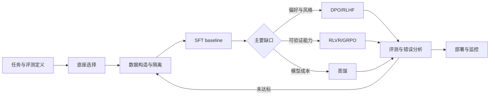

# 模型训练路线：预训练到后训练

> 来源：https://bytedance.larkoffice.com/docx/Fm4TdqbHpo1MPgx7nT1cuW4in0e

这是一张训练项目导航卡。它负责说明阶段顺序、选择条件和交付物；模型结构、训练算法、数据评测和部署细节分别链接到02、03、04、05中的权威卡。

其中，训练前后的数据构造、切分、治理和评测统一由 [04_评测实验与数据质量](<../04_评测实验与数据质量/README.md>)维护；本卡只说明这些环节如何进入训练流程。通用方法与个人项目事实也保持分离：[关键帧检测](<../12_实习工作整理/关键帧检测/README.md>)记录实习中的实际选择、实施过程和结果，这里不复制项目方案。

## 总体路线

```mermaid
flowchart LR
  A[任务与评测定义] --> B[底座选择]
  B --> C[数据构造与隔离]
  C --> D[SFT baseline]
  D --> E{主要缺口}
  E -->|偏好与风格| F[DPO/RLHF]
  E -->|可验证能力| G[RLVR/GRPO]
  E -->|模型成本| H[蒸馏]
  F --> I[评测与错误分析]
  G --> I
  H --> I
  I --> J[部署与监控]
  I -->|未达标| C
```

核心原则是先定位问题，再选择训练方法。数据不足先补数据，格式不稳先做 SFT，偏好不对再做偏好优化，结果可自动验证才考虑 RLVR/GRPO；模型已经达到质量目标后，再处理推理成本和服务约束。

## 阶段、入口与产出

| 阶段 | 先回答的问题 | 权威入口 | 阶段产出 |
| --- | --- | --- | --- |
| 任务定义 | 输入输出、失败成本和主指标是什么，结果能否自动验证？ | [模型评测与实验设计](<../04_评测实验与数据质量/模型评测与实验设计.md>)、[指标与统计计算](<../04_评测实验与数据质量/指标与统计计算.md>) | 任务说明、样本单位、主指标和护栏 |
| 底座选择 | 需要什么语言、视觉、上下文和工具能力？ | [模型架构对比与选型](<../02_大模型/模型细节/模型架构对比与选型.md>)、[预训练与生成基础](<../02_大模型/大模型预训练与生成基础.md>) | 候选底座、资源估算和基线 |
| 数据工程 | 数据是否正确、去重、隔离、覆盖边界且可追溯？ | [数据工程与数据质量](<../04_评测实验与数据质量/数据工程与数据质量.md>)、[训练数据构造与合成数据](<../04_评测实验与数据质量/训练数据构造与合成数据.md>) | 版本化 train/dev/test 与质量报告 |
| SFT baseline | 模型是否能稳定理解任务并按格式输出？ | [SFT](<后训练与对齐/SFT 监督微调.md>)、[LoRA](<后训练与对齐/LoRA 低秩适配.md>)、[SFT超参数](<超参数与优化器/SFT 超参数怎么设与怎么调.md>) | 可复现的监督微调基线 |
| 偏好优化 | 模型会做任务，但答案质量、风格或安全边界是否不稳定？ | [DPO](<后训练与对齐/DPO 直接偏好优化.md>)、[RLHF](<后训练与对齐/RLHF 基于人类反馈的强化学习.md>)、[Reward Model](<后训练与对齐/Reward Model 与 Grader 奖励模型与评分器.md>) | 偏好数据、对齐模型和偏差评测 |
| 可验证强化 | 是否存在稳定、可执行且与最终指标一致的 reward？ | [RL基础](<../01_机器学习基础/概率与序列决策/强化学习基础.md>)、[PPO](<后训练与对齐/PPO 近端策略优化.md>)、[GRPO](<后训练与对齐/GRPO 组相对策略优化.md>)、[RLVR](<后训练与对齐/RLVR 可验证奖励强化学习.md>) | Reward测试集、rollout日志和策略模型 |
| 蒸馏 | 强模型能完成任务，但目标模型成本或延迟是否不合格？ | [知识蒸馏](<后训练与对齐/Knowledge Distillation 知识蒸馏.md>)、[在线策略蒸馏](<后训练与对齐/On-Policy Distillation 在线策略蒸馏.md>) | 过滤后的教师数据和学生模型 |
| 评测迭代 | 提升是否真实、来自哪里、哪些分桶退化？ | [实验分析与问题排查](<../04_评测实验与数据质量/实验分析与问题排查.md>)、[LLM Judge](<../04_评测实验与数据质量/LLM_Judge.md>) | 置信区间、错误分类和下一轮方案 |
| 部署上线 | 延迟、吞吐、显存、成本和回滚是否满足要求？ | [模型部署与推理工程](<../05_推理部署与系统/推理工程/模型部署与推理工程.md>)、[MLOps](<../05_推理部署与系统/生产系统设计/MLOps与模型生产化.md>) | 固定推理配置、容量方案和监控 |

## 继续预训练、SFT、RAG 与后训练怎么选

| 主要现象 | 优先方案 | 判断理由 |
| --- | --- | --- |
| 模型不理解领域术语和文本分布 | 继续预训练 | 需要改变模型对领域语料的表示与语言建模分布 |
| 模型知道内容，但不按任务格式稳定回答 | SFT | 监督样本直接定义输入输出映射 |
| 知识频繁变化，答案必须引用外部资料 | [RAG](<../02_大模型/应用与问题/RAG.md>) | 外部知识比反复写入参数更易更新和追溯 |
| 同一问题能生成多种答案，但偏好排序不稳定 | DPO 或 RLHF | 偏好数据描述“哪个回答更好” |
| 数学、代码、格式或定位结果可自动打分 | RLVR/GRPO | 可执行 reward 能支持采样和策略更新 |
| 强模型效果好，但线上成本过高 | 蒸馏、量化或模型路由 | 问题是能力迁移与系统成本，不是继续堆训练阶段 |

继续预训练时应使用较小学习率，并混入必要的通用数据以监控灾难性遗忘；领域指标和通用能力必须同时评测。SFT、DPO、GRPO 不是固定流水线，后一阶段只有在前一阶段暴露出对应问题时才进入。

## 每个阶段的进入检查

### 训练前

- [ ] 任务输入、输出格式、失败成本和主指标已经固定。
- [ ] train/dev/test 按用户、文档、视频或时间等正确独立单位切分。
- [ ] 数据经过精确与近重复检查，评测集未进入训练、提示示例和合成链路。
- [ ] Tokenizer、Chat Template、最大长度和截断策略与底座一致。
- [ ] 先用未训练底座跑完固定基线，保存配置和逐样本结果。

### SFT 前

- [ ] Assistant 目标区间和 loss mask 已抽样解码确认。
- [ ] 常规例、边界例、负例和困难例都有覆盖。
- [ ] 几十条干净样本能够完成小样本过拟合测试。
- [ ] 学习率、有效 batch、Warmup、精度和 Checkpoint 策略已记录。

### DPO/RLHF 前

- [ ] Chosen 确实优于 rejected，偏好准则可复述且标注一致。
- [ ] 已检查答案长度、拒答比例和格式等系统性偏差。
- [ ] SFT baseline 已稳定，训练后会同时回归任务能力与通用能力。

### RLVR/GRPO 前

- [ ] Reward 在人工样例上与最终指标一致，Parser 失败会返回明确结果而不是崩溃。
- [ ] Reward 各分项、KL、响应长度和格式正确率可以单独监控。
- [ ] 组内采样有足够差异，Reward 不会只鼓励格式、长度或其他捷径。
- [ ] 真实终止、长度截断和 rollout 边界的 bootstrap 语义已经定义。

### 上线前

- [ ] Checkpoint、Adapter、Tokenizer、模板、stop words 和解码参数已锁定。
- [ ] 离线与线上使用相同输入处理和输出解析协议。
- [ ] 延迟、吞吐、显存、错误率、成本和质量护栏均达到阈值。
- [ ] 灰度、监控和回滚路径已经演练。

## 训练运行与故障分诊

训练时至少同步记录 loss、eval metric、learning rate、grad norm、有效 batch、序列长度、tokens/s、显存和 Checkpoint。RL 训练还要记录 reward 分项、KL、响应长度和格式正确率。

| 现象 | 首查方向 | 权威排查入口 |
| --- | --- | --- |
| loss 不动、震荡、突刺或 NaN | 数据、label/mask、学习率、梯度、混合精度 | [Loss异常与收敛排查](<训练稳定性/Loss异常与收敛排查.md>) |
| 梯度爆炸或消失 | 初始化、激活、归一化、残差与裁剪 | [梯度爆炸与梯度消失](<训练稳定性/梯度爆炸与梯度消失.md>) |
| OOM 或模型状态放不下 | 激活、序列长度、优化器状态、参数切分 | [训练框架与并行](<训练框架与并行/README.md>)、[ZeRO](<训练框架与并行/ZeRO.md>)、[FSDP](<训练框架与并行/FSDP.md>) |
| 多卡吞吐低或任务卡住 | 数据等待、计算、集合通信与负载均衡 | [多GPU通信与吞吐优化](<训练框架与并行/多GPU并行通信与吞吐优化.md>)、[分布式故障排查](<训练框架与并行/分布式训练通信与故障排查.md>) |
| 恢复后学习率或结果跳变 | 优化器、调度器、随机状态和数据位置 | [Checkpoint](<训练框架与并行/Checkpoint.md>) |
| reward 升但真实指标不升 | Reward hacking、解析器或指标错位 | [RLVR](<后训练与对齐/RLVR 可验证奖励强化学习.md>)、[Reward Collapse](<后训练与对齐/Reward Collapse 奖励坍缩.md>) |
| 训练指标变好但评测不变 | 过拟合、泄漏、分布偏移或评测实现 | [数据泄漏与污染](<../04_评测实验与数据质量/数据泄漏与Benchmark污染.md>)、[实验排查](<../04_评测实验与数据质量/实验分析与问题排查.md>) |
| 离线正常但线上退化 | 模板、解码参数、服务版本或流量漂移 | [MLOps](<../05_推理部署与系统/生产系统设计/MLOps与模型生产化.md>) |

## 多模态与视频任务路线

多模态项目沿用同一训练主线，但需要额外固定视觉输入和时序口径：

| 环节 | 关键问题 | 入口 |
| --- | --- | --- |
| 视觉输入 | 帧采样、分辨率、视觉Token和时间戳如何对应？ | [Video Understanding](<../02_大模型/视觉多模态与生成模型/多模态模型/Video_Understanding.md>) |
| 模态连接 | Vision Encoder、Projector和LLM如何对齐？ | [VLM与Vision Instruction Tuning](<../02_大模型/视觉多模态与生成模型/多模态模型/VLM与Vision_Instruction_Tuning.md>) |
| 时间定位 | 查询如何映射到起止边界，IoU如何定义？ | [Multimodal Grounding](<../02_大模型/视觉多模态与生成模型/多模态模型/Multimodal_Grounding.md>) |
| Reward | 格式、IoU、边界和时长约束是否与最终指标一致？ | [Reward Model与Grader](<后训练与对齐/Reward Model 与 Grader 奖励模型与评分器.md>) |
| 统计评测 | 同一视频的帧不能当作独立样本 | [指标与统计计算](<../04_评测实验与数据质量/指标与统计计算.md>) |

## 论文阅读索引

这份清单只标明论文在训练路线中的位置；方法定义和工程边界以对应知识卡为准。

| 阶段 | 工作 | 阅读重点与边界 |
| --- | --- | --- |
| 架构与优化 | [Attention Is All You Need](https://papers.nips.cc/paper_files/paper/2017/hash/3f5ee243547dee91fbd053c1c4a845aa-Abstract.html) | Self-Attention与并行序列建模；长序列仍有二次复杂度 |
| 架构与优化 | [Adam](https://arxiv.org/abs/1412.6980) | 一阶、二阶矩自适应更新；权重衰减需结合AdamW理解 |
| 架构与优化 | [AdamW](https://openreview.net/forum?id=Bkg6RiCqY7) | 解耦weight decay；学习率与Warmup仍需单独调节 |
| 架构与优化 | [LoRA](https://openreview.net/forum?id=nZeVKeeFYf9) | 低秩参数高效微调；大幅能力迁移可能仍需更高容量 |
| 架构与优化 | [ZeRO](https://dl.acm.org/doi/10.5555/3433701.3433727) | 分片优化器、梯度与参数；注意通信和恢复复杂度 |
| 架构与优化 | [FlashAttention](https://openreview.net/forum?id=H4DqfPSibmx) | IO-aware Attention；依赖硬件与Kernel实现 |
| 预训练 | [GPT-3](https://proceedings.neurips.cc/paper/2020/hash/1457c0d6bfcb4967418bfb8ac142f64a-Abstract.html) | 规模化自回归预训练与in-context learning；不等同于指令对齐 |
| 预训练 | [Scaling Laws](https://arxiv.org/abs/2001.08361) | 参数、数据与计算的经验规律；只在观测范围内成立 |
| 预训练 | [Chinchilla](https://proceedings.neurips.cc/paper_files/paper/2022/hash/c1e2faff6f588870935f114ebe04a3e5-Abstract-Conference.html) | 固定算力下平衡模型与Token；语言建模Loss不等于下游能力 |
| 预训练 | [LLaMA](https://arxiv.org/abs/2302.13971) | 高质量数据上的开放权重底座；Base模型不是聊天助手 |
| 预训练 | [Qwen Technical Report](https://arxiv.org/abs/2309.16609) | 中文、多语言、代码和工具能力；训练前需确认具体版本 |
| SFT | [FLAN](https://openreview.net/forum?id=gEZrGCozdqR) | 多任务Instruction Tuning；泛化受任务覆盖影响 |
| SFT | [T0](https://openreview.net/forum?id=9Vrb9D0WI4) | PromptSource与零样本任务泛化；模板质量影响明显 |
| SFT | [Self-Instruct](https://aclanthology.org/2023.acl-long.754/) | 自动生成指令数据；需过滤同质化与教师错误 |
| SFT | [LIMA](https://proceedings.neurips.cc/paper_files/paper/2023/hash/ac662d74829e4407ce1d126477f4a03a-Abstract-Conference.html) | 少量高质量SFT塑造回答风格；底层能力仍来自预训练 |
| 偏好对齐 | [Learning to Summarize from Human Feedback](https://proceedings.neurips.cc/paper/2020/hash/1f89885d556929e98d3ef9b86448f951-Abstract.html) | Reward Model加RL的早期范式；Reward泛化是主要风险 |
| 偏好对齐 | [InstructGPT](https://proceedings.neurips.cc/paper_files/paper/2022/hash/b1efde53be364a73914f58805a001731-Abstract-Conference.html) | SFT、Reward Model与PPO链路；标注和RL成本高 |
| 偏好对齐 | [Constitutional AI](https://arxiv.org/abs/2212.08073) | 原则驱动的自我批评与AI反馈；规则设计决定行为边界 |
| 偏好对齐 | [DPO](https://proceedings.neurips.cc/paper_files/paper/2023/hash/a85b405ed65c6477a4fe8302b5e06ce7-Abstract-Conference.html) | 直接优化偏好对；依赖Pair质量与覆盖 |
| 偏好对齐 | [KTO](https://openreview.net/forum?id=iUwHnoENnl) | 从非成对好坏反馈学习；依赖反馈标签质量 |
| 推理与RL | [Training Verifiers to Solve Math Word Problems](https://arxiv.org/abs/2110.14168) | 用Verifier选择候选解；上限受候选质量影响 |
| 推理与RL | [STaR](https://proceedings.neurips.cc/paper_files/paper/2022/hash/639a9a172c044fbb64175b5fad42e9a5-Abstract-Conference.html) | 自生成并筛选推理链；需防错误过程混入 |
| 推理与RL | [DeepSeekMath](https://arxiv.org/abs/2402.03300) | 数学预训练、SFT与GRPO；开放任务Reward更难定义 |
| 推理与RL | [DeepSeek-R1](https://arxiv.org/abs/2501.12948) | RL诱导推理并蒸馏；关注冗长、可控性与评测一致性 |
| 多模态 | [CLIP](https://proceedings.mlr.press/v139/radford21a.html) | 图文对比学习；对细粒度视频时序支持有限 |
| 多模态 | [Flamingo](https://proceedings.neurips.cc/paper_files/paper/2022/hash/960a172bc7fbf0177ccccbb411a7d800-Abstract-Datasets_and_Benchmarks.html) | Resampler与跨注意力连接视觉和语言；训练成本高 |
| 多模态 | [BLIP-2](https://proceedings.mlr.press/v202/li23q.html) | Q-Former连接冻结视觉模型与LLM；复杂视频推理仍有限 |
| 多模态 | [LLaVA](https://proceedings.neurips.cc/paper_files/paper/2023/hash/6dcf277ea32ce3288914faf369fe6de0-Abstract-Datasets_and_Benchmarks.html) | 视觉指令微调；视频时序和精确定位不是其核心强项 |
| 多模态 | [TimeChat](https://openaccess.thecvf.com/content/CVPR2024/html/Ren_TimeChat_A_Time-sensitive_Multimodal_Large_Language_Model_for_Long_Video_Understanding_CVPR_2024_paper.html) | 时间感知视频理解；长视频和边界精度仍需专门评测 |

## 六周学习顺序

| 周次 | 学习重点 | 实践产出 |
| --- | --- | --- |
| 1 | Transformer、损失、优化器、batch、显存 | 读懂一份SFT脚本并整理参数表 |
| 2 | 预训练、Base/Instruct、Tokenizer、长上下文、RAG | 比较候选底座并记录选择依据 |
| 3 | 数据工程、切分、SFT格式与质量检查 | 产出版本化训练/评测数据 |
| 4 | SFT、DPO、偏好数据 | 跑通SFT baseline并构造偏好样本 |
| 5 | RL基础、RLVR、GRPO、Reward与KL | 测试可执行Reward并跑小规模实验 |
| 6 | 多模态、评测、故障排查与部署 | 形成训练到上线的可复现闭环 |

## 最终决策表

| 现象 | 优先怀疑 | 下一步 |
| --- | --- | --- |
| 模型完全不会任务 | 底座能力或SFT数据不足 | 先做SFT小基线，必要时更换底座 |
| 模型不懂领域术语 | 领域语料分布缺失 | 评估继续预训练或RAG |
| 内容基本正确但格式不稳 | 模板和格式样本不足 | 补格式SFT并固定解析协议 |
| 答案可用但偏好不稳 | 缺少偏好信号 | 构造高质量偏好对并尝试DPO |
| 可验证任务仍有提升空间 | 需要采样探索 | 验证Reward后尝试GRPO/RLVR |
| 强模型可用、小模型不足 | 需要能力迁移 | 生成并过滤教师数据做蒸馏 |
| 训练指标提升但测试不升 | 过拟合、泄漏或目标错位 | 检查切分、统计区间和错误分桶 |
| 模型质量达标但上线慢 | 推理与服务约束 | 优化量化、Batch、KV Cache和路由 |

每次迭代只改变能回答当前问题的关键变量，并保存数据版本、代码版本、模型版本、完整配置和逐样本结果。这样训练路线才可解释、可复现，也能明确下一轮应该改数据、训练、Reward、评测还是部署。
