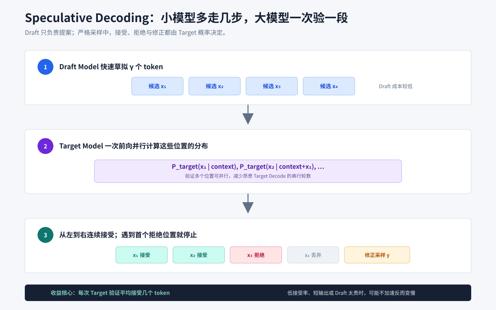

# Speculative_Decoding

## 知识点解析

### 概述

Speculative Decoding 是一种大模型推理加速方法：用小模型先快速草拟多个 token，再由大模型并行验证，从而减少大模型逐 token 解码次数。

### 为什么需要

自回归生成的瓶颈在 decode 阶段：

```text
生成第 1 个 token -> 生成第 2 个 token -> 生成第 3 个 token -> ...
```

每个 token 都要依赖前一个 token，难以完全并行。

Speculative Decoding 的思路是：

```text
小模型 draft 多个 token
  -> 大模型一次性验证
  -> 按 Target/Draft 概率比随机接受
  -> 拒绝后回退
```

### 基本流程

1. Draft Model 根据当前上下文生成若干候选 token。
2. Target Model 对这些候选 token 做验证。
3. 严格推测采样以 $\min(1, p_{\text{target}}(x) / p_{\text{draft}}(x))$ 的概率接受候选；接受表示通过采样规则，不表示该 token 客观“正确”。
4. 如果某个位置被拒绝，则从 Target 与 Draft 的修正分布采样，以保持最终输出服从 Target Model 的分布。
5. 重复直到完成。



### 为什么能加速

小模型生成便宜，大模型验证多个 token 可以并行。

当小模型预测和大模型足够接近时，一次验证能接受多个 token，减少大模型调用次数。

### 适合场景

- 解码阶段瓶颈明显。
- 小模型和大模型输出分布接近。
- 长文本生成。
- 对吞吐和延迟敏感的在线服务。

不适合：

- 小模型质量太差，接受率低。
- 生成很短，调度开销抵消收益。
- 系统已经被其他瓶颈限制，例如网络或队列。

### 关键指标

- Acceptance Rate：草稿 token 接受率。
- Tokens per Second。
- p50/p95/p99 latency。
- Draft Model 成本。
- Target Model 验证开销。

### 和其他推理优化的关系

- [KV Cache](<KV_Cache与Prefill_Decode.md#kvcache与prefilldecode>)：减少重复 [Attention](<../../02_大模型/基础架构/Self-Attention.md#self-attention>) 计算。
- [Continuous Batching](<Batching.md#batching>)：提高吞吐。
- Quantization：降低显存和计算成本。
- Speculative Decoding：减少大模型解码步数。

这些方法可以组合使用，但系统复杂度会增加。

### 常见误区

- 以为 Speculative Decoding 一定提速。
- 忽略小模型加载和调度成本。
- 只看平均延迟，不看 p99。
- 没有监控接受率。
- 小模型和大模型 tokenizer 或输出分布不匹配。

## 面试应对

### Speculative Decoding 的完整流程是什么？

回答思路：按 Draft、并行验证、连续接受和拒绝后回退四步说明。

回答模板：

Speculative Decoding 先让较便宜的 Draft Model 基于当前上下文提出多个候选 Token，再让 Target Model 用一次前向并行计算这些位置的分布。系统从前向后验证候选，连续接受满足规则的前缀；遇到第一个拒绝位置时，按目标分布修正采样并开始下一轮。它把多次昂贵的 Target Decode 尝试合并到一次验证中，从而减少目标模型的串行步数。

### 为什么推测解码可以不改变目标分布？

回答思路：强调候选由小模型提出，但接受、拒绝和修正都由目标模型概率决定；区分严格采样与近似实现。

回答模板：

Draft Model 只负责提出候选，最终是否接受由 Target Model 的概率分布和规定的接受拒绝规则决定；拒绝时还要按修正分布采样。使用严格的推测采样算法时，最终样本分布可以与直接从 Target Model 采样一致。若工程实现为简化逻辑而只做阈值接受或直接接受近似候选，就需要单独评估质量，不能再无条件声称分布完全等价。

### 推测解码的加速收益由什么决定？

回答思路：围绕接受率、每轮草拟长度、Draft 成本、Target 验证效率和生成长度回答。

回答模板：

核心指标是每次 Target 验证平均接受多少个 Token。Draft 与 Target 的分布越接近，接受率通常越高；但 Draft 太大、草拟过长或验证效率差，也会增加额外开销。实际收益取决于接受率、Draft 延迟、Target 一次验证多个 Token 的效率、请求 Batch 和输出长度，所以要联合观察 Acceptance Rate、TPOT、端到端 p99 和额外显存。

### 什么情况下推测解码可能更慢？

回答思路：列出低接受率、短输出、高并发、Draft 资源开销和模型不兼容，并给出先压测再启用的结论。

回答模板：

当 Draft 与 Target 分布差异大导致频繁拒绝、输出很短、Target 本身已通过大 Batch 高效运行，或者加载 Draft Model 占用的显存和调度成本过高时，推测解码可能没有收益甚至更慢。两者还需要兼容的 Tokenizer 和词表映射。上线前应按真实输入输出长度及并发压测，不应只看低并发下的平均 Token 速度。
