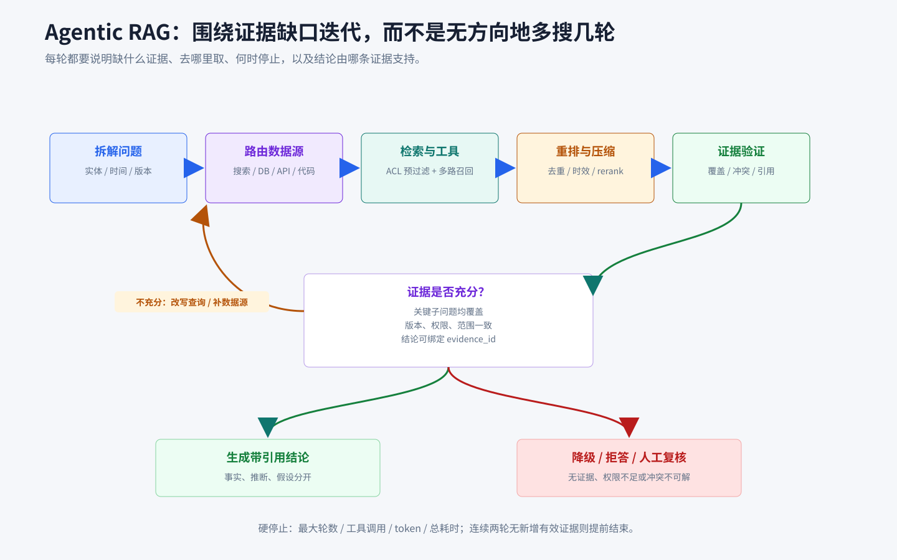

# Agentic RAG

## 知识点解析

### 概述

Agentic [RAG](<../../02_大模型/应用与问题/RAG.md#rag>) 是把传统 RAG 从“一次检索后生成”升级为可规划、可多轮取证、可校验和可终止的 [Agent](<Agent.md#agent>) 工作流。本卡片统一说明 Agentic RAG 的通用机制；业务知识的分类、权限、版本与污染治理见[《RAG 与业务知识库落地》](<../实战落地/RAG与业务知识库落地.md#rag-与业务知识库落地>)。

### 与传统 RAG 的区别

传统 RAG 通常执行固定链路：

```text
用户问题 -> 一次召回 -> 拼接上下文 -> 生成答案
```

Agentic RAG 把检索视为受状态驱动的决策过程：

```text
理解问题
  -> 规划查询与数据源
  -> 检索 / 调用工具
  -> 重排与压缩证据
  -> 判断证据是否充分、冲突或过期
      -> 不充分：改写查询或补充数据源
      -> 有冲突：比较可信度、版本和适用范围
      -> 已充分：生成带引用的结论
  -> 校验结论与引用
```



核心增量不是“多查几次”，而是根据中间证据动态决定下一步，并对继续、降级、拒答和结束给出明确条件。

### 核心机制

#### 查询规划

复杂问题先拆成可验证的子问题。每个子查询都应保留实体、时间、版本、范围和限制条件，避免查询改写改变原意。常见方式包括：

- Query Decomposition：把多跳问题拆成依赖有序的子问题。
- Query Rewriting：补齐同义词、字段名或检索表达。
- Hypothesis-driven Search：先提出待验证假设，再寻找支持或反驳证据。
- Follow-up Retrieval：根据首轮结果暴露的缺口继续检索。

#### 数据源路由

Agent 根据问题类型选择搜索、文档库、数据库、API 或代码工具。路由应由数据时效、精确性、权限和可审计性决定，而不是统一走向量库。实时状态优先查询真实系统；语义资料才适合关键词或向量检索。

#### 候选召回与重排

召回阶段追求覆盖，重排阶段提高相关性。常见组合为：

```text
租户 / ACL / scope 预过滤
  -> 关键词召回 + 向量召回
  -> 时效 / 状态 / 质量过滤
  -> reranker
  -> 去重与聚类
  -> 上下文压缩
```

权限过滤必须在召回和上下文注入之前完成，避免无权候选占用 Top-K 或进入中间链路。分块粒度、top-k 和压缩都要保留证据的实体、条件和出处，不能为了缩短上下文而丢掉限定语。

#### 多跳检索

后续查询依赖前一步得到的实体或事实。例如先确定故障组件，再查该组件版本的规则，最后查相同错误的历史处理记录。每一跳都应记录输入、输出和证据 ID，避免推理链在中途脱离原问题。

#### 证据融合与冲突处理

融合不是把多个片段简单拼接。应显式比较：

- 来源权威性与是否为一手资料。
- 版本、生效时间和适用范围。
- 多个来源是否独立，还是互相转述。
- 证据支持、反驳或仅与结论相关。

来源冲突时应保留冲突并解释采用依据；无法判定时返回不确定或升级人工复核，不能用多数投票掩盖版本差异。

#### 证据验证与引用绑定

生成前检查证据是否覆盖关键子问题，生成后检查每个关键结论能否映射到证据。理想输出把“事实、推断、假设”分开，并为事实附 `evidence_id`。引用存在但不支持具体结论仍属于 grounding 失败。

#### 自我修正与终止

Agentic RAG 必须有结构化退出条件：

- 证据已覆盖所有必需字段并通过验证。
- 达到最大检索轮数、工具调用数、token、费用或总耗时。
- 连续两轮没有新增有效证据。
- 权限不足、数据源不可用或问题本身不可回答。
- 高风险结论需要转人工确认。

自我修正应基于“缺少哪项证据”采取动作，不能让模型无方向地重复搜索。

### 状态与轨迹

一次检索任务至少记录：

```text
原始问题 / 子问题
查询与数据源
候选证据及过滤原因
证据版本与权限范围
冲突和缺口
已用预算与停止原因
最终结论到 evidence_id 的映射
```

这些状态用于复现、审计和 bad case 归因，也能区分检索错、知识错、上下文组织错和生成错。

### 适用边界

适合：

- 需要多跳证据或跨系统查询。
- 首次检索不足，后续查询依赖中间结果。
- 多份资料可能冲突，需要比较版本与可信度。
- 必须提供可追溯引用或证据链。

不适合：

- 单个字段可由 API、SQL 或字典准确返回。
- 简单事实问答或固定规则判断。
- 低延迟场景无法承担多轮调用。
- 数据源质量、权限或版本尚未治理。

### 常见失败模式

- 查询改写丢失实体、时间或版本约束。
- 多轮检索不断扩散，偏离原问题。
- 相似片段很多，但关键证据没有召回。
- 引用与结论相关，却不能直接支持结论。
- 旧版本、跨范围或无权限内容参与回答。
- 工具返回失败被当作“没有证据”。
- 没有预算和停止条件，形成检索循环。
- 简单问题也进入完整 Agentic 流程，增加延迟和成本。

### 评测维度

- Retrieval Recall：正确证据是否被召回。
- Precision：相关片段占全部返回片段的比例。
- Multi-hop Completion：必需证据链是否完整。
- Groundedness：关键结论能否由引用证据支持。
- Citation Correctness：引用是否指向正确来源和范围。
- Conflict Handling：冲突证据是否被识别并合理处理。
- No-evidence Behavior：空证据时是否拒答、补问或降级。
- Context Utility：注入的证据是否实际改善任务结果，而不是只增加上下文长度。
- Latency/Cost：多轮检索、重排和验证的时间与费用。

## 面试应对

### Agentic RAG 和传统 RAG 的区别是什么？

回答思路：抓住固定单轮链路与动态取证闭环的差异。

回答模板：

传统 RAG 通常是一次召回后直接生成；Agentic RAG 会先拆解问题和选择数据源，再根据中间证据决定是否改写查询、继续多跳检索、处理冲突或结束。它还会把关键结论绑定到证据并检查引用是否真正支持结论。它适合复杂、多跳和跨系统问题，但必须设置轮数、成本和无新证据终止条件。

### 什么场景需要多轮检索？

回答思路：说明后续查询是否依赖首轮结果，并指出简单查询不必使用。

回答模板：

当问题需要先确定实体再查规则、首次检索信息不足、来源冲突，或者需要先调用实时工具再检索历史经验时，适合多轮检索。单个字段查询、固定规则判断和简单事实问答通常直接使用结构化查询或普通 RAG，避免增加不必要的延迟和成本。

### 如何判断 RAG 答案有证据支撑？

回答思路：逐项核对关键结论、限定条件和引用内容。

回答模板：

我会把答案拆成关键结论，逐项检查是否存在直接证据，并确认实体、版本、时间和适用范围一致。事实结论绑定 evidence_id，推断与假设单独标记。引用仅仅相关还不够，如果不能支持具体结论，就要继续检索、降低置信度或返回证据不足。

### 如何避免 Agentic RAG 越搜越偏？

回答思路：从保留约束、状态化缺口和硬终止条件回答。

回答模板：

查询改写必须保留原问题中的实体、版本、时间和范围，每轮只围绕明确的证据缺口行动，并记录新增证据。系统设置最大轮数、调用数、耗时和预算；连续多轮没有新增有效证据时提前结束。最终还要检查各子问题是否都服务于原目标，防止检索链扩散。

### Agentic RAG 为什么更慢、更贵？

回答思路：指出成本来自多轮模型、工具、重排和验证。

回答模板：

Agentic RAG 会增加问题拆解、查询改写、多轮检索、工具调用、重排、上下文压缩和证据验证，因此消耗更多 token、外部调用和端到端时间。工程上应先用结构化查询和普通 RAG解决确定性问题，只把确实需要动态取证的复杂问题升级到 Agentic RAG。
