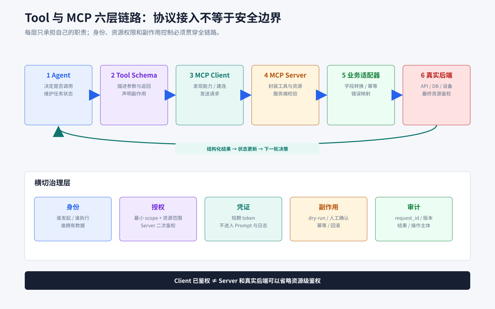

# Tool 与 MCP 链路、授权和治理

## 知识点解析

### 概述

本卡片聚焦 Tool/MCP 在生产环境中的接入链路、传输、身份、资源授权、凭证、审批、审计和治理。Tool Call/MCP 的通用区别、对象模型、Tool Schema、结构化结果和错误模型见[《Tool Call 与 Function Calling》](<../基础概念/Tool_Call与Function_Calling.md#tool-call-与-function-calling>)。

### 六层链路

```text
用户/任务
  -> Agent 编排器
  -> LLM Tool Call
  -> Tool Adapter 或 MCP Client
  -> MCP Server / 业务 API / 本地进程
  -> 外部资源
  -> 结构化结果、审计和轨迹
```



每一层的职责应分开：

| 层 | 职责 |
| --- | --- |
| Agent | 决定是否调用、调用顺序和是否需要更多证据。 |
| Tool schema | 约束名称、描述、参数和返回格式。 |
| MCP Client | 管理连接、能力发现、请求和响应。 |
| MCP Server | 将外部资源封装为可控工具、资源或 Prompt。 |
| 业务适配器 | 做字段转换、状态检查、错误映射和幂等。 |
| 治理层 | 做身份、权限、密钥、审计、限流、审批和隔离。 |

### 传输和连接

常见连接方式包括：

- `stdio`：客户端启动本地 MCP Server 进程，通过标准输入输出传 JSON-RPC；适合开发机、CLI 和隔离的本地工具。
- HTTP 或流式 HTTP：Server 作为独立服务运行；适合共享能力、统一鉴权、扩缩容和审计。
- 内部 RPC：如果组织已有统一服务治理，可以用网关或适配层承载 MCP 能力。

设计工具、页面调试工具和评测系统都属于外部能力，应按“协议、客户端、Server、数据格式和权限”分别描述。已有普通工具接口并不自动等于 MCP Server；如果需要接入 MCP，应通过独立适配层纳入 Workflow，并补齐 allowlist、错误映射和审计。

### D2C 适配与状态门禁

D2C Tool Adapter 沿用[《Tool Call 与 Function Calling》](<../基础概念/Tool_Call与Function_Calling.md#tool-call-与-function-calling>)中的通用 schema 原则，并为 Lynx 页面采集固定业务契约：

```json
{
  "name": "capture_lynx_page",
  "description": "在指定页面、视口和设备状态下采集 Lynx 截图与结构树",
  "inputSchema": {
    "type": "object",
    "required": ["page_id", "viewport", "state_id"],
    "properties": {
      "page_id": {"type": "string"},
      "viewport": {"type": "object"},
      "state_id": {"type": "string"},
      "dry_run": {"type": "boolean", "default": true}
    }
  }
}
```

该契约还要落实以下业务状态约束：

- 只允许访问当前任务绑定的 page、设备、Figma 节点和工作目录。
- 页面稳定且 `page_id`、`viewport`、`state_id` 一致后才能采集。
- 截图与结构树必须来自同一采集批次，并把 artifact、批次和工具版本写入轨迹。
- 任务未就绪时明确返回 `NOT_READY`，不能伪装成空结果或成功。
- 适配器将 MCP 或业务 API 的响应映射为内部工具输出，保留 request ID、证据和可重试状态。
- 发现工具先经过当前 Skill 的 allowlist，再暴露给模型。

### 授权模型

#### 身份

先明确调用主体：当前用户、Agent 服务账号、任务所属项目还是 MCP Server 进程。D2C 评测工具存在用户身份和机器人身份的资源边界，实践中必须把“谁发起”“谁执行”“谁拥有数据”分别记录。

#### 权限

按资源和动作拆分 scope：

- Figma：读取文件、读取指定节点、读取评论、导出图片。
- Lynx/DevTool：连接设备、读取页面树、触发截图、读取日志。
- 评测：读取 GT、创建任务、写回结果、发布 结果数据集平台。
- 文件系统：读取当前工作区、写入临时目录、禁止任意路径遍历。
- 外部写操作：修改数据、发布结果、发送通知，默认需要更高权限。

#### 凭证

密钥不写进 Skill、Prompt、代码和日志。stdio Server 可以从受控环境变量或凭证管理器读取；HTTP Server 应使用短期 token、服务间身份或 OAuth，并限制 audience、scope、过期时间和刷新权限。日志只记录凭证 ID、scope 和过期状态，不记录 token 原文。

#### 审批

以下动作应进入 dry-run 或人工确认：

- 修改设计数据、评测集、结果数据集平台 或生产配置。
- 发布新版本或覆盖已有结果。
- 访问跨项目、跨用户或敏感资源。
- 批量触发设备采集、模型任务或高成本请求。
- 将结果发送给外部人员或写入正式门禁。

### 授权链路的实施顺序

```text
识别主体
  -> 申请最小 scope
  -> 绑定资源范围
  -> 建立短期凭证
  -> MCP Client 建连并完成身份校验
  -> Server 再做资源级鉴权
  -> 每次调用记录审计事件
  -> 到期、撤销和异常时断开
```

权限判断需要覆盖 Agent、MCP Server 和真实后端。MCP Server 和真实后端仍要再次鉴权，因为 Agent 可能被 Prompt Injection 影响，客户端也可能存在漏洞。

### Skill、Workflow 与 MCP 如何配合

- Skill：说明什么时候用“采集页面”或“查询评测集”，以及前置条件和验收。
- Workflow：规定先获取设计稿，再采集实现，再匹配和检测。
- MCP：提供读取 Figma、连接 DevTool、访问评测系统的标准能力。
- Tool Adapter：把 MCP 返回值转换成内部 `工具输出`，统一错误和证据。
- Guardrail：阻止跨资源访问、危险写操作和超预算调用。

## 落地步骤

1. 列出外部系统、资源类型、读写动作和数据敏感级别。
2. 判断直接 API、LangChain Tool 还是 MCP 是否最合适。
3. 为每个能力写 schema、错误码、超时和幂等规则。
4. 实现 MCP Client 或适配器，先只开放只读能力。
5. 在 Server 和后端分别做身份、scope 和资源级校验。
6. 将凭证放入受控环境，禁止出现在 Prompt、结果和日志。
7. 为写操作增加 dry-run、审批、审计和回滚。
8. 用断连、过期、拒权、限流、恶意参数和越权 case 做测试。
9. 记录每次发现能力、调用、结果、主体、资源和版本。

### 接入检查清单

- [ ] Client 能发现的工具都经过 allowlist。
- [ ] Tool description 没有隐含危险副作用。
- [ ] 参数 schema 有必填字段、枚举、长度和路径约束。
- [ ] Server 对用户、项目、资源和动作再次鉴权。
- [ ] token 有过期、撤销和轮换机制。
- [ ] 结果带 request_id、版本和 evidence。
- [ ] 超时、断连和重试不会产生重复副作用。
- [ ] 写操作能 dry-run、审批、审计和回滚。

## 失败与排障

| 现象 | 排查顺序 |
| --- | --- |
| 工具发现为空 | 检查 Client 建连、协议版本、Server 启动日志和 allowlist |
| 调用返回认证失败 | 检查主体、token audience、scope、过期时间和环境 |
| 有权限但资源拒绝 | 检查资源所属项目、用户/机器人身份和 Server 二次鉴权 |
| 工具结果为空 | 检查上游状态、过滤条件、分页和空结果/失败语义 |
| 调用重复写入 | 检查幂等键、重试策略和副作用是否放在可重试节点 |
| 本地 stdio 不稳定 | 检查进程生命周期、stderr 日志、工作目录和环境变量 |
| MCP 接入后上下文变长 | 限制发现工具数量，按 Skill 加载 allowlist 和结果摘要 |

## 面试应对

### 如何把 D2C 外部能力接入生产链路？

回答思路：沿 Agent、Adapter/Client、Server、业务后端和治理层说明职责，并补充 D2C 状态门禁。

回答模板：

我会让 Agent 只看到当前 D2C Skill 允许的工具，由 Tool Adapter 或 MCP Client 负责连接和协议转换，Server 封装 Figma、Lynx/DevTool 与评测系统，业务后端继续负责真实资源。适配器还要检查页面状态、采集批次和任务绑定关系，统一映射错误与证据；治理层负责身份、资源级鉴权、短期凭证、限流、审批和审计。各层职责分开后，协议接入不会绕过业务状态与安全边界。

### 如何给 Agent 接入一个需要授权的外部系统？

回答思路：按主体、scope、资源范围、短期凭证、多层鉴权、审批和审计回答完整授权链路。

回答模板：

我会先明确谁发起、谁执行以及资源属于谁，再按资源和动作申请最小 scope，并把权限绑定到当前项目和具体资源。Client 使用受控的短期凭证建连，MCP Server 和真实后端都要再次做资源级鉴权，不能因为 Client 已拿到 token 就默认可信。只读能力可以在 allowlist 内自动执行，写数据、发布结果和跨项目访问必须先 dry-run，再人工确认，同时具备幂等、审计和回滚。日志只记录凭证 ID、scope 和过期状态，不记录 token 原文。

### MCP 工具很多时如何治理？

回答思路：从发现范围、schema、权限分级、结果契约、失败恢复和可观测性控制工具规模与风险。

回答模板：

我不会把所有已发现工具直接暴露给模型，而是根据当前 Skill 和任务注入 allowlist，并按主体、资源、权限级别和副作用分组。通用 schema 与结果字段沿用统一工具契约，治理层额外记录每次发现和调用所涉及的主体、资源、审批状态与版本。对断连、过期、拒权、限流和重复写入准备专项测试，保证工具数量增加后仍可控、可审计。
