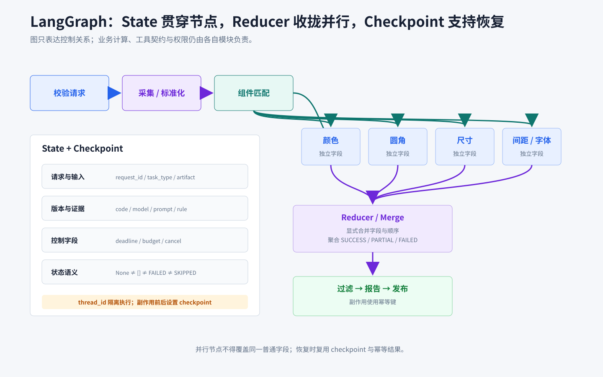

# Workflow 与 LangGraph 编排

## 知识点解析

### 概述

本卡片聚焦 LangGraph 的生产实现：state、node、edge、并行合并、持久化与执行约束。Prompt Chaining、Routing、Parallelization、Orchestrator-Workers、Evaluator-Optimizer、Planning 和 ReAct 的通用定义与选型见[《Workflow》](<../基础概念/Workflow.md#workflow>)。

D2C 视觉一致性评估采用“已知任务类型进入显式专家图，未知目标进入受限规划节点”的实现。颜色、圆角、尺寸、字号、字重和间距检测共享采集与组件匹配结果，然后写入独立分支字段并统一合并。

### 图与状态的职责

LangGraph 把一次执行表示为“状态 + 节点 + 边”：

```text
State：跨节点共享、可持久化的业务事实
Node：读取部分状态，执行单一职责，返回状态更新
Edge：根据确定条件决定下一个节点
Reducer：定义并行或重复更新如何合并
Checkpointer：保存执行进度，支持恢复、审计和人工介入
```

图负责控制关系，不应把业务计算、工具协议或权限逻辑藏在边表达式中。

### State 设计

一个可用的 D2C state 至少包含：

```text
请求：request_id、task_id、任务类型、调用主体
输入：Figma/Lynx 资源、页面状态、viewport、采集批次
版本：代码、模型、Prompt、规则、知识和 schema 版本
过程：当前阶段、节点事件、重试次数、阶段耗时
证据：工具结果、artifact_id、匹配结果、属性检测结果
控制：deadline、预算、取消标记、人工确认状态
结果：最终输出、错误、部分成功说明
```

字段使用业务中立的结构化协议，不依赖某个仓库的类名。请求级图片、身份、阈值和配置不能保存在共享单例中。

状态必须区分：

```text
value = None       -> 尚未产生结果
value = []         -> 已成功执行，结果为空
success = false    -> 能力执行失败
status = skipped   -> 按策略无需执行
status = partial   -> 部分分支成功
```

这些语义不能都压成空列表，否则下游会把采集失败误判为“没有缺陷”。

### Node 设计

每个节点只做一类工作，并满足：

- 声明读取和写入的 state 字段，缺失必需输入时立即失败。
- 成功、空结果、跳过和失败都返回结构化状态。
- 外部调用设置 deadline、重试条件和取消传播。
- 副作用集中在边界节点，并使用幂等键。
- 记录节点版本、开始结束时间、attempt、关键计数和 artifact。
- 不在节点内部修改全局配置或其他请求的状态。

D2C 主图可以实现为：

```text
validate_request
  -> prepare_workspace
  -> capture_or_load_resources
  -> normalize_figma_and_lynx
  -> match_components
  -> fan_out_attributes
       -> detect_color
       -> detect_corner
       -> detect_size
       -> detect_spacing
       -> detect_font_size
       -> detect_font_weight
  -> merge_results
  -> filter_false_positive
  -> build_report
  -> persist_and_publish
```



`match_components` 失败时阻断属性检测，因为没有可靠对象就没有可靠差异；单个属性检测失败时可以按策略返回 `PARTIAL`。

### Edge 与路由

Edge 只表达可验证的转移条件：

- 普通边：前一节点成功后进入固定下一步。
- 条件边：根据结构化字段路由，而不是解析自由文本。
- Fan-out：把只读公共输入分发给多个独立分支。
- Fan-in：等待规定分支结束后进入合并节点。
- 循环边：仅用于受限规划或质量回路，并有硬终止条件。

暂停不是一种业务边。动态暂停由节点内部触发，静态暂停由节点前后的 breakpoint 配置触发。

D2C 双路径入口：

```text
validate_request
  -> 任务类型已注册：fixed_expert_graph
  -> 目标开放且允许规划：bounded_planner
  -> 输入不足：request_more_input
  -> 权限不足：authorization_required
```

规划节点只能从当前请求注入的 allowlist 中选择能力；专家内部继续负责参数校验、业务阈值和输出契约。

### 并行与 merge semantics

并行前必须定义每个分支的写入字段和合并规则。推荐每个属性写入独立键：

```text
attribute_results.color
attribute_results.corner
attribute_results.size
attribute_results.spacing
attribute_results.font_size
attribute_results.font_weight
```

Reducer 需要明确：

- 列表是追加、去重还是覆盖。
- 字典发生同键冲突时谁优先。
- 分支状态如何聚合为 `SUCCESS/PARTIAL/FAILED`。
- 结果顺序是否稳定。
- 一个分支失败是否取消其他分支。
- 总体 deadline 到达后如何收集已完成结果。

合并结果保留每个分支的 `status`、`defects`、`evidence`、`debug`、`latency` 和 `version`。禁止多个并行节点直接覆盖同一普通字段；合并只能由 reducer 或显式 merge 节点完成。

### Persistence 与恢复

Checkpointer 保存的是可恢复状态，不只是日志。生产实现需要：

- 以 `configurable.thread_id` 作为 checkpoint 线程键隔离执行，首次运行与恢复必须使用相同值。
- 在外部调用、人工确认和副作用前后设置稳定 checkpoint。
- 保存 state schema version，升级时提供迁移或拒绝恢复。
- 大图片、结构树和报告写入对象存储，state 只保存 URI、checksum 和 artifact_id。
- 对敏感字段加密或裁剪，并按保留周期清理。
- 恢复时复用已完成的幂等结果，不重复采集或写回。

`run_id` 可以关联日志和 Trace，但不是 checkpointer 的恢复键，也不能替代 `configurable.thread_id`。

#### 动态暂停

需要人工输入或授权时，在节点内部调用 `interrupt()`。它会保存当前图状态并返回中断载荷；恢复时传入 `Command(resume=...)`，同时复用原来的 `configurable.thread_id`：

```python
from langgraph.types import Command, interrupt

def approval_node(state):
    decision = interrupt({"action": "publish", "artifact_id": state["artifact_id"]})
    return {"approval": decision}

config = {"configurable": {"thread_id": "d2c-case-42"}}
graph.invoke(input_state, config=config)
graph.invoke(Command(resume={"approved": True}), config=config)
```

恢复后节点会从开头重新执行，因此 `interrupt()` 之前的外部副作用必须幂等，或移动到恢复后执行。恢复前还要校验操作者、确认内容、checkpoint 版本和输入是否仍有效。

#### 静态暂停

调试和逐节点检查使用节点前后的 breakpoint，例如在编译时配置 `interrupt_before` 或 `interrupt_after`：

```python
graph = builder.compile(
    checkpointer=checkpointer,
    interrupt_before=["persist_and_publish"],
    interrupt_after=["match_components"],
)

config = {"configurable": {"thread_id": "d2c-case-42"}}
graph.invoke(input_state, config=config)
graph.invoke(None, config=config)
```

静态 breakpoint 恢复时必须复用首次执行的 `configurable.thread_id`，并以 `graph.invoke(None, config=config)` 继续；使用流式接口时对应调用 `graph.stream(None, config=config)`。`Command(resume=...)` 专用于恢复节点内动态触发的 `interrupt()`，不适用于静态 breakpoint。静态 breakpoint 在指定节点前后暂停，不替代节点内根据运行时条件触发的 `interrupt()`。

### 循环与终止

受限规划或 Evaluator-Optimizer 循环至少设置：

- 最大模型轮数和工具调用数。
- 单节点与全图 deadline。
- token、费用和外部资源预算。
- 相同工具与参数的重复调用检测。
- 连续无新证据提前结束。
- 用户取消和人工接管入口。

终止条件由 state 字段判断，例如“所有必需证据存在且报告 schema 校验通过”，不能只依赖模型输出“完成”。

### 失败、重试和补偿

| 错误 | 图中处理 |
| --- | --- |
| 参数缺失 | 路由到补充输入或请求失败 |
| 临时网络错误 | 当前节点有限退避重试 |
| 资源采集失败 | 通常阻断，保留原始错误 |
| 单属性检测失败 | 按策略合并为 `PARTIAL` |
| 权限拒绝 | 中断并进入授权流程，不自动重试 |
| 模型超时 | 一次受控重试，再降级或标记不确定 |
| 写回失败 | 基于幂等键重试或执行补偿 |
| 取消 | 传播取消信号并回收临时资源 |

重试策略必须与副作用幂等性匹配。节点已写外部系统却未更新 state 时，恢复前先查询幂等结果，不能盲目重放。

### 实现约束

1. 图构建与请求执行分离；图定义可复用，请求 state 必须隔离。
2. State schema、节点输入输出和错误码都需要版本化。
3. 工具 allowlist、权限主体和资源范围由入口注入，节点不能自行扩权。
4. 业务计算放在可单测函数或专家中，LangGraph 节点只做适配与状态更新。
5. 节点返回增量更新，避免复制大对象；大产物使用 artifact 引用。
6. 条件边只读结构化字段，保证分支可测试和可解释。
7. 并行写入必须有 reducer；部分成功不能伪装成完整成功。
8. 关键 checkpoint 与副作用边界对齐，恢复路径纳入故障注入测试。

### 落地与验证

1. 先画主图、所有终止状态和中断点。
2. 定义 State schema 及空值、失败、跳过、部分成功语义。
3. 为节点定义输入、更新、错误、副作用和幂等键。
4. 为条件边和 reducer 写表驱动测试。
5. 配置 checkpointer，验证暂停、恢复、取消和 schema 兼容。
6. 对并行超时、单分支失败、写回失败和重复恢复做故障注入。
7. 记录 state snapshot、节点轨迹、artifact、工具调用和组合版本。

### 失败与排障

| 现象 | 排查顺序 |
| --- | --- |
| 路由总进入规划节点 | `任务类型`规范化、条件边输入、注册表版本 |
| 并行结果互相覆盖 | 分支写入键、reducer、merge 节点 |
| 中间失败最终变成功 | 状态聚合规则、错误是否被后续节点覆盖 |
| 恢复后重复写入 | checkpoint 位置、幂等键、外部结果查询 |
| 同配置请求互相影响 | 请求 state、可变配置和全局单例 |
| checkpoint 无法恢复 | state schema version、artifact 有效期、代码版本 |

## 面试应对

### LangGraph 为什么适合 Agent 编排？

回答思路：围绕 state、node、edge、reducer 和 checkpoint 回答。

回答模板：

LangGraph 把 Agent 控制关系显式建模为状态图：state 保存请求、证据、错误和版本，node 执行单一职责，edge 根据结构化条件路由，reducer 定义并行结果如何合并，checkpointer 支持暂停、恢复和人工介入。它解决的是编排、状态和恢复问题，不替代业务逻辑、工具协议或模型本身。

### 如何设计 LangGraph state？

回答思路：说明业务事实、控制字段、状态语义和大对象处理。

回答模板：

我会让 state 只保存跨节点需要的结构化事实，包括请求与输入、组合版本、当前阶段、证据引用、重试预算、错误和最终结果，并区分未执行、空结果、失败、跳过和部分成功。图片和结构树等大对象放对象存储，state 保存 URI、checksum 和 artifact_id。state schema 必须版本化，请求之间完全隔离。

### 如何处理并行任务和部分失败？

回答思路：先定义独立写入字段，再说明 reducer 和聚合状态。

回答模板：

每个并行分支写独立字段，公共输入只读共享；reducer 明确定义追加、去重、覆盖、排序和冲突规则。合并时保留各分支的 status、defects、evidence、latency 和 version，再按业务门禁聚合为 SUCCESS、PARTIAL 或 FAILED。D2C 中组件匹配失败应阻断后续检测，单个属性失败则可以返回 PARTIAL，不能伪装成完整成功。

### Checkpoint 如何避免恢复后重复副作用？

回答思路：将 checkpoint、幂等键和外部结果查询组合起来。

回答模板：

我会在外部调用和副作用前后设置稳定 checkpoint，并为写操作生成幂等键。恢复时先读取 checkpoint，再查询外部系统是否已经产生对应结果；已完成就回填 state，未完成才重试。state 记录 schema 和节点版本，大产物保存 artifact 引用。这样即使进程在写回后、状态更新前崩溃，也不会盲目重复写入。
