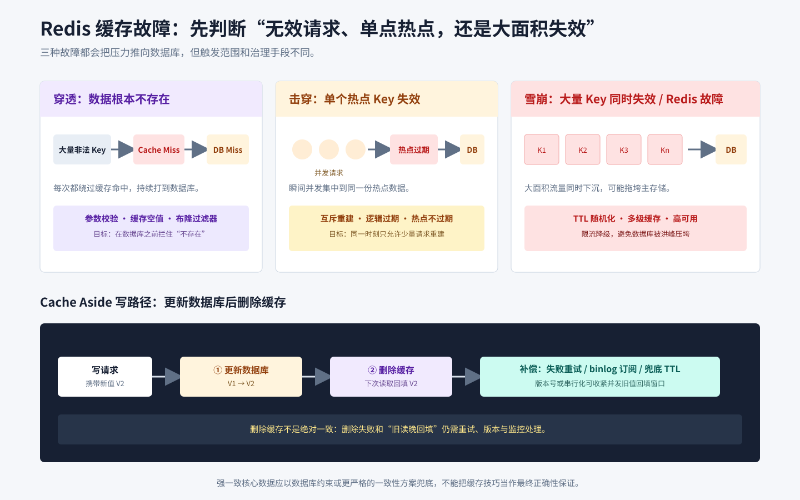

# Redis缓存

## 知识点解析

### 概述

本文整理 Redis 的性能来源、数据结构、持久化、高可用、缓存一致性、缓存异常和分布式锁。



### Redis 为什么快

Redis 快的主要原因：

- 数据主要在内存中，访问速度快。
- 单线程执行命令，避免大量锁竞争和上下文切换。
- 使用 IO 多路复用处理大量连接。
- 数据结构实现高效，例如 SDS、跳表、[哈希表](<../数据结构与算法/哈希表.md#哈希表>)、压缩列表等。

需要注意，现代 Redis 并不是所有工作都只有一个线程，网络 IO、持久化和删除等任务可能使用后台线程，但命令执行主路径仍然强调单线程模型。

### 数据结构

通常所说的 Redis“五种核心数据类型”是指 String、Hash、List、Set 和 ZSet。Bitmap 基于 String 的位操作实现，Geo 基于 ZSet 实现；HyperLogLog、Stream 等是后续扩展能力。因此“五种核心类型”与“Redis 只有五种类型”不是同一含义。

| 数据结构 | 典型场景 |
| --- | --- |
| String | 缓存、计数器、分布式锁 |
| Hash | 用户对象、商品属性 |
| List | 简单队列、时间线 |
| Set | 去重、共同好友、标签 |
| ZSet | 排行榜、延迟队列 |
| Bitmap | 签到、布尔状态统计 |
| HyperLogLog | UV 近似统计 |
| Geo | 附近的人、距离计算 |
| Stream | 消息流、消费组 |

### 持久化

RDB 是某一时刻的数据快照：

- `SAVE` 由主进程同步生成快照，会阻塞命令处理，线上通常不用。
- `BGSAVE` 会 fork 子进程生成快照，主进程继续服务；fork 和写时复制仍可能带来延迟与额外内存。
- 配置的 `save` 条件、执行 `SHUTDOWN` 以及主从全量同步等场景可能触发快照。
- 恢复速度快、文件紧凑，但故障时会丢失上一次快照后的数据。

AOF 先把写命令追加到缓冲区，再按 `appendfsync` 策略刷盘：

| 策略 | 含义 | 取舍 |
| --- | --- | --- |
| `always` | 每条写命令都刷盘 | 最安全，性能最低 |
| `everysec` | 通常每秒刷盘 | 常用折中，故障时可能丢约 1 秒数据 |
| `no` | 交给操作系统决定刷盘 | 性能高，丢失窗口不可控 |

`BGREWRITEAOF` 不是简单压缩旧文件，而是根据当前数据状态生成能恢复同样结果的最小命令集，并在完成后原子替换旧 AOF；重写期间的新写入会被追加并合并。AOF 数据通常更完整，但文件和恢复成本更高。需要兼顾恢复速度与数据完整性时，可采用 RDB+AOF 或混合持久化。

### 高可用

Redis 高可用常见方案：

- 主从复制：读扩展和数据备份。
- Sentinel：监控主从节点。当认为主节点主观下线的 Sentinel 数达到配置的 `quorum` 时，主节点被判定为客观下线（ODOWN）；`quorum` 是可配置阈值，不一定是 Sentinel 总数的多数。真正执行故障转移时，候选 Sentinel 还必须获得全体 Sentinel 的多数授权。Sentinel 解决单主复制组的自动选主，不负责数据分片。
- Cluster：把 key 映射到 16384 个哈希槽并分散到多个主节点，每个主节点可带从节点，兼顾分片扩容和故障转移。

Cluster 默认按 `CRC16(key) % 16384` 定位槽；`{user:1}:name` 这类 hash tag 可让相关 key 落在同一槽。扩缩容时把槽从源节点迁移到目标节点，迁移中的 key 可能通过 `ASK` 临时重定向，槽归属稳定后客户端根据 `MOVED` 更新路由。跨槽多 key 操作受限，设计 key 时要提前考虑业务聚合维度。

### 缓存一致性

Cache Aside 常见写法是先更新数据库，再删除缓存。删除缓存而不是更新缓存，可以减少复杂派生值和并发写导致的旧值覆盖，但仍有两个典型竞态：

1. 数据库已更新，缓存删除失败，旧值会一直被读取。可用消息重试、订阅 binlog 删除缓存，并设置兜底过期时间。
2. 读请求缓存未命中并读到旧数据库值；随后写请求更新数据库并删除缓存；最后先前的读请求把旧值回填缓存。可用延迟双删缩短窗口，或按业务采用版本号、串行化更新。

延迟双删也不是绝对一致保证，延迟时间要覆盖典型读写耗时。对强一致要求高的核心数据，应直接读主存储或采用更严格的一致性方案，而不是只依赖缓存技巧。

### 缓存穿透、击穿、雪崩

| 问题 | 含义 | 解决 |
| --- | --- | --- |
| 缓存穿透 | 查不存在的数据，请求一直打到数据库 | 参数校验、缓存空值、布隆过滤器 |
| 缓存击穿 | 热点 key 失效，大量请求打到数据库 | 互斥锁、逻辑过期、热点 key 不过期 |
| 缓存雪崩 | 大量 key 同时失效或 Redis 故障 | 过期时间随机化、多级缓存、限流降级 |

### 分布式锁

Redis 分布式锁常用 `SET lock_key unique_token NX PX 30000` 原子完成“仅不存在时加锁”和设置超时。`unique_token` 必须标识锁持有者。不能先 `GET` 再 `DEL`，因为检查后锁可能过期并被别人取得；应使用 Lua 把校验和删除做成一个原子操作：

```lua
if redis.call('get', KEYS[1]) == ARGV[1] then
    return redis.call('del', KEYS[1])
end
return 0
```

锁超时必须覆盖业务执行时间，长任务需要受控续期；主从异步复制和故障切换仍可能让多个客户端同时持锁。资金等强一致场景应结合数据库约束、fencing token 或一致性更强的协调系统，而不能只把 Redis 锁当作最终正确性保证。

### 热 key 与大 key

- 热 key 是访问集中到单个 key，可能打满一个分片的 CPU 或网络。可用监控辅助识别；`redis-cli --hotkeys` 依赖 `allkeys-lfu` 或 `volatile-lfu` 等 LFU 淘汰策略提供的访问频率统计，生产环境不要为了临时排查而随意切换淘汰策略。确认热 key 后，可按业务使用本地缓存、读副本、请求合并或拆分 key。
- 大 key 是单个 value 占用过大或集合元素过多，会放大网络传输、持久化、迁移和删除阻塞。可用 `redis-cli --bigkeys`、`SCAN` 配合 `MEMORY USAGE` 排查，治理时拆分数据、限制元素数量，并优先用 `UNLINK` 异步释放。
- 线上不要用 `KEYS *` 全量扫描；检查和删除都应限速、分批，避免治理动作本身造成阻塞。

## 笔试常考

- Redis 五种核心数据类型与 Bitmap、Geo、HyperLogLog、Stream 的关系。
- Redis 为什么快。
- `SAVE`、`BGSAVE`、AOF 三种刷盘策略和 AOF 重写。
- 主从、Sentinel、Cluster 的职责，以及 16384 个槽如何迁移。
- 缓存穿透、击穿、雪崩的故障表现与治理。
- “更新数据库后删除缓存失败”和“旧读回填”的并发时序。
- `SET NX PX` 加锁，以及按唯一 value 校验并用 Lua 原子解锁。
- 热 key 与大 key 的识别、影响和治理。

## 面试应对

### Redis 如何选择持久化与高可用方案？

回答思路：先比较 RDB 与 AOF 的恢复能力和性能代价，再区分 Sentinel 与 Cluster 的适用场景。

回答模板：

持久化方面，RDB 是定期快照，文件紧凑、恢复快，但可能丢失上次快照后的数据；AOF 记录写命令，采用 `everysec` 时通常最多丢失约一秒数据，但文件更大、恢复成本更高。业务常结合两者或使用混合持久化。高可用方面，Sentinel 适合不需要分片的单主复制组，负责监控、选主和故障转移；Cluster 用 16384 个槽进行数据分片，同时提供扩容和故障转移。持久化解决故障后的数据恢复，高可用解决节点故障后的服务接管，两者不能互相替代。

### 缓存和数据库如何保持一致？

回答思路：先说常见方案，再说并发风险和补偿。

回答模板：

常见方案是先更新数据库，再删除缓存。删除缓存比更新缓存更稳，因为缓存值可能由复杂逻辑计算而来，并发写入时直接更新缓存容易出现旧值覆盖新值。这个方案仍然可能有短暂不一致，所以工程上会配合过期时间、延迟双删、消息队列重试、binlog 订阅和监控补偿。核心目标不是做到绝对实时一致，而是在业务可接受范围内控制不一致窗口。

### 缓存穿透、击穿和雪崩有什么区别，如何治理？

回答思路：分别说明请求特征、风险来源和对应治理手段。

回答模板：

缓存穿透是查询不存在的数据，缓存和数据库都无法命中，可通过参数校验、缓存空值和布隆过滤器治理；缓存击穿是单个热点 key 失效后大量请求同时访问数据库，可使用互斥锁、逻辑过期或热点 key 不过期；缓存雪崩是大量 key 集中过期或 Redis 整体故障导致请求集中落到数据库，可通过过期时间随机化、多级缓存、Redis 高可用以及限流降级治理。三者分别对应无效数据、单个热点和大面积失效。

### Redis 分布式锁怎么实现？

回答思路：说明原子加锁、过期时间、唯一标识和安全释放。

回答模板：

Redis 分布式锁常用 `SET key value NX EX seconds` 实现，`NX` 保证 key 不存在时才能加锁，`EX` 设置过期时间避免死锁。value 要使用唯一标识，释放锁时先校验 value 再删除，防止误删其他客户端的锁。更严格的场景还要考虑锁续期、主从切换和业务能否接受 Redis 锁的一致性边界。

### 如何发现和治理 Redis 热 key 与大 key？

回答思路：先区分热 key 与大 key 的影响，再说明排查限制和治理方式。

回答模板：

热 key 是访问量集中在少数 key 上，容易打满单个分片的 CPU 或网络；大 key 是单个 value 过大或集合元素过多，会增加网络传输、持久化、迁移和删除成本。热 key 应先结合业务监控和访问指标定位，`redis-cli --hotkeys` 只有在使用 LFU 淘汰策略时才能依赖其频率统计，生产环境不能为了排查随意切换策略；治理可采用本地缓存、请求合并、读副本或拆分 key。大 key 可用 `--bigkeys`、`SCAN` 和 `MEMORY USAGE` 排查，再通过拆分、限制元素数量和 `UNLINK` 异步删除治理。
