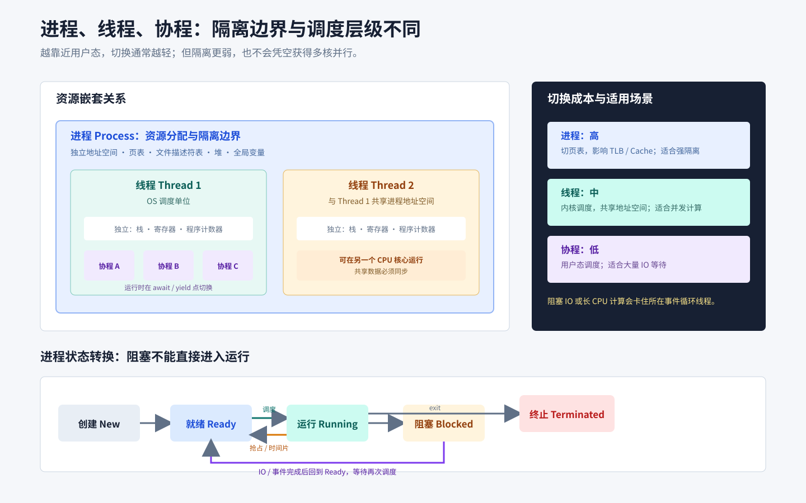

# 进程线程协程

## 知识点解析

### 概述

本文整理进程、线程和协程的资源模型、调度方式、上下文切换、进程状态、调度算法和进程间通信。

### 操作系统的基本特征

现代操作系统具有并发、共享、虚拟和异步四个基本特征，其中并发与共享互为条件，也是最基本的特征：

- 并发：多个程序在一段时间内交替推进；并行则强调多个任务在同一时刻真正同时执行。
- 共享：系统中的有限资源可由多个并发执行的进程共同使用，包括互斥共享和同时共享。
- 虚拟：通过分时复用、地址映射等技术，把一个物理资源抽象成多个逻辑资源。
- 异步：进程以不可预知的速度向前推进，操作系统必须依靠调度和同步机制维持正确性。

### 用户态、内核态与系统调用

用户态中的应用权限受限，不能直接执行特权指令或任意访问硬件；内核态中的操作系统内核可以管理 CPU、内存、设备和进程。二者分离可以限制故障和恶意程序的影响范围，保护系统稳定性。

应用访问文件、网络或进程管理等内核能力时，会通过系统调用进入内核。CPU 随后切换到内核态执行受控服务，处理完成后再返回用户态。系统调用会发生特权级切换，但不一定发生进程或线程上下文切换；只有当前任务阻塞、时间片耗尽或被抢占等情况下，调度器才需要切换执行实体。

### 进程

进程是资源分配的基本单位。每个进程有独立地址空间、页表、文件描述符、堆和全局变量等资源。进程之间隔离性强，一个进程崩溃通常不会直接破坏另一个进程，但进程切换和通信成本较高。

### 线程

线程是 CPU 调度的基本单位。同一进程内线程共享地址空间和进程资源，但每个线程有自己的栈、寄存器和程序计数器。线程通信方便，但共享内存也带来竞态条件，需要锁、信号量、条件变量等机制保证安全。

### 协程

协程是用户态的轻量级执行单元，通常由语言运行时调度。协程切换不需要进入内核，成本低，适合高并发 IO。但协程不是操作系统调度单位，也不天然利用多核。

事件循环只有在协程执行到 `await` 等让出点时，才能调度其他任务。若协程直接调用未被运行时接管的阻塞 IO，或长时间执行 CPU 计算，承载它的事件循环线程就会被阻塞，同一线程上的其他协程也无法推进。常见处理是使用异步 IO，将阻塞调用放入线程池，把 CPU 密集计算交给多进程或原生并行计算库。

### 对比

| 对比项 | 进程 | 线程 | 协程 |
| --- | --- | --- | --- |
| 资源隔离 | 强 | 弱 | 更弱 |
| 调度者 | 操作系统 | 操作系统 | 用户态运行时 |
| 切换成本 | 高 | 中 | 低 |
| 通信方式 | IPC | 共享内存 | 共享上下文/消息 |
| 适用场景 | 服务隔离 | 并发计算/共享数据 | 高并发 IO |

### 进程间通信

常见进程间通信方式包括管道、[消息队列](<../分布式与中间件/消息队列.md#消息队列>)、共享内存、信号量和 Socket。共享内存减少了数据复制，速度快，但必须配合同步机制；Socket 既支持同机通信，也支持跨机器通信。

### 进程状态与调度

进程常见状态包括创建、就绪、运行、阻塞和终止：

- 创建：系统正在建立进程控制块并分配初始资源。
- 就绪：已经具备运行条件，等待 CPU。
- 运行：正在占用 CPU。
- 阻塞：等待 IO、锁或其他事件。
- 终止：执行已结束，系统等待回收或正在释放资源。

进程被接纳后从创建态进入就绪态，调度后从就绪态进入运行态；时间片用完或被更高优先级任务抢占时从运行态回到就绪态；等待 IO 会从运行态进入阻塞态；IO 完成后从阻塞态回到就绪态；执行结束则进入终止态。阻塞态不能直接变为运行态，必须先回到就绪队列。

常见调度算法：

| 算法 | 核心思想 | 主要特点 |
| --- | --- | --- |
| FCFS | 先到先服务 | 简单，可能出现护航效应 |
| SJF | 优先运行短作业 | 平均等待时间低，长作业可能饥饿 |
| RR | 按时间片轮转 | 公平，时间片过小会增加切换 |
| 优先级调度 | 高优先级先运行 | 低优先级可能饥饿 |
| 多级反馈队列 | 动态调整队列和时间片 | 兼顾响应与吞吐 |

调度示例：`P1、P2、P3` 同时到达，服务时间分别为 `5、3、1`，忽略切换开销。FCFS 甘特图为 `P1(0-5) P2(5-8) P3(8-9)`，平均等待时间为 $(0 + 5 + 8) / 3 = 4.33$；SJF 为 `P3(0-1) P2(1-4) P1(4-9)`，平均等待时间为 $(0 + 1 + 4) / 3 = 1.67$。若 RR 时间片为 2 且初始队列为 `P1、P2、P3`，执行顺序为 `P1(0-2) P2(2-4) P3(4-5) P1(5-7) P2(7-8) P1(8-9)`；完成时间分别为 `9、8、5`，等待时间分别为 `4、5、4`。

### IPC 怎么选

| 方式 | 适用场景 | 注意事项 |
| --- | --- | --- |
| 匿名管道 | 有亲缘关系进程、单向字节流 | 生命周期通常依赖进程 |
| 命名管道 | 无亲缘关系的本机进程 | 仍是字节流 |
| 消息队列 | 按消息边界异步通信 | 有复制和队列容量开销 |
| 共享内存 | 大数据量、高性能本机通信 | 必须额外同步 |
| 信号 | 简单事件通知 | 携带信息有限 |
| Socket | 跨机器或通用客户端服务端 | 协议和序列化成本 |

共享内存只提供共同可见的数据区域，不保证操作原子性、可见顺序或一致性。生产者消费者可用互斥锁保护队列，再用条件变量等待“非空/未满”；跨进程时则使用进程共享的信号量或其他内核同步原语，并明确数据布局和生命周期。

### 上下文切换与并发选择

上下文切换要保存和恢复寄存器、程序计数器、栈指针及调度状态。线程切换通常共享地址空间；进程切换还可能更换页表并扰动 TLB 和 Cache，所以开销通常更大。协程切换保存的用户态状态更少，但运行时调度和任务本身仍有成本。

CPU 密集任务需要并行利用多个核心，通常选择多进程、可并行执行的原生线程或底层计算库；IO 密集任务主要在等待，线程池和协程都能用少量执行资源维持大量并发。具体选择还取决于语言运行时限制、隔离要求和阻塞库是否支持异步。

### I/O 模型与 epoll

阻塞 I/O 会让调用线程等待操作完成；非阻塞 I/O 在暂时不能完成时立即返回，由应用稍后重试；I/O 多路复用让一个线程同时等待多个文件描述符的就绪事件；异步 I/O 则由内核在操作完成后通知应用。它们描述的是等待和通知方式，不能简单等同于同步、异步编程模型。

Linux 的 `epoll` 是面向大量文件描述符的 I/O 多路复用机制。应用先把关注的文件描述符及事件注册到内核，再通过 `epoll_wait` 获取已就绪事件。与每轮等待都要传入并扫描整个集合的 `select`/`poll` 相比，`epoll` 避免重复传递完整关注集合，并让应用主要处理就绪项。因此在连接很多但同时活跃连接较少时，它通常能减少无效扫描和线程数量。实际性能仍受事件处理成本、活跃连接比例和触发模式影响。

### 僵尸进程与孤儿进程

子进程退出后，内核会保留退出状态和少量进程表项，直到父进程调用 `wait`/`waitpid` 回收；这段时间子进程是僵尸进程，大量僵尸会耗尽 PID 或进程表资源。父进程若先退出，仍在运行的子进程成为孤儿进程，通常会被 `init`/子收割器接管并最终回收。僵尸已经结束，不能靠普通信号让它“再次退出”，应修复父进程的回收逻辑。

### 常见考法与解法

- 比较进程、线程和协程共享哪些资源、各自保存哪些状态。
- 给出状态转换图，判断调度、时间片和 IO 完成后的状态。
- 计算 FCFS、SJF、RR 的周转时间和等待时间。
- 根据通信范围、数据量和同步要求选择 IPC。
- 分析多线程程序中的竞态、死锁和上下文切换开销。
- 判断 CPU 密集和 IO 密集任务适合多进程、线程还是协程。

调度计算题：

$$
\begin{aligned}
\text{周转时间} &= \text{完成时间} - \text{到达时间} \\
\text{带权周转时间} &= \frac{\text{周转时间}}{\text{实际运行时间}} \\
\text{等待时间} &= \text{周转时间} - \text{实际运行时间}
\end{aligned}
$$

按算法画甘特图，先确定每个时刻运行哪个进程，再计算完成时间。RR 还要明确时间片大小和新进程到达时的入队顺序。

## 笔试常考

- 比较进程、线程、协程共享的资源，以及各自独立保存的执行状态。
- 根据创建、就绪、运行、阻塞和终止条件补全状态转换图。
- 画 FCFS、SJF、RR 甘特图，计算等待、周转、带权周转和响应时间。
- 按同机或跨机、数据量、消息边界和同步要求选择 IPC。
- 分析进程、线程、协程上下文切换涉及的状态及 Cache/TLB 影响。
- 根据 CPU 密集或 IO 密集特点选择多进程、线程池或协程，并判断能否利用多核。
- 区分系统调用中的特权级切换与调度导致的上下文切换。
- 比较阻塞、非阻塞、I/O 多路复用和异步 I/O，并解释 `select`、`poll` 与 `epoll` 的差异。

### 易错点

- 线程共享进程地址空间，但每个线程有独立栈、寄存器和程序计数器。
- 协程并不天然利用多核，它通常运行在线程之上。
- 共享内存速度快，但不提供并发安全。
- 进程是资源分配基本单位，线程是 CPU 调度基本单位，这是常见教材表述。
- 并发表示任务交替推进，并行表示同一时刻真正同时执行。

## 面试应对

### 进程、线程和协程的切换成本为什么不同？

回答思路：比较内核参与、地址空间切换和保存状态规模。

回答模板：

进程切换除了保存寄存器和调度状态，还可能切换页表并降低 TLB、Cache 命中率；同一进程内的线程共享地址空间，通常少一部分内存管理开销；协程由用户态运行时切换，只保存较少的执行上下文，通常最轻。实际成本还受工作集、运行时和切换频率影响，不能只按类型给固定倍数。

### 协程中调用阻塞函数会发生什么？

回答思路：事件循环依赖主动让出，区分异步 IO 与同步阻塞。

回答模板：

事件循环只能在协程让出控制权时运行其他任务。如果协程直接执行同步阻塞 IO 或长时间 CPU 计算，承载事件循环的线程会被卡住，同一线程上的其他协程也无法推进。应优先使用异步库；无法改造的阻塞调用放入线程池，CPU 密集计算则放入多进程或专用计算池。

### 使用共享内存通信时怎样保证正确性？

回答思路：共享内存负责传输，同步原语负责互斥、通知和可见性。

回答模板：

共享内存只让多个执行单元看到同一片数据，并不自动保证并发安全。我会先定义数据所有权和不变量，用进程共享互斥锁保护复合更新，用条件变量或信号量通知数据可读、空间可写，并处理异常退出后的清理。还要避免在未同步时读写标志位，否则可能出现竞态和可见性问题。

### 僵尸进程和孤儿进程有什么区别？

回答思路：区分“子进程已退出但未回收”和“父进程先退出”。

回答模板：

僵尸进程已经退出，但父进程还没有调用 `wait` 或 `waitpid` 读取退出状态，因此内核仍保留少量进程表信息；应由父进程及时回收。孤儿进程是父进程先退出、子进程仍在运行，它通常会被 `init` 或子收割器接管，之后正常回收。两者一个已经结束，一个仍可能运行，处理方式不同。

### 怎样让任务真正利用多核？

回答思路：操作系统可调度实体、运行时限制和任务类型。

回答模板：

真正利用多核需要有多个可被操作系统并行调度的执行实体。CPU 密集任务可使用多进程、原生并行线程或会释放运行时全局锁的底层库；单线程事件循环里的多个协程只能并发等待，不能自己跨核并行。以 CPython 为例，纯 Python 计算通常用多进程，而 NumPy、PyTorch 等释放 GIL 的底层[算子](<../../05_推理部署与系统/推理工程/算子.md#算子>)可以由线程并行，最终应以实际负载测试为准。

### epoll 为什么适合高并发连接？

回答思路：对比阻塞 I/O 和 `select`/`poll`，说明注册关注集合、就绪通知和适用边界。

回答模板：

`epoll` 让应用先把关注的文件描述符注册到内核，再通过 `epoll_wait` 获取已就绪事件。它不需要像 `select` 或 `poll` 那样在每轮等待时传入并检查完整集合，应用可以把工作集中在真正就绪的连接上。因此在连接数很多、同时活跃连接较少时，`epoll` 通常能减少无效扫描和线程上下文切换。它不是所有场景都更快，连接数量较少或大部分连接持续活跃时，优势会缩小。
