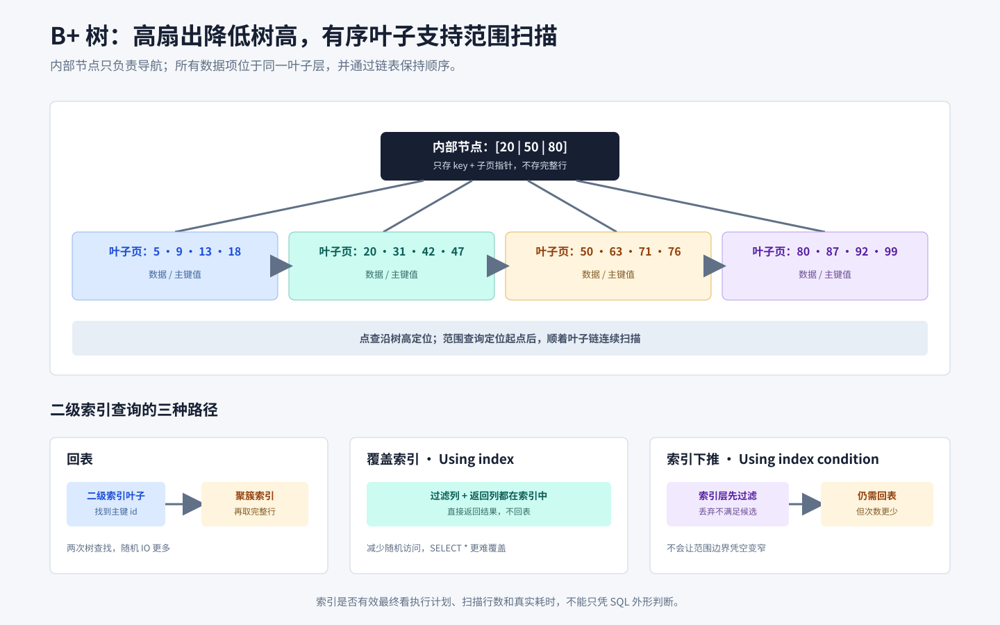

# 索引与查询优化

## 知识点解析

### 概述

本文整理 B+ 树索引、聚簇与非聚簇索引、覆盖索引、联合索引、索引失效、执行计划和慢 SQL 优化。



### B+ 树索引

B+ 树非叶子节点只存 key 和指针，叶子节点存数据或主键，并且叶子节点按顺序链表连接。它适合数据库索引，因为树高低、磁盘 IO 少、查询稳定，并且范围查询效率高。

| 结构 | 特点 | 作为数据库通用索引的取舍 |
| --- | --- | --- |
| B+ 树 | 非叶子节点只导航，数据集中在同层叶子节点，叶子有序相连 | 扇出大、树高低；点查、范围扫描和按序读取都较稳定 |
| B 树 | 内部节点和叶子节点都可保存数据 | 单次点查可能较早命中，但内部节点能容纳的键和子指针更少，范围扫描也不如叶子链顺畅 |
| 哈希 | 按哈希值定位桶，平均等值查找快 | 不保留键顺序，不适合范围、前缀和排序；冲突与扩容也有成本 |
| 普通二叉搜索树 | 每个节点最多两个子节点 | 扇出小导致磁盘场景树高和随机 IO 较多；不平衡时还可能退化为链表 |

B+ 树并非所有场景都绝对最快。纯内存等值查找可能更适合哈希，全文、空间或向量检索也需要专用索引；数据库选择 B+ 树，核心是它对页式存储、范围查询和稳定访问成本的综合适配。

### 聚簇索引和非聚簇索引

InnoDB 中主键索引是聚簇索引，叶子节点存整行数据。普通二级索引是非聚簇索引，叶子节点存主键值，查到主键后可能需要回表查询整行。

覆盖索引是指查询字段都能从索引中拿到，不需要回表。

### 联合索引和最左前缀

联合索引按字段顺序组织，例如 `(a, b, c)` 可以支持 `a`、`a,b`、`a,b,c` 的连续前缀匹配。跳过最左字段通常无法充分使用索引。

### 影响索引利用的常见条件

“索引失效”不是看到某种语法就能下的绝对结论，最终要看数据库版本、索引类型、数据分布和优化器成本。以下写法常使普通 B+ 树难以直接完成定位，或让优化器判断全表扫描更便宜：

- 对索引列使用函数或表达式可能破坏原有有序性，但与表达式一致的函数索引、生成列索引仍可能使用。
- 隐式类型转换是否影响索引，取决于转换发生在哪一侧以及类型、字符集和排序规则，不能一概而论。
- 前导模糊匹配如 `LIKE '%abc'` 通常不能用普通 B+ 树定位前缀，但全文索引等专用方案另当别论。
- 联合索引跳过最左列时通常不能直接按后续列定位连续区间，但仍可能发生索引全扫描、跳跃扫描或覆盖读取，取决于数据库能力。
- `OR` 分支的可索引性不一致时，优化器可能选择全表扫描；部分数据库也可能使用 index merge，或把查询拆成多个分支。分支本身互斥时可以直接使用 `UNION ALL`；通用的等价改写应把后续分支互斥化，例如第二个分支在满足自身条件的同时排除第一个条件，再用 `UNION ALL`。不能把重叠分支直接改成 `UNION`：它会对整个投影去重，可能合并原表中投影值相同的不同记录。只有投影包含唯一行标识，或原查询本来就要求 `DISTINCT` 时，`UNION` 去重才不改变所需语义。拆分不一定更快，必须比较执行计划和实际执行表现。

因此应使用 `EXPLAIN` 或实际执行计划描述“访问方式和成本”，而不是仅凭 SQL 外形断言索引一定失效。

### 联合索引怎么设计

索引字段顺序通常综合考虑：

1. 高频等值查询字段。
2. 选择性较高、能过滤大量数据的字段。
3. 范围查询字段通常放在等值字段之后。
4. 是否可以覆盖 SELECT 和 ORDER BY 所需字段。
5. 写入频率、索引大小和维护成本。

联合索引 `(a, b, c)` 的 B+ 树先按 `a` 排序，`a` 相同时再按 `b`、`c` 排序。因此跳过 `a` 后，`b` 在整棵树上不具备全局有序性。遇到范围条件后，后续字段通常难以继续用于缩小扫描范围，但仍可能用于索引下推或覆盖查询。

以索引 `(tenant_id, status, created_at, id)` 为例，`tenant_id = ? AND status = ? AND created_at >= ?` 可以用前两列等值定位，再对 `created_at` 做范围扫描；此后的 `id` 通常不能继续缩小扫描边界。如果查询还需要索引外的列并带有 `id > ?` 条件，存储引擎可通过索引条件下推（ICP）先在索引层过滤候选项，只对通过条件的记录回表，但扫描的 `created_at` 区间并未因此变窄。若查询所需列全在该索引中，则走覆盖索引路径，直接从索引返回而不回表，也不需要用 ICP 减少回表。

索引还能在顺序匹配时避免额外排序。例如前两列被等值固定后，`ORDER BY created_at, id` 与剩余索引顺序一致，优化器可能直接按索引输出；若跳过中间排序列、排序方向不兼容，或前导列不是单一等值范围，就可能需要 `filesort`。能否消除排序仍应以执行计划为准。

选择性可粗略理解为某列不同值数量与总行数之比，选择性越高，等值条件通常能过滤更多行。但优化器关心的是具体谓词预计返回多少行，而不只是整列平均值：低选择性列在数据倾斜、覆盖查询、配合 `LIMIT` 或利用索引顺序时仍可能值得建索引；返回大部分表数据时，即使有索引，全表扫描也可能更便宜。

### EXPLAIN 关注项

以下字段以 MySQL 为例：

| 字段 | 关注内容 |
| --- | --- |
| `id` / `select_type` / `table` | 查询块、子查询类型和当前访问对象，用来还原连接与执行层次 |
| `possible_keys` | 优化器认为可能可用的索引；为空不等于 SQL 一定无法优化 |
| `type` | 访问方式，如 `const`、`ref`、`range`、`index`、`ALL`，不能脱离扫描行数机械比较 |
| `key` / `key_len` / `ref` | 实际选择的索引、使用的索引键长度以及与哪些常量或列比较 |
| `rows` | 基于统计信息估算每次扫描需要检查的行数，不是实际返回行数 |
| `filtered` | 表条件过滤后预计保留的百分比；可结合 `rows` 粗估传给下一阶段的数据量 |
| `Extra` | `Using index` 表示覆盖索引，可直接从索引返回而无须回表；`Using index condition` 表示 ICP，仍需回表取索引外字段，但先在索引层过滤以减少回表；还应关注 `Using temporary`、`Using filesort` 等 |

普通 `EXPLAIN` 是优化器估计，不等于真实执行结果。MySQL 8.0.18+ 的 `EXPLAIN ANALYZE` 会实际执行语句，并显示各算子的实际耗时、实际行数和循环次数；对写语句使用前应确认执行影响。若估算行数与 `actual rows × loops` 差异很大，应检查统计信息是否陈旧、列值是否倾斜、条件是否相关以及参数值是否具有代表性，再决定更新统计信息、改写 SQL 或调整索引。

### 慢 SQL 排查

慢 SQL 排查要看执行计划、扫描行数、索引命中、回表、排序、临时表、锁等待和数据量。`EXPLAIN` 重点看 type、key、rows、Extra。

排查顺序：

```text
确认 SQL、参数和耗时分布
  -> 查看执行计划和实际扫描行数
  -> 检查索引与查询条件
  -> 检查回表、排序和临时表
  -> 检查锁等待、连接池和资源
  -> 改写或建索引后回归验证
```

## 笔试常考

- 给定联合索引和查询条件，按连续最左前缀判断哪些列可用于定位扫描范围，而不是只看字段是否出现在 SQL 中。
- 遇到首个范围列后，后续列通常不能继续缩小扫描边界，但仍可能用于 ICP 过滤或覆盖读取；三者作用不同。
- 区分回表、覆盖索引与索引条件下推：`Using index` 对应该表的覆盖索引路径并避免回表；`Using index condition` 对应仍需回表的 ICP 路径，只是在索引层提前过滤并减少回表。
- 判断 `OR` 改写：分支互斥时可直接使用 `UNION ALL`；通用等价改写需让后续分支排除前面已匹配的条件，再使用 `UNION ALL`。重叠分支不能直接用 `UNION`，因为它会对整个投影去重；只有投影含唯一行标识，或原查询本来要求 `DISTINCT` 时才不改变所需语义，性能则以执行计划和实测为准。
- 读 `EXPLAIN` 时结合 `type`、`key`、`key_len`、`rows`、`filtered` 和 `Extra`，不能只凭“走了索引”判断计划优劣。
- 比较估算行数与 `EXPLAIN ANALYZE` 的实际行数、循环次数；偏差大时检查统计信息、数据倾斜和条件相关性。
- 判断 `ORDER BY` 能否利用索引顺序：前导列是否等值固定、排序列是否连续、方向是否兼容，并检查是否出现 `Using filesort`。
- 低选择性列不等于绝对不能建索引；结合具体谓词、数据倾斜、覆盖、排序和 `LIMIT` 判断，全表扫描有时反而成本更低。
- 比较 B+ 树、B 树、哈希和二叉搜索树时，从页扇出、树高、等值查询、范围扫描和顺序输出逐项分析。

### 易错点

- “建了索引”不代表优化器一定选择它，小表或低选择性条件可能全表扫描更便宜。
- 索引不是越多越好，会增加写入、存储和优化器选择成本。
- 联合索引能否使用不能只看字段是否出现，还要看顺序、条件类型和查询目标。
- `LIKE 'abc%'` 可以利用前缀，`LIKE '%abc'` 通常无法使用普通 B+ 树定位。
- `SELECT *` 更难形成覆盖索引。
- `OR` 直接改写为 `UNION ALL` 可能重复返回同时命中多个分支的行，必须先证明分支互斥或让后续分支排除重叠；直接改用 `UNION` 又可能合并投影值相同的不同记录，除非投影含唯一行标识或原查询本来要求 `DISTINCT`。
- `Using index` 与 `Using index condition` 不是同一含义：前者表示覆盖读取，后者表示先做 ICP 过滤后仍需回表。

## 面试应对

### 为什么数据库索引用 B+ 树？

回答思路：从页扇出、树高、范围查询和顺序性对比 B 树、哈希与普通二叉搜索树。

回答模板：

数据库索引常用 B+ 树，是因为它适合页式存储和范围查询。非叶子节点只存键和指针，一个页能容纳更多分支，树高和磁盘 IO 都较低；数据集中在同层叶子节点，访问路径稳定，叶子链还能高效范围扫描。相比 B 树，它的内部节点扇出更大、叶子顺序扫描更自然；相比普通二叉搜索树，它更矮且不会因数据顺序退化；相比哈希，它还能支持范围、前缀和排序。当然，纯等值内存查询或全文检索可能选择其他专用索引。

### 慢 SQL 怎么排查？

回答思路：从基线、估算计划、实际统计、索引匹配、等待与资源逐层定位。

回答模板：

我会先固定 SQL、参数、数据量、耗时分布和返回行数，再用 `EXPLAIN` 看访问顺序、`type`、`key`、`key_len`、`rows`、`filtered` 以及排序、临时表和回表情况。条件允许时再用 `EXPLAIN ANALYZE` 比较估算行数与实际行数、循环次数，偏差大就检查统计信息和数据倾斜。随后判断联合索引是否匹配过滤、连接和排序，并区分无须回表的覆盖索引与仍需回表但可减少回表次数的 ICP。最后再排查锁等待、连接池、缓存和 CPU、IO 等资源，并用真实负载回归验证改动。

### 什么是覆盖索引？

回答思路：说明索引包含查询所需字段，因此可以避免回表。

回答模板：

覆盖索引是指 SQL 查询需要的字段都能直接从索引中取得，不需要再根据主键回表查询整行数据。MySQL `EXPLAIN` 的 `Using index` 通常表示这种路径。它能减少随机 IO，提高查询性能。例如联合索引包含 `user_id` 和 `status`，查询只需要这两个字段时，就可能直接使用覆盖索引。

### 联合索引字段顺序怎么确定？

回答思路：结合查询模式、等值范围、选择性、排序和覆盖回答。

回答模板：

我会先根据真实高频 SQL 设计，而不是只看单列选择性。通常把常用等值条件放在前面，范围条件放在后面，再考虑 ORDER BY 和需要返回的字段是否能形成覆盖索引。还要评估索引大小和写入成本。最终会用实际数据和 EXPLAIN 验证扫描行数，避免只凭规则决定顺序。

### 回表、覆盖索引和索引下推有什么区别？

回答思路：分别说明取数据位置和过滤时机。

回答模板：

回表是通过二级索引找到主键后，再访问聚簇索引取得整行数据。覆盖索引表示查询所需字段都在当前索引中，可以完全避免回表，在 MySQL `EXPLAIN` 中通常显示 `Using index`。索引下推用于查询仍需回表的场景：存储引擎先利用索引中的条件过滤候选记录，只把通过条件的记录回表，通常显示 `Using index condition`。因此覆盖索引和 ICP 是不同执行路径，分别解决“完全避免回表”和“减少回表次数”。

### OR 条件什么时候可以改写为 UNION ALL？

回答思路：先判断各分支是否互斥；不互斥时让后续分支排除已命中的条件，并说明 `UNION` 对整个投影去重的语义限制。

回答模板：

把 `OR` 拆成多个查询时，分支互斥可以直接用 `UNION ALL`。更通用的等价写法是让后续分支排除前面已匹配的条件，再用 `UNION ALL`，避免同一行被多个分支返回。不能笼统地说重叠时改用 `UNION`，因为它会对整个投影去重，还可能合并原表中投影值相同的不同记录；只有投影包含唯一行标识，或原查询本来就要求 `DISTINCT` 时，这种去重才不改变所需语义。拆分也不保证更快，最终要比较执行计划和真实数据下的执行表现。
