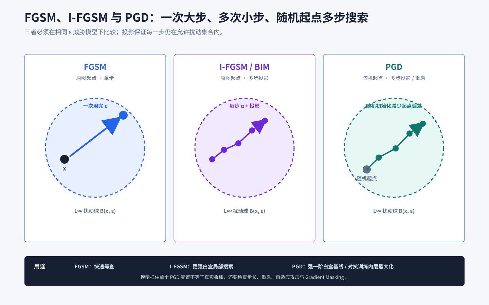

# FGSM

## 知识点解析

### 概述

FGSM 是单步梯度符号攻击方法，通过一次反向传播获得输入梯度，并在 `L_inf` 扰动约束下沿最能增大损失的方向生成对抗样本。

### 解决的问题

FGSM 解决的是“如何用最低成本生成对抗样本”的问题。它只需要一次 forward 和一次 backward，适合解释对抗样本原理、做快速鲁棒性测试和推导攻击公式。

### 攻击目标

非定向攻击：

$$
\begin{aligned}
\max_{x_{\mathrm{adv}}}\quad
& L(f(x_{\mathrm{adv}}),y) \\
\text{s.t.}\quad
& \lVert x_{\mathrm{adv}}-x\rVert_\infty\le\epsilon.
\end{aligned}
$$

定向攻击：

$$
\begin{aligned}
\min_{x_{\mathrm{adv}}}\quad
& L(f(x_{\mathrm{adv}}),y_{\mathrm{target}}) \\
\text{s.t.}\quad
& \lVert x_{\mathrm{adv}}-x\rVert_\infty\le\epsilon.
\end{aligned}
$$

### 公式推导

对损失函数做一阶泰勒展开：

$$
L(x+\delta,y)
\approx L(x,y)+\delta^{\mathsf T}\nabla_x L(x,y)
$$

在 $\lVert\delta\rVert_\infty\le\epsilon$ 下，为了最大化内积，每个维度都取梯度符号方向：

$$
\begin{aligned}
\delta&=\epsilon\,\operatorname{sign}(\nabla_x L), \\
x_{\mathrm{adv}}&=\operatorname{clip}(x+\delta).
\end{aligned}
$$

定向攻击符号相反：

$$
x_{\mathrm{adv}}
=\operatorname{clip}
\left(
x-\epsilon\,\operatorname{sign}
\left(\nabla_x L(f(x),y_{\mathrm{target}})\right)
\right)
$$



### PyTorch 骨架

```python
import torch
import torch.nn.functional as F


def fgsm_attack(model, images, labels, epsilon):
    model.eval()
    images = images.detach().clone().requires_grad_(True)
    logits = model(images)
    loss = F.cross_entropy(logits, labels)
    gradient = torch.autograd.grad(loss, images)[0]
    adversarial = images + epsilon * gradient.sign()
    return adversarial.clamp(0, 1).detach()
```

### 常见考法与解题方法

| 考法 | 怎么考 | 怎么解 |
| --- | --- | --- |
| 公式推导 | 为什么是 $\operatorname{sign}(\nabla_x L)$ | 从一阶泰勒和 `L_inf` 约束推导 |
| 定向攻击 | 定向和非定向符号区别 | 非定向增大真实标签 loss，定向减小目标标签 loss |
| 预算理解 | `8/255` 是什么 | 图像归一化到 `[0,1]` 后每个像素最大变化 |
| 方法局限 | FGSM 为什么弱 | 单步线性近似粗糙，不能充分探索局部高损失区域 |

### 易错点

- 图像已归一化到 mean/std 后，直接加 `8/255` 会导致预算口径错误。
- 攻击时模型处于 train mode，BatchNorm/Dropout 造成不稳定。
- 只裁剪像素范围，不说明扰动预算。
- 定向攻击符号写反。

## 面试应对

### 1. FGSM 的公式是什么，为什么要取梯度符号？

回答思路：先写非定向攻击目标，再用一阶泰勒展开说明在 `L_inf` 约束下逐维取符号能够最大化损失增量；补充定向攻击的符号相反。

回答模板：

> FGSM 是单步白盒攻击。非定向攻击写成 $x_{\mathrm{adv}}=\operatorname{clip}(x+\epsilon\,\operatorname{sign}(\nabla_x L(f(x),y)))$。对损失做一阶展开后，增量近似为 $\delta^{\mathsf T}\nabla_x L$；在 $\lVert\delta\rVert_\infty\le\epsilon$ 下，每一维取 `epsilon` 乘梯度符号可以使这个内积最大，因此得到该更新式。定向攻击要减小目标标签损失，所以更新符号相反。最后还要同时保证扰动预算和合法像素范围。

### 2. FGSM 与 I-FGSM、PGD 有什么区别，分别适合什么场景？

回答思路：从更新次数、起点、攻击强度、计算成本和用途比较，明确 FGSM 适合快速测试但不足以单独支撑强鲁棒结论。

回答模板：

> FGSM 只做一次梯度更新，成本最低，适合原理说明、快速筛查和低成本训练；I-FGSM 把一次大步拆成多次小步并逐步投影，白盒攻击通常更强；PGD 进一步在扰动球内随机初始化，更适合搜索局部最坏扰动和做鲁棒评估。FGSM 的单步线性近似较粗，不能因为模型扛住 FGSM 就认定其鲁棒；正式评估至少还应加入多步攻击、合理参数搜索和必要的自适应攻击。

### 3. 如何设计一个可信的 FGSM 实验，攻击失败时先查什么？

回答思路：固定威胁模型和数据口径，报告 clean/robust 指标；失败时检查归一化、梯度、模型模式、定向符号及预算裁剪。

回答模板：

> 我会先明确 `L_inf` 威胁模型、`epsilon`、定向或非定向设置，并保证攻击前后的预处理口径一致。实验同时报告 clean accuracy、FGSM 下的 robust accuracy 或 ASR，并与更强的多步攻击对照。若 FGSM 几乎无效，我会依次检查输入是否真正参与求导、模型是否误用 train mode、`8/255` 是否被错误加在标准化空间、定向攻击符号是否写反，以及是否只做了像素裁剪却没有正确处理扰动预算。这样可以区分实现错误、梯度异常和模型真实鲁棒性。
