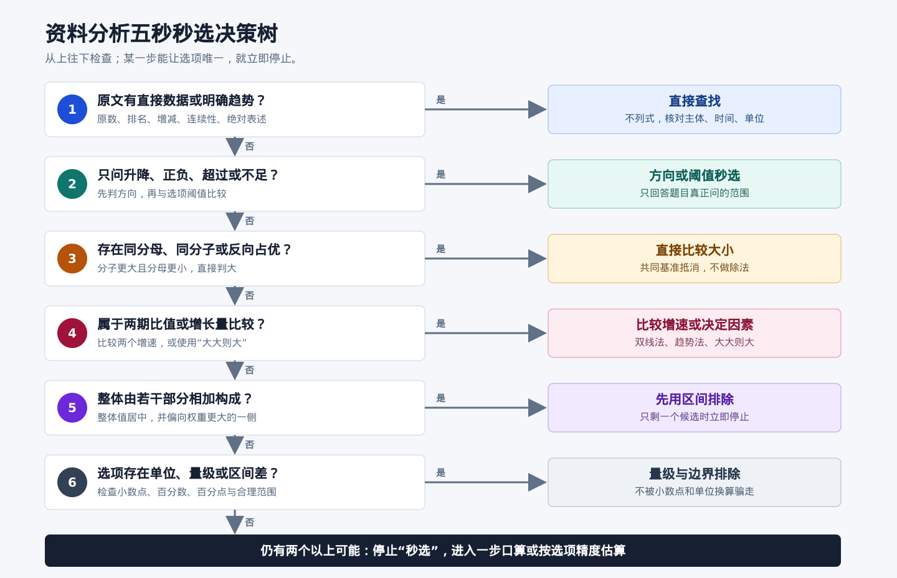
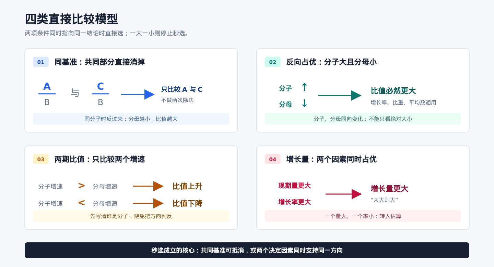
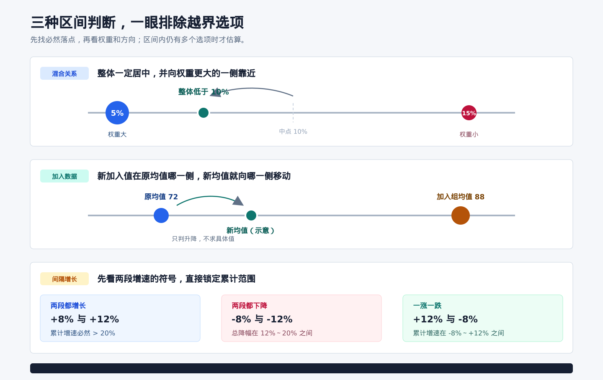

# 资料分析秒选技巧

## 使用定位

本卡不重复公式推导，专门整理能够通过**方向、大小、区间、图形和选项关系**直接判断的技巧。这里的“不计算”是指不做完整乘除和精确求值，不代表不读题、不列关系或不核对适用条件。

一眼判断只有三种合法依据：

1. **顺序确定**：一个量的分子更大且分母更小，或者两个决定因素同时占优。
2. **范围确定**：答案必在某个区间、某个方向或某个数量级内。
3. **选项唯一**：利用前两项结论后，只有一个选项仍可能成立。

若只能排除部分选项，就转入估算；不能为追求“秒杀”强行套口诀。

## 五秒判断顺序

拿到题目后依次检查：

1. 能否直接查表、读图或根据题干原文判断。
2. 是否只问上升下降、最大最小、超过不足。
3. 能否利用同分母、同分子或“分子大且分母小”直接比较。
4. 是否属于比重、平均数、利润率等“两期比值”，只需比较两个增速。
5. 是否属于混合增长或混合平均数，可先用居中与偏向排除。
6. 是否可从正负、量级、单位和选项范围直接排除。
7. 上述方法仍不能唯一确定时，再做一步口算、估算或精算。

## 零笔运算

### 1. 直接查找优先

综合判断题不按 A、B、C、D 顺序硬算。先找：

- 材料已有原数或明确文字结论的选项。
- 只比较两个已给增速、金额或占比的选项。
- 只问增长、下降、超过、不足等方向的选项。
- 含“全部、均、唯一、连续增长”等绝对表述的选项，一个反例即可否定。

只有剩余选项都需要运算时，才开始计算。原则是“先查后算、先易后难”。

### 2. 同基准直接比较

| 结构 | 直接结论 |
| --- | --- |
| 多个部分除以同一个整体 | 部分量越大，占比越大 |
| 多个总量除以同一个人数或面积 | 总量越大，平均值越大 |
| 同一个总量除以不同人数 | 人数越少，平均值越大 |
| 同一基期比较正增长量 | 正增速越大，增长量越大 |
| 同一正增速比较增长量 | 基期量越大，增长量越大 |

看到共同分母或共同分子时，不要真的做除法。

### 3. 分子分母反向占优

比较两个正比值：

- 分子更大、分母更小，前者一定更大。
- 分子更小、分母更大，前者一定更小。
- 分子和分母同时变大或同时变小，不能直接判断。

这条可用于增长率、比重、平均数、倍数和单位指标比较。

### 4. 双线法比较增速

比较两个时期的增速，本质上同时看“增加多少”和“原来有多少”：

- 甲的增量更大、基期更小，则甲增速一定更大。
- 甲的增量更小、基期更大，则甲增速一定更小。
- 增量和基期同时更大，属于一大一小，不能秒选。

柱状图或折线图中，可以先看相邻年份的垂直高度差代表增量，再看前一年高度代表基期。只有两条判断线同时支持同一对象时，才可直接选。

### 5. 两期比值只判方向

题目比较现期与基期的比重、平均数、利润率或“每单位指标”时：

- 分子增速大于分母增速，比值上升。
- 分子增速小于分母增速，比值下降。
- 两者增速相同，比值不变。

常见映射：

| 题目 | 分子 | 分母 |
| --- | --- | --- |
| 某类占总量比重 | 某类数量 | 总量 |
| 人均收入 | 收入 | 人数 |
| 单位面积产量 | 产量 | 面积 |
| 利润率 | 利润 | 收入或成本，按题目定义 |
| 招聘景气指数 | 需求人数 | 求职人数 |

先确定题目到底把谁放在分子、谁放在分母，不能见到两个增速就机械比较。

### 6. 两期比重差先判方向再限幅

若题目问“比重上升或下降多少个百分点”：

1. 先比较部分增速与整体增速，确定正负方向。
2. 在部分增速非负、现期比重不超过 100% 的常见场景下，比重变化的绝对值不超过两增速之差。
3. 选项中若只有一个同时满足方向和范围，可直接选。

例如部分增长 12%、整体增长 7%，比重一定上升，且变化不超过 5 个百分点。若选项为“上升0.6、上升5.4、下降0.6、下降5.4个百分点”，直接选上升0.6个百分点。

边界：部分增速为负时，不能无条件使用“小于增速差”这一限幅结论；只判方向，或回到估算。

### 7. 混合关系居中偏向

当整体由两个不重不漏的部分组成时：

- 整体增速一定介于两个部分增速之间。
- 整体平均数一定介于两个部分平均数之间。
- 权重更大的部分，会把整体结果拉得更靠近自己。

例如两部分增速分别为 5% 和 15%，整体增速不可能低于5%或高于15%。若5%对应部分的**基期量**更大，整体增速还应低于中点10%。

反向判断也成立：整体增速为8%，已知一个部分增速为12%，另一个部分增速必低于8%。

边界：

- 混合增长率按基期量加权，不能看到现期量较大就直接判“偏向”。
- 各部分必须不重不漏、统计口径一致、权重为正。
- 两个以上部分时可以先判区间，通常不能仅凭“偏向”唯一确定。

### 8. 增长量“大大则大”

正增长场景下，增长量随现期量和增长率同时增大：

- 甲现期量更大且增长率更大，甲增长量一定更大。
- 甲现期量更小且增长率更小，甲增长量一定更小。
- 一个量大、另一个率小，不能直接判断，应比较量级或做估算。

下降场景同理：现期量更大且降幅更大，减少量一定更大。增长和下降混在一起时先按正负分组，不能套同一句口诀。

### 9. 基期量反向占优

在增长因子均为正的正常统计场景下：

- 甲现期量更大、增长率更小，则甲基期量一定更大。
- 甲现期量更小、增长率更大，则甲基期量一定更小。
- 现期量和增长率同时更大，需要进一步判断。

单独求一个基期量时也可先判范围：

- 正增长：基期量小于现期量。
- 负增长：基期量大于现期量。

若选项只有一个位于正确方向，直接选。

### 10. 图形高度差

同一坐标轴、刻度连续且绘图精度足够时：

- 柱高或点位表示数量，高低直接表示数量大小。
- 相邻年份的垂直高度差表示增长量大小。
- 折线向上或向下只表示数量增减，不等于增速大小。

不能使用的情况：

- 左右双坐标轴混用。
- 纵轴断轴、采用非线性刻度，或不同图使用不同刻度。
- 比较增长率却只看线段斜率。
- 两个候选高度非常接近，图形精度不足。

### 11. 同期间年均增速排序

多个对象的起止年份相同，比较年均增速时，不需要开方：

- 直接比较“末期相对初期扩大了多少倍”。
- 初期相同，末期越大，年均增速越大。
- 末期相同，初期越小，年均增速越大。
- 一个初期更小且末期更大，年均增速必然更大。

只有比较期间完全相同时才能这样做；期间不同不能省略年数影响。

### 12. A 与非 A

整体只分成 A 和“非 A”时，可由占比阈值直接判断：

| A 的占比 | A 与非 A 的关系 |
| --- | --- |
| 大于 50% | A 大于非 A |
| 大于 2/3 | A 大于非 A 的 2 倍 |
| 大于 3/4 | A 大于非 A 的 3 倍 |
| 小于 1/3 | 非 A 大于 A 的 2 倍 |

通用记法：A 占比超过 `k/(k+1)`，则 A 超过非 A 的 k 倍。此法适合直接排除明显不可能的倍数选项。

### 13. 正负、单位与量级

计算前先做三个检查：

- **正负**：正增长的增长量不能为负；下降后的基期通常大于现期。
- **单位**：亿元与万元、万人与人、百分数与百分点会造成一万倍、百分之一或口径错误。
- **量级**：部分不得超过整体；正常比重在0至100%之间；倍数与“多几倍”相差1。

四个选项若处于不同数量级，通常只需核对单位和小数点，不需要完整计算。

### 14. 连续区间反推

已知“起点到终点”的累计增速，以及“起点到中间点”的增速时，不必求后一段的具体增速：

- 累计增速大于前一段增速，后一段一定增长。
- 累计增速小于前一段增速，后一段一定下降。
- 两者相等，后一段不变。

例如2021年至2023年累计增长25%，2021年至2022年增长10%，则2022年至2023年一定增长。这个结论比较的是同一指标连续两段的变化倍数，不是把两个增速直接相减。

边界：各期数值须为正，时间段必须首尾相接、统计口径一致。

### 15. 新加入值拉动平均数

原有一组数据又加入一批新数据时，只看新加入部分的平均值位于原平均值哪一侧：

- 新加入部分高于原平均值，新平均值上升。
- 新加入部分低于原平均值，新平均值下降。
- 两者相同，新平均值不变。
- 新平均值一定介于原平均值与新加入部分平均值之间，并偏向数量更多的一组。

反过来，移除高于原平均值的一组，剩余平均值下降；移除低于原平均值的一组，剩余平均值上升。若材料给出新增总量和新增份数，只需比较“新增总量/新增份数”与原平均值，不必求最终平均值。

### 16. 间隔增长先看符号和范围

连续两段增速已知时，先看正负号，很多选项无需计算乘积即可排除：

- 两段都增长：累计增速大于两段增速之和。
- 两段都下降：累计降幅大于任一段降幅，但小于两段降幅之和。
- 一涨一跌：累计增速必在两个单段增速之间。

例如先增长8%、再增长12%，累计增速一定大于20%；先下降8%、再下降12%，累计降幅一定在12%至20%之间。只有区间内仍有多个选项时，才估算修正项。

边界：各段增速必须大于-100%；“增速”用带正负号的数比较，“降幅”用正数大小比较，不要混用。

### 17. 贡献率先判正负与排序

贡献率比较的是“某部分增长量占整体增长量的比例”。同一整体、同一时期内，分母相同，可先直接比较各部分增长量：

- 整体增长时：增长部分贡献率为正，下降部分贡献率为负；部分增长量越大，贡献率越大。
- 整体下降时：下降部分贡献率为正，增长部分贡献率为负；部分减少量越大，正贡献率越大。
- 各部分不重不漏时，贡献率合计为100%；单项可以大于100%，也可以为负。

所以看到“贡献率超过100%”不能直接判错：可能是某部分大幅增长，同时其他部分抵消了部分增量。整体增长量为0时贡献率无定义；接近0时贡献率会极不稳定，不能靠粗略比较。

## 一步口算即可锁定

### 1. 阈值反推

不要计算具体占比，只检查是否超过选项给出的阈值：

- 判断 `A/B` 是否超过50%，只比较 A 与 B 的一半。
- 判断是否超过1/3，只比较 3A 与 B。
- 判断是否不足70%，只比较 A 与 B 的七成。

题目只问“超过、不足、约为哪一档”时，比较到阈值即可停止。

### 2. 化同比倍数

两个分数的分子或分母接近整数倍时，先把其中一个整体放大：

- 比较 `28/82` 与 `58/155`，前者约放大两倍为 `56/164`。
- 此时第二个分数分子更大、分母更小，因此第二个更大。

这里没有做除法，只做了简单倍数变形。

### 3. 选项反向验证

选项是整数百分数、简单分数或整十数时，不求完整结果，直接把候选值代回：

- 求占比约30%，就检查部分量是否接近整体的三成。
- 求倍数约1.5，就检查较大量是否接近较小量的一倍半。
- 求增长量的选项相差很大，就检查“基期加该选项”能否接近现期。

优先验证容易心算、处在中间或能一次排除多项的候选值。

## 综合判断题的验证次序

四个选项按成本排序，而不是按字母排序：

1. 原文直接查找。
2. 正负、趋势、单位和时间范围。
3. 同基准、两期比值、混合区间等零笔判断。
4. 阈值比较和一步口算。
5. 基期、年均、多步乘除等复杂计算。

问“错误的是”，找到一个确定错误项即可停止；问“正确的是”，发现错误项只能排除，必须继续验证，直到唯一答案成立。

## 机构术语对照

| 常见名称 | 实质 | 是否属于零计算 |
| --- | --- | --- |
| 双线法 | 同时比较增量与基期，利用分子分母反向占优 | 是 |
| 趋势法 | 比较分子与分母谁变化得更快，判断比值升降 | 是 |
| 大大则大 | 两个决定因素同时占优时利用单调性 | 是 |
| 盐水法、十字交叉 | 加权平均的居中与偏向性质 | 判区间时是 |
| A 与非 A | 部分与补集之间的占比、倍数转换 | 是 |
| 图形秒杀、格尺法 | 用同轴图形高度差比较增长量 | 条件满足时是 |
| 间隔增长“偷懒法” | 先由两段增速的符号确定累计增速范围 | 选项有区分时是 |
| 贡献率比较 | 同一整体内先比较各部分增长量及其正负 | 判符号、排序时是 |
| 415份数法 | 把增长率转成份数后求增长量 | 仍有简算 |
| 假设分配法 | 先给近似结果，再分配误差修正 | 仍有简算 |
| 高位叠加、削峰填谷 | 多数求和或平均数的口算方法 | 仍有口算 |

学习时应记住右侧的数学依据，不依赖某一家机构的命名。

## 不能作为规则的“技巧”

- “不会就蒙 B/C”没有稳定依据。
- 选项之间出现和、差、倍数关系，只能提示可能的干扰项，不能单独证明答案。
- “整体一定更靠近现期量较大的部分”不严谨；混合增速看基期权重。
- “两期比重变化一定小于增速差”需要检查增长率符号和比例边界。
- “折线最陡就是增速最大”错误；纵轴展示的是数量时，斜率对应增量而非增长率。
- “估算结果最接近哪个就选哪个”只在误差不会跨越选项边界时成立。

## 训练方法

刷题时给每题先标一种标签：

| 标签 | 标准 |
| --- | --- |
| 0笔 | 只凭方向、大小、区间或直接读数唯一确定 |
| 1笔 | 一次阈值比较、倍数变形或选项代回即可确定 |
| 估算 | 需要首位、两位有效数字或简单百化分 |
| 精算 | 选项接近，必须保留较高精度 |

复盘重点不是记答案，而是回答两个问题：

1. 这道题最早在哪一步已经可以停止？
2. 当时有哪些条件不足以支持秒选？

连续训练时，先追求判断合法，再追求速度；错误使用一次“秒杀”通常比多算十秒损失更大。

## 公开来源

1. [花生十三：行测3大模块基础入门课](https://www.bilibili.com/cheese/play/ep45174)：课程目录列出双线法、趋势法、ABRX、415份数法、假设分配法、盐水法、高位叠加和削峰填谷等方法。
2. [华图《资料分析：秒杀类与易错类》](https://file.huatu.com/ziliao/202003/202003021429565951.pdf)：整理增长量“大大则大”、混合关系居中偏向、两期比值方向和图形判断。
3. [华图：资料分析秒选两期比重](https://m.jl.huatu.com/2022/0721/2323730.html)：说明两期比重先判方向、再利用范围排除选项。
4. [中公：资料分析综合分析解题策略](https://m.sc.offcn.com/html/2023/02/232883.html)：提出综合判断题“先查后算、先易后难”的验证顺序。
5. [华图：资料分析常用速算方法](https://m.qh.huatu.com/2025/0928/1783080.html)：归纳分数性质、化同、差分和按选项差距决定精度。
6. [华图：资料分析中的间隔增长率速算](https://jl.huatu.com/2021/0624/1721342.html)：说明两段同为正增长时，累计增速大于两段增速之和，并据此排除选项。
7. [中公：贡献率你了解多少](https://www.offcn.com/xingce/2020/0826/14862.html)：说明贡献率可正、可负、可超过100%，同一整体内可按部分增长量比较。
8. [华图：A与非A模型](https://m.puyang.huatu.com/2024/0820/5977971.html)：用部分占整体的阈值，直接转化部分与其余部分的倍数关系。
9. [华图：如何快速判断平均数的变化](https://m.qh.huatu.com/2025/0826/1781559.html)：说明平均数类题目可通过总量增速与份数增速直接判断升降。

机构资料用于归纳方法名称和常见用法；本卡的条件边界、反例提示和示例均重新核验整理，不把宣传中的“秒杀”视为无条件成立。
