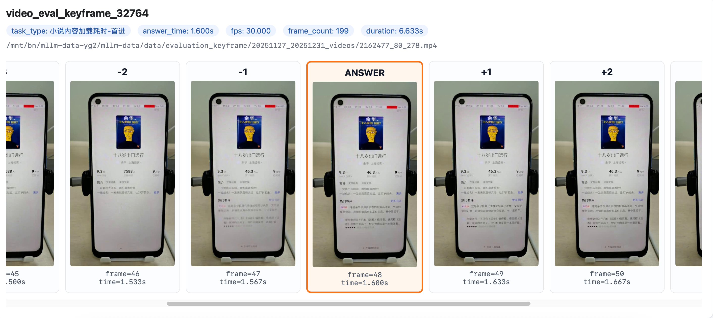
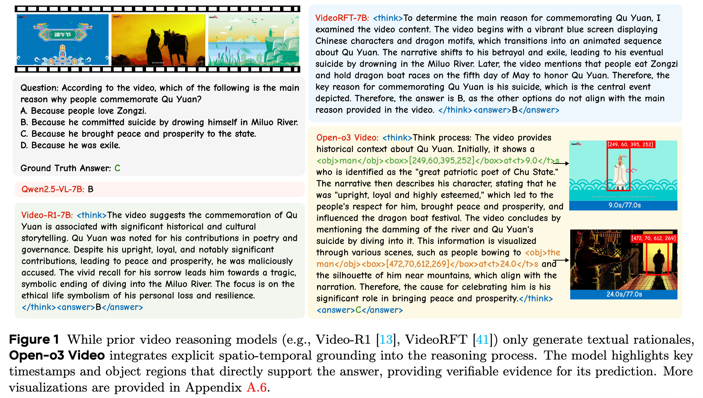
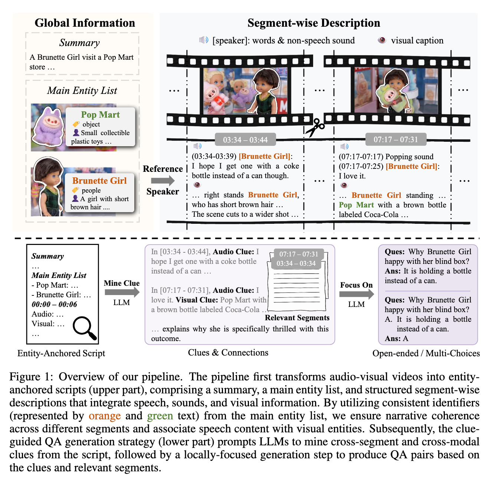
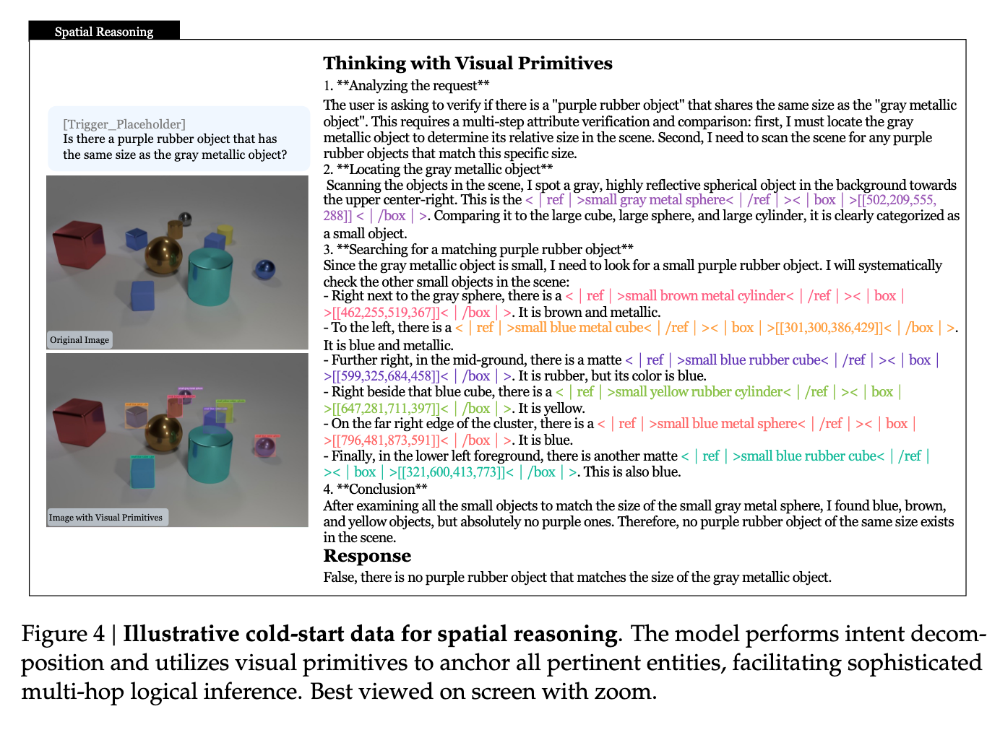
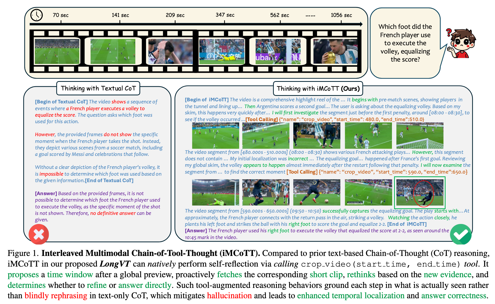
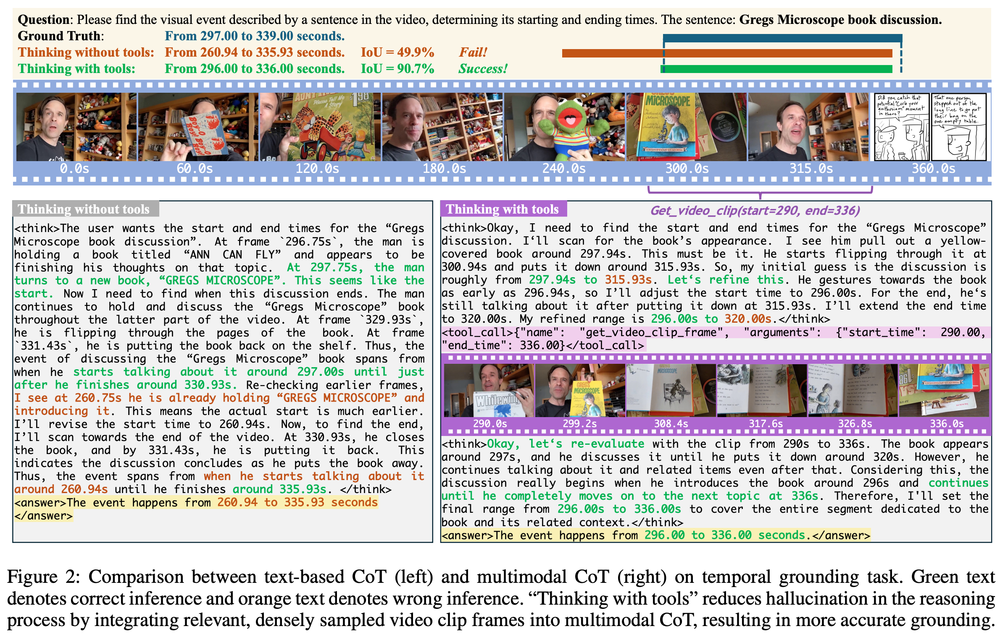
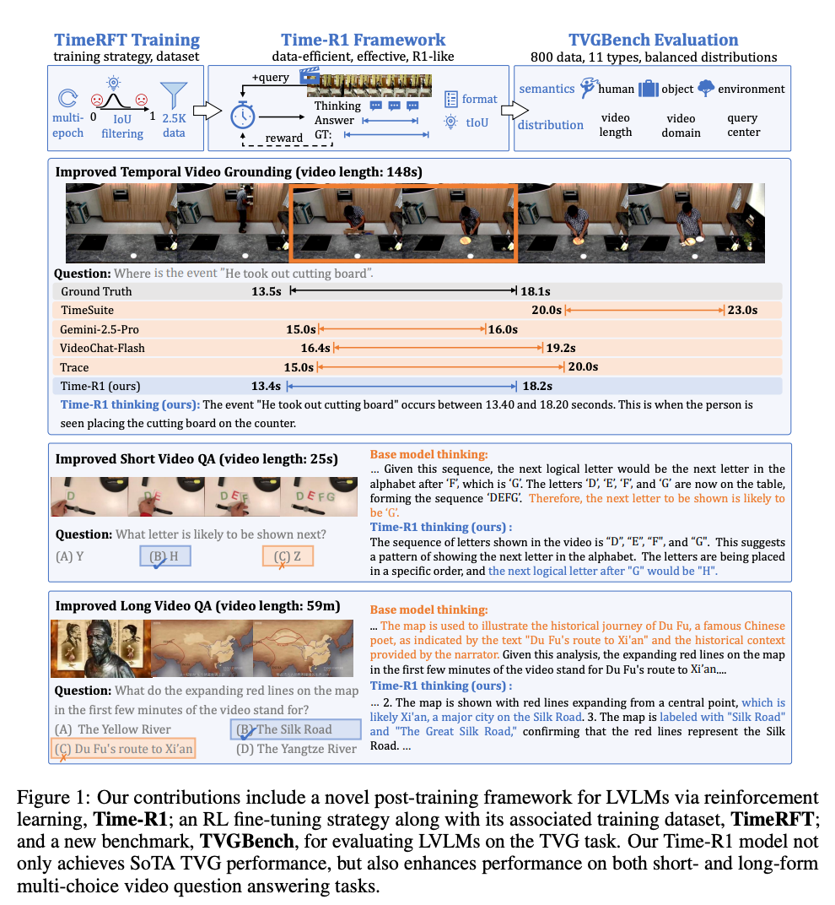

# 关键帧检测：CoT 蒸馏与 GRPO/RL 方案

## 知识点解析

### 概述

关键帧检测的基础模型已经可以处理视频输入、理解任务描述并输出时间点，当前需要解决的不是“模型完全不会做任务”，而是少数业务线和指标上的边界判断仍然不稳定。对于这些指标，继续增加普通样本、调整 Prompt 或做常规数据清洗，收益已经有限，因此需要把人工标注中隐含的判断过程显式化：先说明目标区域和完成态条件，再比较候选时间点前后的视觉证据，最后判断第一次满足条件的边界。CoT 蒸馏用于提供结构化的过程监督，GRPO 用于在模型已经具备基本判断能力后，利用时间、格式、证据和长度等可验证奖励进一步优化困难样本。完整路线是：

```text
Direct SFT 已解决大部分基础能力
  -> 定位仍然低 ACC 的指标和 bad case
  -> 构造结构化 CoT 数据
  -> 清洗 GT、校验视觉证据和时间边界
  -> Structured CoT SFT 冷启动
  -> Verifier-based GRPO/RL 优化剩余边界能力
  -> 评测、重标和数据飞轮
```

这套方案的重点不是让模型输出更长的解释，而是让模型学习“哪个时间点第一次满足完成态，以及这个判断由哪些可验证证据支持”。

### 1. 问题背景与方案目标

关键帧任务的输入通常是一段记录用户操作或页面加载过程的视频，输出是某个业务指标完成的时间点。例如：

```text
输入：视频 + task_type + 完成态定义 + 排除条件
输出：<answer>{"time": 6.97}</answer>
```

业务上的完成时间不是“页面第一次看起来像完成”的时间，也不是“视频结束前最稳定的一帧”，而是：

```text
满足任务定义的最早时间
  + 关键区域已经完成
  + 页面没有仍在进行的过渡
  + 后续没有推翻当前判断的二次刷新
```

因此任务本质上是**视频时间定位与边界判定**，而不是单纯的时间回归。

方案目标包括：

1. 提升少数低 ACC 指标的时间定位准确率。
2. 让模型区分加载中、局部完成、首次完成、后续稳定和二次刷新。
3. 让模型引用与时间点对应的视觉证据，减少事后合理化和幻觉。
4. 让训练数据可以被程序解析、自动校验和持续回流。
5. 在收益可验证的前提下控制 CoT 长度、视频 token 和 RL rollout 成本。

### 2. 当前模型效果与能力基础

当前模型效果如下：

| 业务线/范围 | 当前 ACC |
| --- | ---: |
| 全量平均 | 89.982 |
| 国际电商 | 97.457 |
| 番茄系 | 89.055 |
| 搜索系 | 75.977 |

这组结果说明：

- Direct SFT、数据治理、Prompt 和推理优化已经解决了大部分基础问题。
- 国际电商已经达到较高水平，继续提升的重点转向少量难例和边界样本。
- 番茄系整体已经接近 90，但仍需关注长尾指标和边界样本。
- 搜索系当前仍有较大提升空间，是更值得优先投入数据和训练资源的业务线。

因此，CoT + GRPO 的定位应从“解决模型不会做关键帧”调整为：针对剩余低 ACC 指标，学习更细的视觉证据、首次满足边界、局部异步加载和二次刷新判断。

### 3. 为什么 Direct SFT 仍然不够

这里的结论是：**Direct SFT 能解决大部分基础问题，但不能充分解决少数指标中的细粒度边界判断问题。**

#### 3.1 Direct SFT 已经能解决什么

普通 SFT 使用最终时间标签训练：

```text
视频 + 任务说明 -> {"time": 6.97}
```

它适合建立以下能力：

| 能力 | SFT 的作用 |
| --- | --- |
| 视频输入适配 | 学会接收视频、抽取时间相关视觉信息 |
| 任务遵循 | 根据 task_type 选择需要关注的页面或组件 |
| 完成态理解 | 学会识别明显的页面完成状态 |
| 时间预测 | 根据视觉变化输出大致完成时间 |
| 格式遵循 | 稳定输出可解析的 JSON 或指定标签 |
| 业务覆盖 | 通过大量样本学习常见页面和指标模式 |

这也是为什么方案必须先做 Direct SFT。若模型连视频输入、任务规则和答案格式都没有学会，直接做 CoT SFT 或 GRPO 只会增加无效训练样本和 rollout 成本。

#### 3.2 剩余能力缺口是什么

普通 SFT 的监督通常只提供最终答案，没有明确提供：

- `6.53s` 为什么还不能判完成。
- `6.97s` 为什么是第一次满足。
- `10.00s` 为什么只是后续稳定，而不是答案边界。
- 哪个 UI 区域是任务定义中的核心区域。
- 哪些局部变化是必须等待的，哪些是任务豁免项。
- 页面看似稳定后，如何判断后面是否发生二次刷新。

当相邻时间点之间的视觉差异很小，或者页面存在局部异步加载时，单点标签没有把真正的判定依据表达出来。模型可能学到常见答案区间或页面先验，却没有稳定学习“完成条件的组合”和“首次满足”的时间边界。

#### 3.3 为什么数据工程和 Prompt 工程可能已经遇到瓶颈

如果已经完成以下工作，继续做同类优化通常收益有限：

1. 清理无法解码、输入格式错误和明显错误标签。
2. 增加关键指标覆盖和困难样本。
3. 调整 FPS、最大帧数和视频输入配置。
4. 优化任务描述、完成态定义和排除条件。
5. 对常见 bad case 做样本补充和 Prompt 修正。

这类方法主要改善输入质量、任务表达和样本覆盖，但不能把人工判断中“前后比较、排除假停稳、验证后续稳定”的过程充分传给模型。此时应从最终答案监督升级到结构化过程监督，再用业务指标定义的 reward 做进一步优化。

### 4. 为什么使用 CoT + GRPO

CoT 和 GRPO 解决的是两个不同层次的问题：

```text
CoT SFT：把人工判断依据显式教给模型
GRPO：在多个候选判断之间，用可验证奖励强化更好的边界决策
```

#### 4.1 CoT 解决监督不完整

结构化 CoT 将一个最终时间点拆成：

```text
任务理解
  -> 目标区域
  -> 必须满足的证据
  -> 候选时间窗口
  -> before：为什么还未完成
  -> current：为什么第一次满足
  -> after：为什么没有被推翻
  -> 最终答案
```

这样，模型不只是看到“答案是 6.97”，还会看到：

```text
6.53s：核心图片仍是占位状态，不能判完成
6.97s：核心图文已经清晰，页面停稳，首次满足
10.00s：后续没有核心区域二次刷新，只是稳定延续
```

#### 4.2 GRPO 解决可验证的策略优化

当模型已经能够生成基本合法的结构化答案后，可以对同一个 prompt 采样多个回答：

```text
同一个视频和任务规则
  -> policy 生成 G 个候选回答
  -> verifier 计算每个回答的时间、格式、证据和长度 reward
  -> 组内归一化
  -> 强化高于组平均的回答
```

GRPO 不要求单独训练 Critic，而是使用组内相对奖励构造优势：

```text
A_i = (r_i - mean(r_group)) / (std(r_group) + epsilon)
```

它适合关键帧任务的原因是最终结果可以被程序或规则部分验证：

- 时间误差可以计算。
- 输出格式可以解析。
- before/current/after 的顺序可以检查。
- 关键证据是否出现在对应时间窗口可以复核。
- 输出过长和重复可以惩罚。

### 5. CoT 数据如何构造

#### 5.1 数据来源

CoT 数据应组合多种来源，而不是把所有原始样本一次性让教师模型自由生成：

| 数据来源 | 作用 |
| --- | --- |
| 高质量人工标注 | 提供可信的完成态定义和 GT |
| 原始 Direct SFT 数据 | 保持业务覆盖和基础格式 |
| 低 ACC 指标样本 | 直接针对目标能力缺口 |
| 模型 bad case | 覆盖 early、late、二次刷新和证据幻觉 |
| GT 附近 hard negative | 区分“接近完成”和“首次完成” |
| Video Primitive | 提供客观时间轴和状态变化 |
| 强教师模型 | 生成结构化观察、证据链和候选判断 |

高质量样本优先用于冷启动和评测；普通样本经过自动校验、教师复核和抽样人工审核后再进入训练。

#### 5.2 教师模型的输入

教师模型至少需要看到：

```text
视频
task_type
完成态标准
排除条件
豁免条件
输出 schema
```

教师在可见输入中不应直接看到：

```text
GT 是 6.97 秒
答案必须选 6.97 秒
人工标注认为某一帧正确
```

否则教师可能围绕答案进行事后合理化，生成“看起来合理但不是真实视觉证据”的解释。

更稳的流程是：

```text
教师先独立观察视频和任务规则
  -> 生成时间轴、候选窗口和判断
  -> 使用 GT/规则做隐藏校验
  -> 校验通过后形成训练样本
```

#### 5.3 第一步：生成 Video Primitive

Video Primitive 是客观的视频理解单元，不直接等于最终答案。

**State Primitive** 描述相对稳定的状态：

```text
时间：1.00-2.00
状态：详情页主体已经出现，书封清晰，但热门书评区域仍为空或正在加载。
```

**Event Primitive** 描述状态转移：

```text
时间：2.00-2.40
事件：热门书评区域从占位状态切换为完整文本。
before：区域为空或存在占位。
during：文本和头像逐步出现。
after：关键内容清晰，页面布局停止变化。
```

Primitive 的约束：

- 描述必须来自视频。
- 时间段要覆盖任务相关的关键变化。
- State 和 Event 不能大面积重复。
- 不输出 GT、关键帧或最终完成态结论。
- 不为了凑长度描述与任务无关的静止画面。

这样可以把“视频看懂了”和“按业务规则做判断”解耦。同一份时间轴可以服务于多个 task_type，也能降低教师模型围绕答案编造解释的风险。

#### 5.4 第二步：生成问题驱动的 Evidence Chain

将 task_type 规则和相关 Primitive 交给教师，只抽取当前任务需要的证据：

```text
当前任务关注哪个区域？
  -> 哪些状态和事件相关？
  -> 哪些候选时间需要比较？
  -> 前一个候选为什么不满足？
  -> 当前候选增加了什么证据？
  -> 后续是否发生二次刷新？
  -> 最终答案是什么？
```

不要把完整视频 caption 原样当作 CoT。完整 caption 适合描述视频发生了什么，关键帧 CoT 需要回答的是：

```text
针对当前 task_type，哪个证据决定了第一次完成边界？
```

#### 5.5 第三步：粗筛与精筛

人工标注的真实判断路径通常是：

```text
边看视频
  -> 发现疑似完成区间
  -> 往前确认还没有完成
  -> 往后确认没有被推翻
  -> 标出首次满足完成态的时间
```

机器侧可以拆成两个阶段：

```text
粗筛：低 FPS 扫描完整视频，定位候选窗口
精筛：候选窗口内高 FPS 复查，确认首个满足条件的帧
```

推荐的结构化输出：

```text
1. 完整视频粗筛
   -> 输出主要状态变化和候选窗口

2. 候选窗口未完成段
   -> 描述仍缺少什么证据

3. 首次完成态段
   -> 描述新增证据和首次满足原因

4. 后续稳定段
   -> 检查二次刷新、内容替换和边界是否被推翻

5. 最终答案
   -> 输出首次完成态片段的起始时间
```

两段式策略还能降低视频 token 成本。例如，10 秒视频若全程使用 30 FPS，需要处理约 300 帧；如果全视频使用 10 FPS 粗筛，再对 2 秒候选窗口使用 30 FPS 精筛，则约处理 100 + 60 = 160 帧。实际参数仍需结合视频长度、FPS、视觉 token 和边界精度验证。

#### 5.6 推荐的结构化 CoT Schema

```json
{
  "task_understanding": "定位首屏完成加载并稳定的最早时间",
  "target_region": "首屏商品区域、权益栏和底部导航",
  "required_evidence": [
    "核心商品图文完成渲染",
    "页面主干停止位移",
    "后续没有核心内容二次替换"
  ],
  "candidate_observation": [
    {
      "time": 6.53,
      "frame_ref": "frame_196",
      "status": "not_satisfied",
      "evidence": "商品区域仍在刷新，部分图片为空白占位。"
    },
    {
      "time": 6.97,
      "frame_ref": "frame_209",
      "status": "satisfied",
      "evidence": "核心商品图文和权益栏清晰显示，页面停止位移。"
    },
    {
      "time": 10.00,
      "frame_ref": "frame_300",
      "status": "stable_after",
      "evidence": "后续没有核心区域二次刷新或内容替换。"
    }
  ],
  "boundary_check": "6.53 尚未完成，6.97 首次满足，10.00 只是后续稳定。",
  "answer": {
    "time": 6.97
  }
}
```

字段职责：

| 字段 | 作用 |
| --- | --- |
| `task_understanding` | 压缩任务规则，明确要判断什么 |
| `target_region` | 限定关键区域，避免无关描述 |
| `required_evidence` | 将完成态拆成可检查条件 |
| `candidate_observation` | 记录时间顺序和状态变化 |
| `frame_ref` | 将自然语言证据绑定到抽帧或帧编号 |
| `boundary_check` | 解释首次满足和前后排除关系 |
| `answer` | 提供最终可解析结果 |

### 6. CoT 数据质量与治理

#### 6.1 为什么 CoT 可能是脏的

教师模型生成的 CoT 可能出现以下问题：

- 看到 GT 后进行事后合理化。
- 描述视频中不存在的按钮、交互或 UI 元素。
- 把后面发生的变化错误地写到前面的时间段。
- 将正常页面切换解释为异常跳变。
- 把稳定延续误写成新的完成证据。
- before 已经满足条件，却仍然把更晚时间写成首次完成。
- 用大量重复句子掩盖没有视觉依据。

因此，CoT 不是生成后直接训练，而是必须经过结构、时间、证据和来源校验。

#### 6.2 GT 先分流，再决定如何生成 CoT

原始人工 GT 也可能存在标注错误。不能强制教师围绕错误 GT 生成解释，否则会把脏标签和伪证据一起蒸馏给学生模型。

建议分成两类：

| GT 状态 | CoT 生成方式 | 后续处理 |
| --- | --- | --- |
| GT 正确 | 教师围绕 GT 前后证据生成 CoT | 通过校验后进入训练 |
| GT 疑似错误 | 教师独立判断时间并给出理由 | 抽样人工复核，决定是否修改 GT |

对于模型重标数据，应设置准入阈值：

```text
模型重标准确率达到预设阈值
  -> 进入训练候选集
低于阈值
  -> 回溯生成过程或交给人工重标
```

阈值不能只看模型自身置信度，而应在独立抽样集上用人工结果验证。

#### 6.3 数据分层

```text
clean：
  GT、时间顺序、视觉证据和最终答案一致，直接进入训练候选集。

ambiguous：
  画面边界模糊、GT 与模型判断接近或证据不足，降低权重、抽样审核或单独评估。

reject：
  视频不可用、结构不合法、证据幻觉严重或存在答案泄漏，不进入训练。
```

人工投入分为三个优先级：

```text
P0：冷启动金标和高可信评测集
  必须逐条确认，建立任务标准。

P1：低 ACC 指标、困难边界和模型失败样本
  重点审核 early/late、二次刷新、小 UI 元素和 GT 冲突。

P2：普通自动生成训练集
  以规则校验、教师复核和抽样审核为主，不逐条人工重写。
```

调研资料中有自动时间标注与人工修正结果的时间区间 IoU 大于 `0.5` 的比例约为 `93.82%` 的案例。这个数字不能直接当作当前项目效果承诺，但说明自动生成数据可以先测可用率，再将人工成本集中到困难样本，而不是默认逐条重写。

#### 6.4 自动质量检查

**第一层：视频和 Primitive**

- 视频可以解码。
- 时间轴没有越界、倒序或大面积重叠。
- State/Event 的描述与画面一致。
- 没有大量重复 caption。

**第二层：结构**

- 必需字段完整。
- 时间是合法数字或合法时间段。
- `candidate_observation` 至少包含未完成、首次满足和后续复核信息。
- JSON、XML 或标签结构可以解析。
- `answer.time` 与首次满足片段时间一致。

**第三层：时间**

```text
answer 时间是否位于候选窗口？
before/current/after 是否严格按时间递增？
answer 是否早于视频结束？
是否满足业务允许误差？
是否在答案后发生了必须等待的二次刷新？
```

**第四层：证据闭环**

必须能回答：

```text
前面为什么不满足？
当前看到了什么新增证据？
为什么是第一次满足？
后续有没有推翻当前判断？
```

**第五层：来源泄漏**

CoT 中禁止出现：

```text
GT
人工标注认为
参考答案是
给定时间
标签已经说明
```

也要检查隐式泄漏，例如所有样本都用相同句式、先写答案再补泛化理由，或时间精确到画面无法支持的粒度。

**第六层：长度和重复**

- 短任务保留结论和一到两条关键证据。
- 边界任务保留 before/current/after 和 boundary_check。
- 删除与任务无关的完整视频 caption。
- 惩罚重复的“因此”“可以判断”等套话。
- 避免 CoT 过长导致 answer 截断。

#### 6.5 语义一致性校验与回填

可以使用独立的语义一致性模块或教师复核模型，判断：

```text
指定时间段内是否真的出现了描述中的 UI 元素？
元素是新增、消失、移动还是内容替换？
描述的触发条件是否真实存在？
描述的方向、时间和状态是否与视频一致？
```

校验结果可以分为：

```text
高一致性 -> 保留
部分一致 -> 降权或人工抽样
低一致性 -> reject 或回填重生成
```

回填不是让模型重复生成同一段文字，而是把错误类型反馈给生成器，例如：

```text
“描述了页面下移，但视频实际是用户主动滑动”
“描述了图标后出现，但图标从页面开始就存在”
“答案后发生了核心商品二刷，需要修改完成边界”
```

#### 6.6 质量分

可以将多项检查合成质量分：

```text
Q =
  w_structure * structure_score
  + w_visual * visual_grounding_score
  + w_time * temporal_alignment_score
  + w_boundary * boundary_score
  - w_leakage * leakage_penalty
  - w_redundancy * redundancy_penalty
```

质量分的用途：

```text
高分 clean：
  进入 Structured CoT SFT。

中间分 ambiguous：
  降采样、降低 loss 权重或人工抽查。

低分 reject：
  进入数据审计集，不参与训练。
```

### 7. 实际数据演进路线

#### 7.1 M0：先打通蒸馏链路

第一阶段目标不是一次性覆盖全部指标，而是：

1. 确定 CoT schema 和数据量级。
2. 优先构造番茄系和国际电商高优指标数据。
3. 验证 CoT SFT 是否能提升目标指标。

调研记录中的阶段性计划是构造 `5000+` 条 CoT 数据，其中番茄系约 `6000+` 条，并以国际电商高优指标和番茄系指标作为第一轮验收对象。

#### 7.2 第一版数据：验证基本格式

第一版重点是打通：

```text
原始 GT
  -> 教师模型生成 CoT
  -> 解析和质量检查
  -> 训练小模型
  -> 验收指标
```

第一版数据存在两个典型问题：

- 时间切片不够细，直接把 GT 前后内容压成大段描述。
- 没有充分模拟人工“粗筛、精筛、前后复核”的判断路径。

因此第一版可以用于验证链路，但不能把其所有输出无条件作为高质量训练数据。

#### 7.3 第二版数据：加入粗筛、精筛和 GT 治理

第二版重点改进：

1. 先完整视频粗筛候选窗口，再在候选区间高帧率精筛。
2. 清理 CoT 中的 GT 泄漏和“围绕标签解释”的表达。
3. 对人工 GT 正确和疑似错误样本分流。
4. 让模型说明为什么前面不满足、为什么当前首次满足、为什么后面没有推翻。

此阶段的目标不是让每个样本都输出更长文本，而是让关键边界附近的增量证据更清楚。

#### 7.4 第三版数据：集中低 ACC 指标

第三版优先选择低 ACC 指标和剩余指标构造 CoT：

```text
低 ACC 指标全量数据
  + 剩余指标按单指标上限采样
  -> 约 2.7w 条候选数据
```

同时引入 Video Primitive：

```text
第一步：只描述客观状态和事件，形成可复用时间轴
第二步：根据 task_type 选择相关证据并判断完成边界
第三步：输出最终 answer
```

后续可以逐步加入 `evidence_region`、`region_id` 或 bounding box，但必须对比：

```text
效果提升多少
预处理和线上耗时增加多少
grounding 错误是否会传导到最终判断
```

### 8. CoT 数据如何进入训练

#### 8.1 数据角色分工

```text
原始 Direct SFT 数据：
  学基础视频理解、任务遵循和短答案格式。

clean Structured CoT 数据：
  学目标区域、状态证据、边界比较和结构化表达。

hard boundary 数据：
  学习 early/late、局部加载和二次刷新。

RL-friendly 数据：
  提供可计算答案、时间和证据 reward 的训练样本。

evaluation 数据：
  保持隔离，用于判断泛化和真实业务收益。
```

评测集不能因为人工修正过就全部回流训练，否则会失去评测集的独立性。

#### 8.2 阶段一：Base/Prompt Baseline

在固定测试集上记录：

- `frame_err` 和 `time_err`。
- PASS 率。
- 格式解析率。
- early/late 偏差。
- 各 task_type 和业务线指标。
- 失败样本分类。

没有 baseline，就无法判断 CoT 或 RL 的收益来自模型能力，还是来自输入配置、Prompt 或评测变化。

#### 8.3 阶段二：Direct SFT 冷启动

先训练短答案：

```text
视频 + 任务规则
  -> <answer>{"time": ...}</answer>
```

准出条件：

- 小数据可以稳定过拟合。
- assistant 标签确实参与 loss。
- 输出格式稳定可解析。
- dev 时间误差优于 baseline。
- 关键业务线没有明显退化。

#### 8.4 阶段三：Structured CoT SFT

在 Direct SFT checkpoint 上加入少量高质量结构化 CoT：

```text
task_understanding
  -> target_region
  -> required_evidence
  -> before/current/after
  -> boundary_check
  -> answer
```

为什么放在 Direct SFT 后：

- 模型已经具备视频输入和基本任务能力。
- CoT 数据主要补充边界证据，而不是承担全部基础训练。
- 更容易通过消融实验判断收益是否来自 CoT。

推荐从以下配比开始做实验：

```text
Direct SFT 数据为主
  + 少量 clean CoT
  + 中等比例 hard boundary CoT
```

再根据格式率、输出长度、目标指标和其他业务线退化情况调整。

#### 8.5 阶段四：Verifier-based GRPO

GRPO 训练循环：

```text
对同一个 prompt 采样 G 个回答
  -> 解析结构化输出
  -> 计算多项 reward
  -> 组内标准化
  -> 更新 policy
  -> 用 KL 约束不要偏离 reference 过远
```

GRPO 不能一开始做，因为初始模型大多会生成无法解析、没有证据或格式错误的 rollout，组内 reward 没有区分度。CoT SFT 先提供合法输出和基本证据引用，RL 再优化困难边界。

#### 8.6 Reward 设计

```text
R_total =
  w_answer * R_answer
  + w_time * R_time
  + w_format * R_format
  + w_evidence * R_evidence
  + w_boundary * R_boundary
  - w_length * P_length
  - w_hallucination * P_hallucination
```

**`R_answer`**

- 最终时间是否在业务允许误差内。
- 无完成态时是否输出正确负结果。
- 任务类型和答案字段是否匹配。

**`R_time`**

```text
误差越小，reward 越高；
超过业务容忍阈值后快速下降；
early 和 late 可以使用不同惩罚。
```

如果业务验收标准是 `frame_err <= N` 或 `time_err <= T`，reward 应与该标准一致，不能只优化平均时间距离。

**`R_format`**

- 标签是否完整。
- JSON 是否可解析。
- `time` 是否为正确类型。
- 是否有多余字段或 Markdown。

格式 reward 不能压过答案 reward，否则模型可能学会“格式正确但时间错误”。

**`R_evidence`**

- UI 元素是否在对应时间出现。
- 证据描述是否属于目标区域。
- 事件时间和状态是否一致。
- evidence 是否支持最终答案。

**`R_boundary`**

核心条件是：

```text
before 未完成
current 首次满足
after 稳定或没有推翻
```

**`P_length` 和 `P_hallucination`**

- 惩罚重复、循环和无关 caption。
- 惩罚没有视觉支持的 UI 元素、交互和因果解释。
- 不应惩罚必要的 before/current/after 证据。

#### 8.7 可选阶段：OPD

OPD（On-Policy Distillation）可以放在 Structured CoT SFT 之后，作为强教师与学生之间的可选路线：

```text
student 按自己的 policy 生成 rollout
  -> teacher 对这些状态输出 token-level 分布
  -> student 学习 teacher 的软分布
```

它适合弥补学生模型真实会犯的错误，但需要 teacher rollout 或 logits，资源成本高，且词表、模板和任务分布需要兼容。因此主线应先完成：

```text
Direct SFT
  -> Structured CoT SFT
  -> Verifier-based GRPO
```

只有当学生模型仍有明显能力差距且资源允许时，再评估 OPD。

### 9. 冷启动、参数与训练稳定性

#### 9.1 冷启动检查

进入训练前确认：

- 视频可以解码。
- 视频占位符与视频输入正确对应。
- 单条样本 forward 和 loss 正常。
- assistant 标签参与 loss。
- 小样本可以过拟合。
- CoT schema 可以解析。
- 评测程序可以读取输出。

#### 9.2 CoT SFT 参数

| 参数 | 设置和调整逻辑 |
| --- | --- |
| learning rate | 全参数微调通常更保守；LoRA 可用更大学习率，但仍需看 loss 和 dev 指标 |
| effective batch size | 影响梯度稳定性，显存不足时使用 gradient accumulation |
| warmup | 短训练通常使用较小比例，出现初期 loss spike 时增加 |
| epoch | train loss 继续下降但 dev 指标下降，说明过拟合 |
| max length | 覆盖完整结构和答案，但不能无限容纳重复 CoT |
| CoT 比例 | 先少量混入，观察边界指标、长度和格式稳定性 |
| gradient clipping | loss spike 或梯度异常时检查并限制梯度范数 |

#### 9.3 GRPO 参数

| 参数 | 调整逻辑 |
| --- | --- |
| policy learning rate | 通常比 SFT 更保守，过大容易 KL 飙升 |
| group size | 太小方差大，太大 rollout 成本高 |
| temperature | 太低探索不足，太高格式和答案不稳定 |
| max completion length | 太小会截断证据，太大增加重复和成本 |
| KL 系数 | 太强学不动，太弱容易偏离 reference |
| reward 权重 | 先保证 answer/format，再加入 evidence/boundary/length |
| rollout batch | 受视频 token、显存和推理吞吐限制 |

建议调参顺序：

```text
固定 reward，先验证 rollout 可解析
  -> 扫 policy learning rate
  -> 调 group size 和 temperature
  -> 调 KL
  -> 调 reward 权重
  -> 最后调整长度和采样预算
```

### 10. 如何判断训练是否有效

不能只看 train loss、RL reward 或 CoT 长度：

| 现象 | 可能原因 |
| --- | --- |
| reward 升但真实时间指标不升 | reward hacking 或 reward 与业务目标不一致 |
| CoT 变长但时间误差不降 | 学到解释模板，没有学到边界判断 |
| format reward 升但 answer reward 不升 | 格式奖励过强 |
| KL 快速升高 | policy 更新过猛或 KL 约束太弱 |
| KL 很低且 reward 不变 | 更新太保守、采样缺少差异或 reward 全相同 |
| 输出长度持续增长 | 长解释被 reward 鼓励，长度惩罚不足 |
| 平均指标升但困难集变差 | hard case 被稀释或过拟合简单样本 |

最终评测至少包含：

```text
固定回归集
  + 低 ACC 指标集
  + 困难边界集
  + 二次刷新集
  + 各 task_type 分桶
  + frame/time error
  + PASS 和格式正确率
  + evidence accuracy
  + early/late 分布
  + response length
  + 训练和推理成本
```

### 11. Bad case 如何回流

#### 11.1 过早预测

补充：

- loading、骨架屏和白膜 hard negative。
- 主体出现但核心区域未完成的样本。
- before/current 相邻边界样本。
- 必须等待的小 UI 元素。

#### 11.2 过晚预测

补充：

- current 已满足、after 只是稳定延续的样本。
- 第一完成帧与更晚稳定帧的对比样本。
- 不需要等待的局部变化和豁免条件。

#### 11.3 证据幻觉

处理：

- 降低样本权重或直接 reject。
- 加强 Primitive 和时间对齐校验。
- 加入独立语义一致性 verifier。
- 将“证据不足”作为合法状态，不强行编造证据。

#### 11.4 过长或循环输出

处理：

- 缩短 schema。
- 只保留任务相关的关键证据。
- 加长度和重复惩罚。
- 限制 completion length。
- 混入 Direct SFT 短答案，避免模型只会长输出。

### 12. 现有工作与相关研究调研

以下结论来自两篇项目调研资料：

- [视频理解能力分析与思维链蒸馏](https://bytedance.larkoffice.com/docx/FunedgArWo7vJ5xrRqRcop1pnWd)
- [关键帧识别数据蒸馏方案](https://bytedance.larkoffice.com/wiki/Us5JwotgTigobokUZ4zcUykgnqg)

#### 12.1 调研共识

多篇工作共同说明：

1. 视频 CoT 的有效性取决于时间和视觉证据绑定，而不是文本长度。
2. 先做结构化观察，再做问题驱动判断，比一次性生成完整自由文本更稳定。
3. 时间定位和空间区域应作为独立、可验证的监督信号。
4. 冷启动 SFT 适合教格式、基本证据和任务分解，RL 适合优化最终时间和边界。
5. 长视频更适合 global-to-local 或粗筛到精筛的采样方式。

#### 12.2 相关工作对当前项目的迁移

| 工作 | 核心思想 | 对关键帧任务的迁移 |
| --- | --- | --- |
| STVG-R1 | 用对象 ID 和时空证据替代脆弱的坐标回归 | 建立稳定的 UI/对象 primitive，拆分时间、区域和格式 reward |
| OmniVideo-100K | Entity-Anchored Scripting 与 Clue-Guided QA | 先构造“时间段 -> UI 状态/动作/字幕”，再选择任务相关 evidence set |
| Open-o3 Video | 将 reasoning 与时间戳、对象区域绑定 | 设计 `evidence_span + evidence_region + reasoning + answer` |
| [Thinking with Visual Primitives](<Thinking with Visual Primitives 视觉原语推理.md>) | 点、框、mask 和轨迹是推理中的一等证据 | 将 State/Event/Region primitive 作为 CoT 可引用对象 |
| LongVT | 先稀疏浏览，再局部高密度复查 | 采用低 FPS 粗筛 + 候选窗口高 FPS 精筛 |
| VITAL | 通过 visual toolbox 重新采样减少长视频幻觉 | 将局部重采样结果写入可审计的 CoT，按难度分桶做 GRPO |
| Chain-of-Frames | 推理步骤必须绑定具体帧 | 记录 `frame_id`、`frame_time` 和 `evidence_region` |
| Time-R1 | 时间 reward 直接约束 temporal grounding | 程序化校验 `answer_time`、`first_evidence_time` 和前后帧关系 |
| Reinforcing Structured CoT | 先 summary，再 think，再 answer | 采用短 summary 或 Observe/Compare/Answer，减少 thinking drift |
| OmniParser | 先解析 UI 元素，再做动作或任务判断 | 先得到 OCR、按钮、图标和候选区域，再让模型判断完成态 |
| VLX-Seek | 从坐标生成转向可检索的区域指代，并加入拒识 | 训练模型引用 UI region token，并学习“目标不存在或仍未完成” |

#### 12.3 证据绑定的启发



关键帧任务应同时绑定：

```text
when：证据发生在哪个时间或帧
where：证据位于哪个 UI 区域
what：该区域发生了什么状态变化
why：该变化是否满足任务完成条件
```

如果只有自然语言描述，模型可能写出“页面完成了”，但无法证明是哪一个区域、哪一帧完成，也无法检查是否存在后续替换。



对当前项目而言，不一定一开始就把 bounding box 直接输入线上模型。更稳妥的方式是先用于离线数据生成、质量审核和 verifier，再通过消融实验决定是否进入训练输入。

#### 12.4 视觉原语与 UI 结构化输入



可以把视频表示为：

```text
全局信息：
  主要页面、主要 UI 区域、任务相关实体。

分段信息：
  时间段、可见 UI 状态、动作、OCR、相邻帧变化。

任务证据：
  与 task_type 相关的区域、状态和边界候选。
```



对关键帧任务，推荐使用三类 primitive：

```text
State Primitive：
  某个时间段内某个 UI 区域处于什么状态。

Event Primitive：
  某个时间段发生了什么变化，before/during/after 是什么。

Region Primitive：
  UI 区域的 ID、粗框、文本或检测结果。
```

模型先引用 primitive，再生成短证据句，比直接生成长篇自然语言更容易自动检查。

论文方法、训练数据、Reward、RFT/OPD 流程以及对关键帧任务的迁移方式，详见 [Thinking with Visual Primitives：视觉原语推理](<Thinking with Visual Primitives 视觉原语推理.md>)。

#### 12.5 粗筛到精筛与多模态 CoT



长视频或高 FPS 输入会带来较高视觉 token 成本。global-to-local 的迁移方式是：

```text
低 FPS 观察完整视频
  -> 形成候选时间假设
  -> 对候选窗口高 FPS 采样
  -> 比较相邻帧并修正边界
  -> 输出最终时间
```



这类工作说明，纯文本 CoT 无法替代视觉复查。若初始采样看不到关键按钮、白膜或局部刷新，模型需要在候选窗口重新获得视觉证据，而不是凭文本继续推理。



对当前任务的直接启发是：格式 reward 只能保证输出可解析，时间 reward 和边界 reward 才能约束模型真正提升关键帧定位。

### 13. 关键帧项目的最终训练路线

```text
阶段 0：Base / Prompt baseline
  明确低 ACC 指标、错误类型和评测口径。

阶段 1：Direct SFT
  学会视频输入、任务规则、基础完成态和短答案格式。

阶段 2：CoT 数据构造
  GT 分流、Video Primitive、问题驱动 evidence chain、粗筛和精筛。

阶段 3：质量治理
  结构校验、时间校验、视觉一致性、GT 泄漏过滤、人工 P0/P1/P2 审核。

阶段 4：Structured CoT SFT
  以 clean 数据为主，重点学习 target region、before/current/after 和 boundary check。

阶段 5：Verifier-based GRPO/RL
  以 answer、time、format、evidence、boundary 和 length reward 优化低 ACC 指标。

阶段 6：评测与数据飞轮
  固定回归集、困难集、bad case 分桶、重标、更新 verifier 和 reward。

阶段 7：可选能力扩展
  根据消融结果加入 bounding box、region token、局部重采样或 OPD。
```

不建议一开始就做：

- 全量长 CoT。
- 没有 verifier 的 GRPO。
- 让教师直接看到 GT 后生成解释。
- 把所有脏 GT 强行改造成“合理 CoT”。
- 用单一总 reward 掩盖时间、证据和格式分项问题。

## 面试应对

### 常考点及考法

| 常考问题 | 考察重点 |
| --- | --- |
| 为什么 Direct SFT 不够？ | 能否准确区分基础能力和边界能力缺口 |
| CoT 数据怎么来？ | 能否讲清 Primitive、教师生成、过滤和 GT 治理 |
| 为什么不能直接让教师围绕 GT 写解释？ | 是否理解 GT 泄漏和事后合理化 |
| CoT 怎么训练？ | 是否能讲清 Direct SFT、CoT SFT、GRPO 的阶段关系 |
| GRPO 的 reward 怎么设计？ | 是否能把业务指标转成可验证 reward |
| 怎么判断 RL 真有效？ | 是否会看真实业务指标而不只看 reward |
| 低 ACC 指标怎么做数据飞轮？ | 是否能闭环 bad case、重标、训练和回归 |

### 解法/回答思路

回答时按以下顺序：

```text
先说 Direct SFT 已经解决了什么
  -> 再说剩余问题是哪些低 ACC 指标的边界判断
  -> 说明 CoT 如何补充 before/current/after 证据
  -> 说明质量治理如何避免脏 CoT
  -> 说明 CoT SFT 先冷启动，GRPO 后优化
  -> 最后用固定回归集和困难集验证真实收益
```

### 易错点

- 不要说“普通 SFT 完全不能做关键帧”，因为它通常已经能解决大部分基础样本。
- 不要把“CoT 可能有噪声”归到“为什么 SFT 不够”，它属于数据质量治理。
- 不要把 CoT 等同于越长越好，关键是时间、区域和状态证据。
- 不要在没有稳定格式和 verifier 时直接做 GRPO。
- 不要只看 RL reward，要看 frame/time error、PASS、困难集和分指标 ACC。
- 不要把 GT 直接暴露给教师模型，否则可能生成答案驱动的伪解释。

### 回答模板

#### 为什么关键帧任务要从 Direct SFT 升级到 CoT 和 GRPO？

Direct SFT 可以解决大部分基础问题，包括视频输入、任务遵循、明显完成态识别和答案格式，但它通常只监督最终时间点，不能充分表达“前一个候选为什么未完成、当前为什么第一次满足、后面为什么只是稳定延续”。在低 ACC 指标和困难边界样本上，我会先用 Video Primitive 和结构化 CoT 把目标区域、必需证据以及 before/current/after 判断显式化，再用 Structured CoT SFT 让模型学会这种证据链。等模型能稳定生成合法结构后，再用 GRPO 对同一个样本采样多个回答，通过时间误差、格式、证据、边界和长度 reward 强化更好的判断。因此 Direct SFT、CoT SFT 和 GRPO 分别对应基础冷启动、过程监督和可验证策略优化。

#### CoT 数据是怎么得到的？

CoT 数据不是直接让教师模型看到 GT 后编一段解释。我会准备视频、task_type、完成态规则和原始标注，先让教师生成任务无关的 Video Primitive，包括稳定状态和状态事件，再根据具体任务只抽取相关证据，形成 task understanding、target region、required evidence、before/current/after、boundary check 和最终答案。生成后需要做视频可用性、结构、时间顺序、视觉一致性、GT 泄漏和长度检查。对于人工 GT 正确的样本可以直接生成 CoT；对于疑似脏 GT 的样本，要让模型独立判断并抽样人工复核，不能强制围绕错误标签生成解释。

#### 为什么不能直接把完整视频 caption 当作 CoT？

完整视频 caption 主要回答“视频中发生了什么”，而关键帧 CoT 要回答“针对当前 task_type，哪个证据决定了第一次完成边界”。如果把完整 caption 原样作为 CoT，里面会有大量与任务无关的信息，增加视觉 token 和文本噪声，也容易让模型学会复述而不是比较边界。因此我会先把视频拆成 State/Event Primitive，再让问题驱动的 CoT 只引用与目标区域和完成条件相关的证据。

#### CoT 数据如何进入训练？

我会分阶段使用。第一阶段用原始短答案做 Direct SFT，让模型稳定处理视频和输出格式；第二阶段加入少量 clean Structured CoT SFT，训练目标区域、required evidence 和 before/current/after；第三阶段准备可以由 verifier 检查的 RL-friendly 样本，对同一个 prompt 采样多个回答，用时间、格式、证据、边界和长度 reward 做 GRPO。原始 Direct SFT 数据主要保证基础能力和业务覆盖，CoT 数据主要补边界证据，低质量和评测数据不直接混入训练。

#### GRPO 的 reward 怎么设计？

我会拆成多个可诊断的分项 reward，而不是只用一个文本相似度分数。`R_time` 衡量预测时间与业务 GT 的误差，`R_format` 检查 JSON 或标签是否可解析，`R_evidence` 检查描述的 UI 元素和状态是否真实出现在对应时间，`R_boundary` 检查 before 未完成、current 首次满足、after 没有推翻，另外对重复冗长和视觉幻觉做惩罚。总体上先保证 answer 和 format 有稳定信号，再逐步加入 evidence、boundary 和 length。最终 reward 必须和业务 ACC、frame error 和 time error 相关，否则可能出现 reward 上升但真实指标不升。

#### 如何判断 CoT 和 RL 带来了真实收益？

我会固定模型、数据划分、评测集和推理配置，逐阶段比较 Direct SFT、Structured CoT SFT 和 CoT+GRPO。指标同时看 frame/time error、PASS、格式正确率、early/late 分布、evidence accuracy、输出长度和成本，并单独看低 ACC 指标、困难边界集和二次刷新集。如果 reward 上升但真实时间指标不升，说明 reward 可能被利用或与业务目标不一致；如果 CoT 变长但边界准确率不升，说明模型学到的是解释模板而不是视觉判断。

#### 关键帧数据飞轮怎么做？

先按 task_type、early/late、二次刷新、小 UI 元素和证据幻觉对 bad case 分桶，再针对每类错误补 hard negative、相邻候选和反例。对疑似错误 GT 先用模型预清洗，再在独立抽样集上做人工复核；高可信样本进入 CoT SFT，困难样本进入 verifier 和 GRPO，评测集保持隔离。训练后重新看分桶指标，把新的失败类型反馈给数据生成 Prompt、过滤器、reward 和标注标准，形成“评测 -> 归因 -> 重标/构造 -> 训练 -> 回归”的闭环。

#### OPD 在这条路线里放在哪里？

OPD 不是主线必经阶段，而是放在 Structured CoT SFT 之后的可选实验。它让 student 先按自己的 policy 生成 rollout，再由更强 teacher 对这些真实错误状态提供 token-level 软分布，因此比只模仿 teacher 预先生成的答案更贴近 student 的部署问题。但它需要 teacher 推理和 logits 资源，训练稳定性和模型兼容性也更复杂。所以我会先完成 Direct SFT、Structured CoT SFT 和 verifier-based GRPO，只有在 student 仍存在明显能力差距且资源允许时再评估 OPD。
